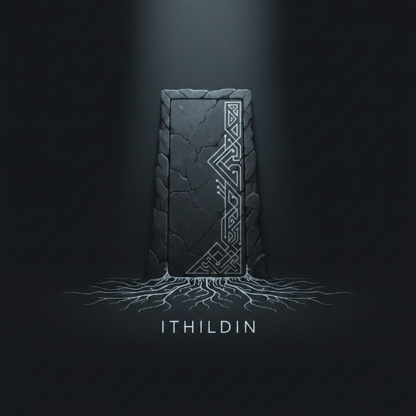

# Ithildin UI Inspiration and Style Guide
Version: 0.2

## Reference Image

## Theme: The Root and The Door
The UI should feel like a stone threshold in moonlight. You step through a door
and the roots reveal what is connected. The tone stays subtle and forensic.

## Core Metaphors
- Monolith: the single source of truth, quiet authority, permanence.
- Door: entry to hidden structure, threshold for insight.
- Runes: structured knowledge, encoded meaning, precise geometry.
- Roots: networked discovery, evidence trails, deep provenance.
- Cold light: clarity and focus, never theatrical.

## Tone
- Quiet power, not spectacle.
- Archaeological futurism: ancient texture with modern precision.
- Forensic clarity: data is the hero, the UI is the frame.
- Subtle mysticism: a hint of ritual, no fantasy overload.
- Moonlit excavation, not fantasy set dressing.

## Color System (Baseline)
- Obsidian: #0B0D10 (primary background)
- Basalt:   #12151B (surface)
- Slate:    #1C222B (surface hover)
- Ash:      #2A313B (dividers)
- Silver:   #C7D0D9 (primary text)
- Fog:      #8C97A3 (secondary text)
- Icy:      #8FD3E8 (accent, links, highlights)
- Ember:    #D1B36A (warning, emphasis)

Notes:
- Avoid purple bias. Use cyan/steel accents sparingly.
- Contrast should be high but not stark (avoid pure white).
- Alternate anchors (compatible with GitHub-dark tones):
  - Void #0D1117, Stone #161B22, Slate #21262D, Mithril #8B949E, Moonlight #C9D1D9
  - Glow-cyan #58A6FF, Pale-blue #79C0FF

## Typography
- Display: Cinzel (headings, titles)
- Body: Space Grotesk (paragraphs, UI labels)
- Longform: Crimson Text (dossiers, deep analyses)
- Data: IBM Plex Mono (counts, IDs, metrics)

Guidance:
- Keep headings tight and tall.
- Use uppercase micro-labels for sections (letter spacing +2 to +4).

## Texture and Light
- Background: subtle vertical fog gradient (top light -> bottom dark).
- Noise layer: 2 to 4 percent opacity, very fine grain.
- Rune/vein lines: thin 1px strokes, 8 to 12 percent opacity.
- Card edges: 1px highlight on top edge, 1px shadow on bottom.
- Beam of light: diagonal gradient from upper-left (approx 30 degrees).
- Root fade: linework that brightens near source and fades toward tips.

## Layout Principles
- Hero: a single monolith block with a short manifesto.
- Slab cards: wide, low height, strong horizontal rhythm.
- Dossier pages: left rail for stats, right column for narrative.
- Articles: longform, generous line height, no crowded sidebars.
- Visuals: full-bleed panels with minimal chrome.
- Optional asymmetric balance: a slim left rail only when navigation density is high.

## Component Guidance
- Navigation: minimal, small caps, no heavy pills.
- Data tiles: monospaced numerals, subtle rune divider.
- Dossier list: index-like rows with compact metadata.
- Findings: compact cards, evidence tags as thin chips.
- Graph/flows: dark canvas, cyan for selection, silver for labels.
- Cards: 2 to 3px radius, slight top highlight rule, inset shadow for depth.

## Motion
- Page load: 150 to 250ms fade + 8px rise.
- Section reveals: staggered by 60 to 90ms.
- Hover: color shift only, no large movement.
- Graph: slow easing, no bouncy spring.
- Root growth: optional line draw for graph edges (low amplitude, short duration).

## Logo Usage
- Primary placement: nav left, hero center.
- Monochrome only (silver on dark).
- Maintain clear space equal to logo width on all sides.
- Use as watermark at 6 to 10 percent opacity in hero.

## Do / Do Not
Do:
- Keep UI calm and precise.
- Use linework and light sparingly.
- Let data density feel intentional and curated.

Do not:
- Use neon or fantasy tropes.
- Overuse glowing effects.
- Add heavy ornamentation around data.

## Implementation Notes
- Define CSS variables for all colors and fonts.
- Keep components modular so tone can be tuned globally.
- The UI should read like an archive, not a dashboard.
- Use texture overlays sparingly; no large illustration blocks.
