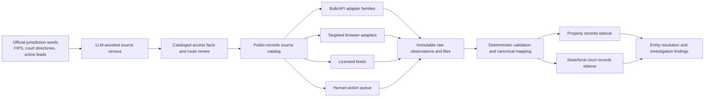

# Property Records and State/Local Court Records Roadmap

**Status:** active architecture; core platform and first property pilots implemented
**Research current through:** 2026-07-28
**Scope:** United States first; official public, account, licensed, request, and
physical-record routes represented in one source model
**Planning convention:** dependency order and acceptance evidence, with no
timeline estimates

## Executive recommendation

Build a public-records control plane, not a collection of unrelated county
scrapers.

The platform should treat this as three distinct acquisition programs:

1. **Property breadth:** parcel geometry, assessment rolls, tax accounts, sales,
   and other structured data available through official bulk files and APIs.
2. **Property depth:** recorder indexes, deeds, mortgages, liens, releases, and
   document images, acquired selectively in jurisdictions relevant to an
   investigation.
3. **State and local courts:** statewide or local case indexes first, followed
   by docket entries and selected filings through the source's current public,
   account, bulk, request, or physical-record route.

Modern LLMs make a national source census, schema mapping, document extraction,
and portal-drift triage much more feasible. The control plane still needs to
represent fragmented authority, changing access rules, CAPTCHA and account
workflows, paid products, courthouse-only records, statutory redactions,
sealing, and the difference between a visible portal and a documented machine
route.

The architecture consists of:

- A shared source catalog for facts, capabilities, routes, reviews, and probes.
- Generic Socrata, ArcGIS REST, and bulk-file adapters.
- A canonical property model based in part on the federal cadastral standard.
- A canonical court model mapped to the National Open Court Data Standards.
- Statewide parcel/assessment pilots in Florida, North Carolina, and
  Massachusetts, followed by several high-value county datasets.
- Court-metadata pilots through formal programs in Indiana, Wisconsin,
  Minnesota, North Carolina, Arizona, Oregon, and Washington, with targeted
  public-portal discovery sources kept in a separate access tier.
- Recorder-depth pilots using the existing NYC ACRIS integration and official
  paid/bulk offerings in Miami-Dade and Harris County.

The design should be metadata-first and document-on-demand. National
completeness is a source-discovery goal. Retrieval depth can then follow the
investigation's selectors, hypotheses, and document demand.

## Current implementation status

### Platform foundation

| Capability | Implemented components |
|---|---|
| Source control plane | `public_records_catalog.py`, tracked YAML manifests, immutable access reviews, terms snapshots, source capabilities, and probe history |
| Nationwide discovery | `public_records_census.py`, configured state/territory and record-role targets, multi-source associations, and separately assessed coverage gaps |
| Priority | `public_records_priority.py`, with separate benefit, feasibility, and risk dimensions plus an auditable basis |
| Shared contracts | `public_records_contract.py`, canonical query fingerprints, source-aware result statuses, coverage, warnings, errors, and continuations |
| Adapter families | Reusable Socrata SODA and ArcGIS REST clients in `public_records_http.py`; manifests, resumable transfer, hashing, and archive handling in `public_records_bulk.py` |
| Normalized sidecars | Property and state/local-court schemas in `public_records_store.py`; adapter-neutral envelope retention, structured projections, canonical court states, and preserved source-native labels |
| Evidence artifacts | Content-addressed acquisitions, derived representations, page/region/quote evidence, and restriction history in `public_records_artifacts.py` |
| Document understanding | Deterministic extraction validation and append-only review workflow in `public_records_extract.py` |
| Entity resolution | Explainable, reversible candidates across owners, instrument parties, and court parties in `public_records_entity_candidates.py` |
| Investigation workflow | Cross-domain plans, catalog-backed actions, unified routers, source monitoring, and caller-supplied evaluation bundles |
| Adoption | Source health, canonical citations, property/legal documentation, and `search-all-sources`, `investigate-person`, `trace-entity`, `deep-investigate`, and `pursue-lead` wiring |

There is no platform-wide `maximum_records_per_run` compatibility setting.
Callers can select query or transfer limits, while endpoint page-size mechanics
remain source/transport facts.

### Implemented property pilots

- North Carolina OneMap owner, address, parcel, and geometry queries, including
  a verified live route and property-sidecar ingestion.
- Florida DOR assessment-roll and GIS directory discovery, manifest, bounded
  probe, dry-run, and resumable transfer.
- MassGIS municipal manifest, probe, transfer, archive inspection, and
  extraction.
- Cook County Parcel Universe PIN/tax-year history and geography.
- Harris Central Appraisal District tax-year manifests, artifact probes,
  resumable transfer, and dry-run planning.
- Maryland statewide address/parcel assessment queries with the source's
  withheld-current-owner state preserved explicitly.
- Hardened ACRIS and East Baton Rouge source envelopes and pagination.
- Adapter-neutral retention of every canonical property envelope and status,
  with structured projections for NC OneMap, Cook County, Maryland, and direct
  document-shaped ACRIS results.
- Catalog/action routes for ACRIS selected images and copies, Miami-Dade
  commercial recorder products, and Harris County Clerk real-property data
  products.

### Implemented court foundation and catalog cohort

- Unified local state-court search plus adapter-neutral ingestion of canonical
  cases, parties, attorneys, representations, judges, docket entries, events,
  documents, restrictions, and all result-status snapshots.
- CourtListener and NYSCEF registered in the shared catalog.
- Formal or account/data-product candidates registered for Pennsylvania,
  Maryland, Indiana, Wisconsin, Minnesota, North Carolina, Arizona, Oregon,
  Washington, and Texas.
- Targeted discovery candidates registered for Pennsylvania UJS, Maryland Case
  Search, Delaware CourtConnect, and DC Superior Court eAccess.
- `public_records_actions.py` turns those source routes into reproducible plans
  or deduplicated `human_actions`; candidate entries are not represented as
  implemented query adapters.

The remaining coverage work is primarily additional source-family deployments,
formal product/feed evaluation, structured projection and bulk transforms
beyond the current pilots, and gold-set growth. A source's integration status is visible across
its catalog record, adapter, health probe, citation mapping, fixtures,
documentation, and investigation workflow.

### Existing backlog to consolidate

The current infrastructure queue already contains useful jurisdictional demand
signals:

- Property: #64 Bexar County appraisal, #82 Miami-Dade property and recorder,
  #84 Orleans Parish, and #148 Texas deeds/UCC/oil-and-gas assignments.
- Courts: #25 Palm Beach County, #27 Pima County, #56 Bexar County, #67 Texas
  statewide, #85 California, #90 NYSCEF filing text, #102 Los Angeles probate,
  and #118/#149 U.S. Virgin Islands.
- Completed foundations include #83 East Baton Rouge property and #89 NYSCEF.

These should become children of two program-level epics—property records and
state/local courts—rather than remaining independent integrations with
different schemas and operational rules.

## Governing principles

### Model the authority that made each assertion

“Property records” are not one dataset:

- An assessor's owner field is a dated tax-roll assertion.
- Parcel GIS is a mapping aid and is commonly disclaimed as a legal survey.
- A recorder index proves that an instrument was indexed in a particular way.
- A deed is evidence of a recorded conveyance, not conclusive proof of current
  title or beneficial ownership.
- A tax collector, sheriff, land court, and recorder can each describe a
  different part of the same property's history.

Likewise, a court case index, register of actions, docket entry, filed document,
court order, and later disposition are different evidence objects. The
platform represents them as distinct object types rather than a generic “court
hit.”

### Prefer source families over jurisdiction-specific scrapers

The scalable unit is an adapter family plus a declarative jurisdiction
manifest. High-value families include:

- Official CSV, fixed-width, GeoPackage, shapefile, and other bulk releases.
- ArcGIS REST `FeatureServer` and `MapServer`.
- Socrata SODA.
- Statewide court portals and cataloged bulk/compiled-data feeds.
- Vendor families used by assessors, recorders, and courts, with each
  authority's endpoint, terms, schema, and probe facts retained separately.
- Manual, account-required, paid-copy, public-record-request, and courthouse
  workflows represented as first-class source actions.

Vendor fingerprinting is useful for discovery. It is not proof that two
customers expose the same endpoints or route.

### Record access route as an independent planning dimension

A technically easy endpoint and a documented machine route are different
source facts. The catalog stores both so feasibility and implementation mode
remain explainable.

| Access class | Typical source | Integration expression |
|---|---|---|
| A | Official bulk file or documented API | Direct or scheduled adapter capability |
| B | Official public query service | Targeted adapter with source-published page/rate facts |
| C | Official browser or account portal | Targeted query or structured action reflecting the current route |
| D | Licensed or fee-based API/bulk product | Product, account, contract, and budget action; adapter when configured |
| E | In-person, mail, copy order, or public-record request | Structured `human_actions` item |
| X | Sealed, nonpublic, or source-restricted material | Restriction state and tombstone metadata; no acquisition route |

The source catalog records both `access_class` and an independently reviewed
`automation_disposition`: `allowed`, `allowed_with_limits`, `unclear`,
`prohibited`, or `not_applicable`.

Robots directives, terms, court rules, statutes, licenses, source notices,
public visibility, bulk collection, and republication are recorded as distinct
source facts.

### Preserve false-zero semantics

Every adapter should return one of:

`ok`, `no_results`, `partial`, `unavailable`, `restricted`,
`human_required`, `rate_limited`, `terms_blocked`, or `source_changed`.

The result contract assigns a CAPTCHA, login wall, server error, sealed case,
redacted owner, unsupported county, or source-schema change its corresponding
state instead of `no_results`. This is one of the most important lessons
already embodied in the NYSCEF fixtures.

## Proposed architecture



### Storage boundaries

Recommended physical layout:

- `datasets/public_records_catalog.db`: global source, jurisdiction, access,
  adapter, terms, coverage, and health metadata.
- `datasets/property_records.db`: normalized property metadata acquired through
  cataloged source routes. Store large geometry in versioned GeoParquet or
  an equivalent spatial format rather than ordinary SQLite rows.
- `datasets/state_court_records.db`: normalized case, docket, and document
  metadata.
- Content-addressed artifact storage for raw downloads and selected document
  images, keyed by SHA-256 and governed by the source's retention and
  redistribution rules.
- `investigation.db`: investigation-scoped searches, entities, findings,
  connections, human actions, and canonical references into the sidecars.

This follows the platform's existing pattern of keeping large, regenerable
corpora outside the investigation database.

### Source catalog

Each source manifest should include at least:

```yaml
source_id: us-fl-dor-property-roll
domain: property
roles: [assessment, parcel_geometry, sales]
authority: Florida Department of Revenue
operator: Florida Department of Revenue
jurisdiction_geoids: ["12"]
official_url: https://www.floridarevenue.com/property/Pages/DataPortal_RequestAssessmentRollGISData.aspx
platform_family: official_bulk
access_class: A
automation_disposition: allowed_with_limits
authentication: none
fees: none
license_or_terms_url: null
redistribution: review_required
protected_record_policy: source_redactions_preserved
coverage_start: source_specific
update_cadence: annual_with_preliminary_and_final_releases
stable_keys: [county_fips, native_parcel_id, roll_year]
adapter_family: bulk_property_roll
adapter_version: 1
last_verified_at: 2026-07-28
health_status: candidate
```

Additional fields should capture:

- Source role: assessor, GIS, tax collector, recorder, clerk, court,
  administrative office, archive, or document vendor.
- County/state/court coverage and explicit exclusions.
- Historical depth, source “good through” date, and update cadence.
- Search capabilities and available document types.
- Authentication, MFA, CAPTCHA, cost, rate limits, and bulk options.
- Terms/robots/court-rule URLs plus reviewed snapshots and dates.
- Redistribution, retention, protected-person, sealing, and deletion rules.
- Native identifiers, pagination, incremental-update strategy, and expected
  schema.
- Citation template and source-reliability classification.
- Last successful sentinel query, observed drift, and owner team.

### Unified interfaces

Keep existing commands for compatibility, but introduce two discoverable
front doors:

```text
tools/query_property.py sources|owner|address|parcel|instrument|chain|map
tools/query_state_courts.py sources|search|case|docket|documents|download
```

Provider adapters should expose the subset they support from:
`probe`, `capabilities`, `search`, `fetch_record`, `fetch_document`, `sync`,
and `apply_deletions`. Capability flags are catalog data rather than assumptions
inferred from the presence of an e-filing or search portal.

Every provider returns a shared envelope:

```json
{
  "schema_version": "1.0",
  "source": {},
  "jurisdiction": {},
  "query": {},
  "retrieved_at": "ISO-8601",
  "access_status": "ok",
  "coverage": {},
  "results": [],
  "raw_artifact_refs": []
}
```

The envelope should be written through the existing output utilities, logged
under one canonical `source_id`, and usable by both an investigator and an
orchestrated agent.

## Canonical property model

The [FGDC Cadastral Data Content
Standard](https://www.fgdc.gov/standards/projects/cadastral/index_html) provides
a useful baseline vocabulary for parcels, interests, transactions, and surveys.
It should inform—but not dictate—the internal model because local assessment
and recording practices remain heterogeneous.

Recommended entities:

| Entity | Essential fields and semantics |
|---|---|
| `jurisdiction` | State/county/municipality GEOID, authority, recorder/assessor boundaries |
| `parcel_snapshot` | Jurisdiction-scoped native APN/PIN/BBL/SSL, roll year, effective and retrieval dates |
| `parcel_geometry` | Geometry, CRS, source resolution, accuracy/disclaimer, snapshot |
| `address_observation` | Situs or mailing address, raw and normalized values, source/effective date |
| `assessment` | Land, improvement, total, market, assessed, exempt values and tax year |
| `tax_account_event` | Bill, payment, delinquency, lien, adjudication, tax sale |
| `sale_event` | Sale date, price, qualification code, and whether assessor- or instrument-derived |
| `recorded_instrument` | Native document number, type, execution/recording dates, book/page, consideration |
| `instrument_party` | Raw party name, normalized candidate, role, sequence, and address |
| `instrument_parcel` | Many-to-many link between instruments and parcels |
| `parcel_lineage` | Split, merge, renumbering, condominium conversion, predecessor/successor |
| `ownership_assertion` | Assertion type, party, source, confidence ceiling, effective interval |
| `document_artifact` | Hash, MIME type, pages, acquisition method, rights tier |

Required semantic rules:

- A native parcel number is unique only within a jurisdiction and sometimes
  only within a particular roll year.
- Preserve execution date, recording date, sale date, assessment year, source
  snapshot date, and retrieval date separately.
- Preserve co-owners and all instrument parties rather than flattening them to
  one owner.
- Keep a property-owning LLC distinct from its possible beneficial owners.
- Retain legal descriptions verbatim even when lot/block/subdivision fields are
  parsed.
- Preserve `owner_redacted`, `protected_record`, `source_withheld`, and
  `not_collected` as distinct states.
- Source-withheld identity remains withheld rather than being backfilled into
  that source observation.
- Label parcel boundaries as source-provided mapping geometry, not surveyed
  legal boundaries.

Chain-of-title analysis should be a derived view with explicit gaps and
conflicts, not a single mutable `current_owner` field.

## Canonical court model

The [National Open Court Data
Standards](https://www.ncsc.org/our-centers-projects/national-open-court-data-standards)
are the best starting point for a cross-state case schema. They are voluntary
mapping standards, not a guarantee of public access or national uniformity.

Recommended entities:

| Entity | Essential fields and semantics |
|---|---|
| `court` | State, county/district, level, division, official identifier and parent court |
| `case` | Source-native case number, court, caption, type, filing date, status, confidentiality state |
| `case_party` | Raw name, role, sequence, normalized entity candidate, representation |
| `attorney` | Raw and normalized name, bar identifier where public, represented party |
| `judicial_officer` | Judge/magistrate/referee identity and assignment interval |
| `docket_entry` | Native sequence/ID, filed/entered dates, text, filer, document availability |
| `case_event` | Hearing, conference, trial, disposition, judgment, appeal, transfer |
| `document_artifact` | Source document ID, docket link, hash, pages, rights/restriction state |
| `restriction_event` | Sealed, expunged, made nonpublic, redacted, removed, or restored |
| `source_snapshot` | Retrieval time, portal coverage, source state, parser/model versions |

Court data is versioned because a record that was public can later be sealed,
expunged, destroyed, or otherwise made nonpublic. Minnesota's bulk-data
guidance, for example, describes full refreshes that remove records which
become nonpublic. Restriction/tombstone events update the current serving and
index state while retaining the provenance of an earlier observation.

The representation model distinguishes a party allegation, charge, sworn
declaration, admission, court finding, verdict, judgment, and docket
description. Portal metadata should be labeled unofficial whenever the court
says it is not the certified record, and legally consequential claims should
be checked against the filed or certified source.

Juvenile, adoption, mental-health, protective-order, minor-related, and
sensitive family matters carry explicit case type, access state, and review
metadata. Home addresses, full birth dates, account numbers, and other personal
fields carry field-level visibility and representation state. Employment,
housing, credit, and insurance screening are outside this investigative
platform's documented use case.

### Cross-domain search workflow

The query router should turn one subject into a reproducible search plan rather
than issuing the same name to every source:

The plan retains the full source inventory for coverage analysis, but generates
query tasks only for sources whose cataloged service area matches a requested
jurisdiction. Each task carries the subset of requested jurisdictions matched
by that source.

1. Resolve the subject's raw names, entity names, aliases, known addresses,
   registered agents, counsel, and relevant date intervals.
2. Search assessment and parcel sources for each jurisdictionally appropriate
   name/address variant.
3. Convert parcel hits into native parcel identifiers, legal descriptions,
   predecessor/successor parcels, and recorder search keys.
4. Search recorder indexes in both party directions and by parcel/legal
   description where supported. Follow referenced deeds, mortgages, releases,
   assignments, liens, and lis pendens.
5. Search court sources by person/entity, related property-owning entities,
   counsel, case number, address, lender, trustee, and other supported keys.
6. Prioritize cases involving foreclosure, tax-lien enforcement, lis pendens,
   quiet title, partition, condemnation, mechanic's liens, probate inventory or
   sale, receivership, fraudulent transfer, asset freeze, zoning/code
   enforcement, eviction, or property division across the cataloged online,
   bulk, subscription, request, copy-order, and physical-office routes.
7. Retrieve only the docket items most likely to resolve the hypothesis:
   complaints/petitions, lis pendens, property-description exhibits, sworn
   affidavits, deeds or mortgages attached as exhibits, dispositive orders,
   judgments/orders of sale, and satisfactions/releases.
8. Record negative, partial, restricted, and human-action results alongside
   successful results so another agent can reproduce the coverage.

The router should generate a canonical query JSON and fingerprint. That record
includes the source, jurisdiction, court/office, search mode, all filters, date
bounds, pagination, aliases used, coverage warnings, and retrieval state.

## Verified property-source landscape

### Breadth: structured parcel and assessment sources

The following official sources are strong pilot candidates. Importance and
ease are initial 1–5 estimates that are recomputed against active
investigations and current source-route metadata.

| Source | Coverage/value | Importance | Ease | Proposed use |
|---|---|---:|---:|---|
| [NYC ACRIS](https://www.nyc.gov/site/finance/property/acris.page) | Recorder index and parties for Manhattan, Bronx, Brooklyn, and Queens, generally 1966-present | 5 | 5 | Harden existing benchmark |
| [Florida DOR assessment, sales, and GIS data](https://www.floridarevenue.com/property/Pages/DataPortal_RequestAssessmentRollGISData.aspx) | Statewide rolls and parcel GIS; long historical series | 5 | 5 | First bulk pilot |
| [North Carolina OneMap parcels](https://services.nconemap.gov/secure/rest/services/NC1Map_Parcels/MapServer/1) | Statewide ArcGIS parcel layer covering all counties | 4 | 5 | First ArcGIS pilot |
| [MassGIS property tax parcels](https://www.mass.gov/info-details/massgis-data-property-tax-parcels) | Standardized parcels and assessor data for all 351 municipalities, with downloads and services | 4 | 5 | First statewide schema pilot |
| [Wisconsin statewide parcels](https://www.sco.wisc.edu/parcels/data/) | Free annual statewide/county files and REST service | 3 | 5 | Bulk/ArcGIS reuse test |
| [New Jersey parcel data](https://nj.gov/njgin/edata/parcels/) | Statewide geometry, assessment, and sale data with protected owner names removed | 4 | 4 | Redaction-aware pilot |
| [Maryland hidden-owner assessment data](https://opendata.maryland.gov/Business-and-Economy/Maryland-Real-Property-Assessments_Hidden-Property/ed4q-f8tm) | Monthly statewide assessment data without owner names | 4 | 4 | Metadata-only pilot |
| [Cook County parcel universe](https://datacatalog.cookcountyil.gov/Property-Taxation/Assessor-Parcel-Universe-Current-Year-Only-/pabr-t5kh) | Large high-value Socrata assessment dataset | 5 | 5 | Socrata reuse test |
| [Harris County appraisal bulk data](https://hcad.org/hcad-online-services/pdata/) | Official characteristics, values, and quarterly GIS downloads | 5 | 4 | Texas property pilot |
| [Philadelphia property parcels](https://opendataphilly.org/datasets/department-of-records-property-parcels/) | Weekly files and API in several spatial formats | 4 | 4 | City open-data pilot |
| [DC property and land GIS](https://maps2.dcgis.dc.gov/dcgis/rest/services/DCGIS_DATA/Property_and_Land/MapServer/53/) | Parcel/tax data including value and sale fields | 4 | 4 | Active-investigation value |
| [Montana cadastral data](https://msl.mt.gov/geoinfo/msdi/cadastral/) | Monthly statewide parcel/CAMA data | 2 | 5 | Low-friction state exemplar |
| [Los Angeles County parcel GIS](https://public.gis.lacounty.gov/public/rest/services/LACounty_Cache/LACounty_Parcel/MapServer/0) | High-value parcel geometry and APN/address data; owner names are not published online | 5 | 4 | Geometry only |

The [Census Bureau's geographic support program
description](https://www2.census.gov/geo/pdfs/gsp/Geographic_Support_Program-AMS.pdf)
notes its own use of commercial national parcel datasets and that coverage can
still be incomplete. A licensed national parcel product may therefore be
useful as a routing and coverage layer, but it should not replace official
local evidence.

### Depth: recorder indexes and document retrieval

| Source | Verified access pattern | Ease | Recommended treatment |
|---|---|---:|---|
| NYC ACRIS | Free structured index; document images can be retrieved selectively | 4–5 | Existing free benchmark |
| [Miami-Dade official records](https://www.miamidadeclerk.gov/clerk/records-library.page) | Public search plus official fee-based API/bulk and image offerings | 3 | Best paid recorder pilot |
| [Harris County real-property records](https://www.cclerk.hctx.net/Applications/WebSearch/RP.aspx) | Public grantor/grantee search and official bulk/FTP data sales | 3 | Request specifications and sample |
| [MassLandRecords](https://www.masslandrecords.com/) | Multi-registry account/browser portal with indexes and images | 2 | Account/browser source action; evaluate product details |
| [MDLandRec](https://landrec.msa.maryland.gov/Pages/Login.aspx) | Statewide free account with MFA and historic/modern indexes and images | 2 | Account route with targeted record capabilities |
| [DC Recorder of Deeds](https://otr.cfo.dc.gov/service/recorder-deeds-document-images) | Vendor portal, account, and copy fees | 2 | Account/copy action for selected instruments |
| [Philadelphia deeds](https://www.phila.gov/services/property-lots-housing/get-a-copy-of-a-deed-or-other-recorded-document/) | Online records from 1974 with paid document access | 2 | Investigation-driven retrieval |
| [Los Angeles County recorder](https://www.lavote.gov/home/recorder/real-estate-records/general-info) | No public online grantor/grantee index; copy/order workflow | 1 | Copy/order source action |

Maryland illustrates why source visibility state is part of the data model. Its statewide open
assessment dataset omits owner names, while the separate [SDAT property
search](https://sdat.dat.maryland.gov/) expressly prohibits automatic
collection and data mining. The implemented open-data adapter preserves
`owner_visibility.state=withheld_by_source`; the SDAT search remains a distinct
catalog route rather than a mechanism for backfilling that field.

## Verified state/local court landscape

State court access is institutionally fragmented. The [U.S. Courts PACER
description](https://www.uscourts.gov/court-records/find-a-case-pacer) confirms
that PACER covers federal appellate, district, and bankruptcy courts; it is not
a state/local solution. The [NCSC court-data
guidance](https://cosca.ncsc.org/resources-courts/court-data-open-care) provides
the right framing: access should be open where lawful, but designed with
privacy, security, and downstream use in mind.

### Formal statewide acquisition candidates

These sources expose an official bulk, API, subscription, reseller, or
compiled-data path. Those formal routes are evaluated alongside the
interactive portal's advertised capabilities.

| Source | Verified route and important limitation | Initial treatment |
|---|---|---|
| [Indiana bulk-data program](https://www.in.gov/courts/iocs/statistics/bulk-data/) | Formal Rule 9 application and agreement; file-drop or messaging metadata; bulk documents are rarely approved | Strong metadata-feed candidate through the formal program |
| [Wisconsin WCCA REST agreement](https://www.wicourts.gov/courts/resources/docs/RESTagreementpaid.pdf) | Formal REST access to public case data, excluding filed documents; includes correction/destruction obligations | Strong incremental-sync and deletion-reconciliation pilot |
| [Minnesota bulk extracts](https://mncourts.gov/help-topics/court-statistics/bulk-data) | Agreement-based criminal, judgment, eviction, probate, and conciliation extracts; portal document access has separate terms | Bulk metadata route plus a distinct document route |
| [North Carolina Remote Public Access](https://www.nccourts.gov/services/remote-public-access-program/rpa-online-access) and [extracts](https://www.nccourts.gov/services/remote-public-access-program/rpa-extract-access) | Licensed statewide real-time access and defined extracts; public-site terms prohibit batch processes | Licensed RPA and extract capabilities |
| [Arizona eAccess](https://www.azcourts.gov/eaccess/eAccess-Information) | Paid statewide case data/documents plus official bulk and custom-report programs | Pursue formal data and document access |
| [Oregon OJCIN](https://www.courts.oregon.gov/services/online/Pages/ojcin-signup.aspx) | Court-operated subscriptions and explicit reseller/bulk tiers | Clear but cost-sensitive licensed candidate |
| [Washington JIS-Link](https://www.courts.wa.gov/jislink/?fa=jislink.home) | Fee-based statewide docket access without documents; bulk/index data may be licensed under dissemination policy | Formal metadata agreement plus separate county document routes |
| [Texas re:SearchTX](https://www.txcourts.gov/media/1459238/data-committee-report-2024.pdf) | Broad civil-document coverage, data-mining safeguards, and no documented public API in the reviewed materials | Partnership/account route and targeted paid retrieval |

A “statewide” label alone does not describe case types, historical depth,
documents, access route, fees, or update/deletion obligations. Each catalog
entry publishes those fields separately.

### Public discovery and targeted-document candidates

These are valuable discovery layers. Their catalog entries represent the
observed portal, account, compiled-data, or formal-feed route independently
from the advertised search capabilities.

| Source | Verified scope | Initial treatment |
|---|---|---|
| [Pennsylvania UJS docket sheets](https://ujswebportalhelp.pacourts.us/HelpDocuments/UJSWebPortal/UJS%20Docket%20Sheets%20%28Case%20Search%29.pdf) | Public docket sheets across court levels | Targeted docket-sheet route plus a separate AOPC compiled-data route |
| [Maryland court records](https://www.mdcourts.gov/courts/courtrecords) | Statewide Case Search summaries | Discovery metadata with portal-version monitoring |
| [Wisconsin public case search](https://www.wicourts.gov/casesearch.htm) | Unified appellate and circuit search | Public discovery route plus the separate REST product |
| [Delaware CourtConnect](https://courts.delaware.gov/docket.aspx) | Superior, Common Pleas, and Justice of the Peace civil data | Targeted case/docket route; Chancery products remain separate |
| [Massachusetts court dockets](https://www.mass.gov/info-details/how-to-search-court-dockets) | Public docket search with category/document limits and bot challenge | Portal and compiled-data-request routes |
| [Minnesota Court Records Online](https://www.mncourts.gov/Access-Case-Records/MCRO.aspx) | Statewide register of actions and many public documents | Portal document route plus formal bulk extracts |
| [District of Columbia eAccess](https://eaccess.dccourts.gov/eaccess/home.page.3) | Broad free docket access and some document images | Targeted case/docket/document candidate |

### Fragmented but strategically important states

**California.** The [Judicial Branch public-records
page](https://courts.ca.gov/policy-administration/public-records) directs users
to 58 individual superior courts for trial records. [California Rule
2.503](https://courts.ca.gov/cms/rules/index/two/rule2_503) also limits remote
access to certain categories and constrains bulk distribution. The right
architecture is a state catalog plus county adapters and human actions, not a
fictional statewide trial-court endpoint.

**Florida.** The statewide [e-filing portal
FAQ](https://www.myflcourtaccess.com/authority/faqs) says members of the public
cannot use the filing portal to search unrelated cases and should use county
clerk sites. The official [ACIS portal](https://acis.flcourts.gov/portal/home)
is useful for appellate records, but trial records remain primarily
county-based. Palm Beach and Miami-Dade are sensible demand-driven pilots.

**Texas.** re:SearchTX has broad value, but a 2024 Texas Judicial Council
report describes an API as a requested future enhancement rather than a
capability that can be assumed. A [January 2026 e-filing status
report](https://www.txcourts.gov/media/1462553/efiletexas-status-jcit-20260109.pdf)
shows near-statewide integration while also documenting remaining
case-management-system issues. Pursue official access or a data agreement,
then supplement with Bexar and other local clerks.

**New York.** The official [NYSCEF Terms of
Use](https://iappscontent.courts.state.ny.us/NYSCEF/live/termsOfUse.htm)
state that automated extraction and data mining are prohibited. The catalog
therefore records the guest portal as a structured `human_required` route with
the requested criteria and official URL. County clerk records, appellate sites,
and any future UCS feed remain distinct source routes.

### Better alternatives to scraping

For portals without documented machine access, the source-census agent should
look for:

1. Administrative-office bulk or compiled-data programs.
2. Court rules governing journalistic, scholarly, or public-interest data
   requests.
3. Official APIs, daily extracts, docket feeds, or vendor agreements.
4. Public-record requests for defined metadata fields and time windows.
5. Targeted manual retrieval of specific dockets and documents.

Minnesota has a paid [bulk-data
program](https://mncourts.gov/help-topics/court-statistics/bulk-data), and
Massachusetts [Rule 3 on compiled
data](https://www.mass.gov/trial-court-rules/uniform-rules-on-public-access-to-court-records-rule-3-requests-for-compiled-data)
provides a formal request path for some scholarly, journalistic, educational,
and governmental uses. These channels are usually more durable than reverse
engineering an interactive portal.

## Prioritization model

Track benefit, feasibility, and risk as separate planning dimensions. The
cataloged source route contributes to feasibility and risk without disappearing
inside one blended “easy and important” score.

### Benefit score

| Factor | Weight |
|---|---:|
| Demand from active profiles, open leads, and known addresses | 30% |
| Record richness and investigative value | 25% |
| Population, asset, transaction, or case coverage | 20% |
| Reuse across jurisdictions or source families | 15% |
| Historical depth | 10% |

### Feasibility score

| Factor | Weight |
|---|---:|
| Clear, documented machine-access route | 30% |
| Stable documented API or bulk file | 25% |
| Schema consistency and source documentation | 15% |
| Incremental update support | 15% |
| Authentication, fee, and operating cost | 15% |

### Risk register

Score and retain these separately:

- Automation, licensing, redistribution, and account terms.
- Protected-person and sensitive-case exposure.
- Sealing, expungement, redaction, and deletion obligations.
- Portal fragility and vendor/schema drift.
- Ambiguous identifiers or material coverage gaps.
- Cost volatility and account dependency.

A source with no current acquisition route can still have high investigative
benefit; its feasibility and source-state fields make that distinction visible.

Priority should be recomputed from the active investigation profiles. A
medium-population county tied to several open leads may outrank a statewide
source with no current demand.

## How to use LLM agents safely and effectively

### 1. Source census

Seed agents with official Census state/county GEOIDs, the [2025 county
gazetteer](https://www2.census.gov/geo/docs/maps-data/data/gazetteer/2025_Gazetteer/),
state court directories, active-profile geographies, and the existing infra
queue. For every jurisdiction, agents identify the official:

- Assessor or appraisal authority.
- Parcel/GIS authority.
- Tax collector, tax-sale, or sheriff source.
- Recorder/register/clerk and archival source.
- Trial, appellate, probate, land, and municipal court systems.
- Bulk/API/compiled-data program.

Agents submit manifests with official citations and an explicit “not found” or
source-action state. Discovery output is a catalog candidate with its supporting
evidence, not an implemented adapter.

### 2. Access and vendor classification

LLMs can summarize terms, court rules, robots files, access notices, fees,
authentication, and vendor fingerprints into a proposed source record. The
reviewed `automation_disposition`, evidence snapshot, and reviewer identity are
stored centrally so adapters and agents consume one current route decision.

### 3. Schema mapping and adapter scaffolding

After a real endpoint or file has been probed:

- Give an agent the official documentation, small sample, and canonical schema.
- Have it propose a declarative field map, transformations, coverage notes, and
  fixture cases.
- Generate adapter scaffolding from a family template.
- Record deterministic fixture validation and a bounded live probe with the
  adapter version.

This preserves the repository rule: prove the endpoint first, code second.

### 4. Document understanding

For lawfully obtained deeds and court filings, models can:

- OCR old scans and identify pages/regions.
- Classify instruments, pleadings, orders, judgments, and exhibits.
- Extract parties and roles, dates, amounts, legal descriptions, references to
  earlier instruments, docket-entry relationships, and disposition language.
- Suggest missing links, contradictions, rapid transfers, related addresses,
  and entity-resolution candidates.

Every extracted value retains:

- Raw document SHA-256.
- Source URL or acquisition receipt.
- Retrieval time.
- Document/page/region or bounding-box provenance.
- Exact supporting quote.
- OCR, parser, model, and prompt/schema versions.
- Validation status and confidence ceiling.

Represent privacy and visibility at the artifact, representation, record, and
field levels. A redaction/PII detector can flag Social Security numbers, full
dates of birth, account numbers, minors, victims, protected addresses, and
apparent redaction failures so index/export paths select the appropriate
representation and state.

IDs, dates, amounts, page references, and required fields should be validated
deterministically. The review queue retains low-confidence output alongside its
evidence and producer metadata.

### 5. Entity resolution

The implemented candidate workflow keeps proposed links distinct from resolved
entities:

- Normalize entity suffixes and punctuation while preserving raw names.
- Retain addresses, registry IDs, registered agents, instrument references,
  attorneys, and other stable matching signals.
- Represent a common-name-only match as its own weak candidate.
- Keep a trust, trustee, beneficiary, LLC, member, and beneficial owner as
  separate roles.
- Make every merge explainable, reversible, and attributable.

### 6. Drift monitoring

Run explicitly named sentinel queries through registered source handlers. When
fields, URLs, pagination, challenge behavior, or coverage change, an LLM can
diagnose the diff and propose a new mapping or fixture. A changed access method
is represented as a catalog revision and probe event rather than a hidden
adapter workaround.

## Evaluation and acceptance evidence

### Adapter acceptance

An integration's acceptance report includes:

- A reviewed source manifest and access disposition.
- One or more official endpoint/file probes.
- Cached, sanitized fixtures and golden expected outputs.
- Challenge/error/restriction versus true-zero tests.
- Pagination and schema-drift tests.
- Canonical source IDs and references.
- `source_report.py`, citation-registry, and skill integration.
- Retrieval, coverage, and freshness documentation.
- Bounded live probes with the query footprint recorded.

### Model evaluation

Build adjudicated gold sets spanning:

- Clean digital documents and degraded scans.
- Typewritten, handwritten, rotated, and multi-column pages.
- Multi-party and multi-parcel instruments.
- Condominium and metes-and-bounds legal descriptions.
- Amended, superseded, sealed, and later-restricted court entries.
- Similar-name entities and deliberately difficult nonmatches.

Example evaluation targets that a caller can place in a gold-set bundle:

- At least 99.5% precision for document IDs, case numbers, dates, and monetary
  amounts used in evidence.
- At least 98% precision for party roles and document classification.
- Zero invented required values.
- Zero leakage of deliberately protected fields.
- At least 95% recall of documents that human reviewers judge material in the
  metadata-first triage evaluation.

These are evaluation targets to validate with pilot data, not embedded tool
ceilings or claims about current model performance.

### Operational metrics

Track:

- Sources cataloged and percentage with reviewed access status.
- Population/geography coverage by source role, weighted by investigation
  demand.
- Historical depth and freshness.
- Sentinel-query success and false-zero incidents.
- Adapter-family reuse and custom code per deployment.
- Time and cost to onboard a new jurisdiction.
- Search-to-useful-record and metadata-to-document retrieval yield.
- Parcel-to-instrument and case-to-document linkage rates.
- Audited extraction precision/recall.
- Manual minutes and fees per useful record.
- Citation/provenance audit pass rate.
- Restriction/tombstone propagation time.

## Dependency-ordered implementation plan

### Foundation: control plane and compatibility

1. [Implemented] Define `public_records_catalog.db`, source manifests, access
   states, reviewed route facts, and immutable probes.
2. [Implemented] Adopt canonical property and NODS-mapped court schemas.
3. [Implemented] Define the shared result envelope and canonical reference
   formats.
4. [Implemented] Register and fixture ACRIS, East Baton Rouge, CourtListener,
   and NYSCEF; represent NYSCEF's current guest workflow as a catalog-backed
   action without a second adapter switch.
5. [Implemented] Add source-health, citation, documentation, and skill wiring
   while preserving existing commands.
6. [Implemented] Extract reusable Socrata, ArcGIS, and bulk-file families.
7. [Implemented] Seed the nationwide source census and compute separate
   active-profile benefit, feasibility, and risk dimensions.

**Acceptance evidence:** an investigator can ask which property/court sources
cover a jurisdiction, what each source contains, its current route, its last
verified health, and how to query or request it.

### Breadth pilots

Property:

- [Implemented] Florida DOR, North Carolina OneMap, and MassGIS adapter pilots.
- [Implemented] Cook County Socrata parcel-history pilot.
- [Implemented] Harris Central Appraisal District JSON-manifest/bulk pilot.
- [Implemented] Maryland statewide assessment pilot with explicit
  `withheld_by_source` owner visibility.
- [Cataloged action route] Harris County Clerk recorder search/bulk products.
- [Remaining deployment] Additional structured projection mappers and bulk
  transforms for state and county releases; their canonical envelopes can
  already be retained without a mapper.

Courts:

- [Cataloged] Formal metadata/product routes in Pennsylvania, Maryland,
  Indiana, Wisconsin, Minnesota, North Carolina, Arizona, Oregon, Washington,
  and Texas.
- [Cataloged] Targeted discovery routes for Pennsylvania UJS, Maryland Case
  Search, Delaware CourtConnect, and DC Superior Court eAccess.
- [Implemented] Catalog-backed action plans for portal, account, product,
  request, and physical-record routes.
- [Remaining deployment] Implemented query/feed adapters for selected court
  programs once their concrete source route is configured.

**Acceptance evidence:** unified property and court queries return source-aware envelopes;
true zeros, access barriers, and restricted records remain distinguishable.

### Document depth and investigation workflow

1. [Implemented] Harden ACRIS index coverage and represent selected image/copy
   capabilities through a concrete action route.
2. [Cataloged] Miami-Dade and Harris County official recorder products;
   establishing product accounts, samples, and operating budgets remains a
   deployment decision.
3. [Implemented] Content-addressed artifacts, derived representations,
   page/region/quote evidence, extraction validation, and review queues.
4. [Implemented] Reversible entity candidates for property owners, instrument
   parties, and court parties.
5. [Implemented] Adapter-neutral court ingestion for canonical parties,
   attorneys, judges, docket entries, events, and documents.
6. [Implemented] Explicit source monitoring, priority recomputation, and
   restriction/tombstone event models.

**Exit test:** for a selected entity, the platform can trace:

```text
registry aliases
  -> assessor/parcel observations
  -> relevant recorded instruments
  -> conservative ownership assertions
  -> state/local case index
  -> docket entries
  -> selected filings
  -> evidence-backed findings
```

Every link retains the native identifier, official source, retrieval time,
coverage caveat, and supporting evidence.

### Expansion by measured value

- Add more statewide bulk parcel programs and high-demand counties.
- Pursue negotiated court feeds and licensed recorder data when pilots show
  better cost/reliability than portal retrieval.
- Add California and Florida county families while representing filing portals
  and machine APIs as different source capabilities.
- Implement copy-order/public-record-request actions for Los Angeles County and
  other offline jurisdictions.
- Keep vendor-family deployments tied to source-specific endpoint, terms,
  schema, and probe evidence.
- Re-score the backlog from observed investigation yield as priorities change.

## Hypotheses to test

### H1: adapter families will absorb most jurisdictional variation

**Prediction:** at least 70–80% of each new ArcGIS, Socrata, or standardized
bulk deployment can be expressed as configuration and field mappings.

**Falsification:** repeated deployments require substantial custom navigation,
identity logic, or parser code. If so, narrow the family boundary rather than
building a maze of special cases.

### H2: LLM-assisted onboarding will cut source-integration time

**Prediction:** reviewed source manifests, mappings, fixtures, and
documentation can be produced at least 50% faster than a fully manual process
without lowering audited field accuracy.

**Test:** compare matched jurisdictions using total engineering/review time,
defects, and gold-set accuracy.

### H3: metadata-first triage will capture most material documents

**Prediction:** docket/instrument metadata plus an LLM-assisted relevance model
will retain at least 95% of documents a human gold set judges material while
retrieving a much smaller document set.

**Test:** blind comparison on selected recorder and court dockets. Tune toward
recall and route uncertain items to review.

### Evidence and source-state invariants

- Every endpoint or file adapter carries official source metadata and probe
  evidence.
- Terms, court rules, licenses, accounts, fees, and CAPTCHA behavior are
  cataloged source facts rather than scattered adapter switches.
- Sealed, nonpublic, removed, redacted, and source-withheld states remain
  explicit in snapshots, records, fields, artifacts, and tombstone history.
- A source-withheld identity remains source-withheld in the normalized model.
- Assessor-owner observations, title assertions, recorded conveyances, and
  beneficial-ownership candidates remain distinct evidence types.
- Portal failures, route states, and restrictions remain distinct from a
  successful `no_results` response.

## Current decisions and open choices

1. The three-track split—property breadth, property depth, and state/local
   courts—is adopted.
2. `datasets/public_records_catalog.db` is the durable source control plane;
   larger normalized property/court corpora remain sidecars.
3. The source catalog, shared result envelope, ArcGIS/Socrata/bulk families,
   nationwide census, and initial pilot cohort are implemented.
4. Miami-Dade and Harris County recorder products are represented as catalog
   and action routes. Establishing product accounts, obtaining samples, and
   selecting operating budgets remain open deployment choices.
5. Court candidates are cataloged with their distinct portal, account, bulk,
   request, and product routes. Implementation priority can follow active
   investigation demand and the separate benefit/feasibility/risk metrics.

The implemented foundation turns one-off integrations into a platform and
lets LLM-assisted source census work produce reusable manifests, adapters,
fixtures, search plans, evidence, and action records.
