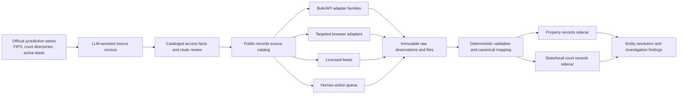

# Property Records and State/Local Court Records Roadmap

**Status:** active architecture; core platform and first property pilots implemented
**Research current through:** 2026-07-30
**Scope:** United States first; official public, account, licensed, request, and
physical-record routes represented in one source model
**Planning convention:** dependency order and acceptance evidence, with no
timeline estimates

## Executive recommendation

Build a public-records control plane, not a collection of unrelated county
scrapers.

The platform should treat this as three distinct acquisition programs:

1. **Property breadth:** parcel geometry, assessment rolls, tax accounts, sales,
   and other structured data available through official bulk files and APIs.
2. **Property depth:** recorder indexes, deeds, mortgages, liens, releases, and
   document images, acquired selectively in jurisdictions relevant to an
   investigation.
3. **State and local courts:** statewide or local case indexes first, followed
   by docket entries and selected filings through the source's current public,
   account, bulk, request, or physical-record route.

Modern LLMs make a national source census, schema mapping, document extraction,
and portal-drift triage much more feasible. The control plane still needs to
represent fragmented authority, changing access rules, CAPTCHA and account
workflows, paid products, courthouse-only records, statutory redactions,
sealing, and the difference between a visible portal and a documented machine
route.

The architecture consists of:

- A shared source catalog for facts, capabilities, routes, reviews, and probes.
- Generic Socrata, ArcGIS REST, and bulk-file adapters.
- A canonical property model based in part on the federal cadastral standard.
- A canonical court model mapped to the National Open Court Data Standards.
- Statewide parcel/assessment pilots in Florida, North Carolina, and
  Massachusetts, followed by several high-value county datasets.
- Court-metadata pilots through formal programs in Indiana, Wisconsin,
  Minnesota, North Carolina, Arizona, Oregon, and Washington, with targeted
  public-portal discovery sources kept in a separate access tier.
- Recorder-depth pilots using the existing NYC ACRIS integration and official
  paid/bulk offerings in Miami-Dade and Harris County.

The design should be metadata-first and document-on-demand. National
completeness is a source-discovery goal. Retrieval depth can then follow the
investigation's selectors, hypotheses, and document demand.

## Current implementation status

### Platform foundation

| Capability | Implemented components |
|---|---|
| Source control plane | `public_records_catalog.py`, tracked YAML manifests, immutable access reviews, terms snapshots, source capabilities, and probe history |
| Nationwide discovery | `public_records_census.py`, configured state/territory and record-role targets, multi-source associations, and separately assessed coverage gaps |
| Priority | `public_records_priority.py`, with separate benefit, feasibility, and risk dimensions plus an auditable basis |
| Shared contracts | `public_records_contract.py`, canonical query fingerprints, source-aware result statuses, coverage, warnings, errors, and continuations |
| Adapter families | Reusable Socrata SODA and ArcGIS REST clients in `public_records_http.py`; manifests, resumable transfer, hashing, and archive handling in `public_records_bulk.py`; aligned native-CRS SHP/SHX/DBF feature decoding in `public_records_shapefile.py`; dependency-backed FileGDB layer and feature extraction in `public_records_filegdb.py` |
| Normalized sidecars | Property and state/local-court schemas in `public_records_store.py`; adapter-neutral envelope retention, structured projections, canonical court states, and preserved source-native labels |
| Evidence artifacts | Content-addressed acquisitions, derived representations, page/region/quote evidence, and restriction history in `public_records_artifacts.py` |
| Document understanding | Deterministic extraction validation and append-only review workflow in `public_records_extract.py` |
| Entity resolution | Explainable, reversible candidates across owners, instrument parties, and court parties in `public_records_entity_candidates.py` |
| Investigation workflow | Cross-domain plans with field-oriented complementary-route groups and missing-complement gaps, catalog-backed actions, unified routers, source monitoring, and caller-supplied evaluation bundles |
| Adoption | Source health, canonical citations, property/legal documentation, and `search-all-sources`, `investigate-person`, `trace-entity`, `deep-investigate`, and `pursue-lead` wiring |

There is no platform-wide `maximum_records_per_run` compatibility setting.
Callers can select query or transfer limits, while endpoint page-size mechanics
remain source/transport facts.

### Implemented property pilots

- North Carolina OneMap owner, address, parcel, and geometry queries, including
  a verified live route and property-sidecar ingestion.
- Florida DOR assessment-roll and GIS directory discovery, manifest, bounded
  probe, dry-run, resumable transfer, streaming NAL/SDF ingestion, and aligned
  GIS-PIN native-geometry projection.
- Georgia DOR county property-route discovery and platform triage, paired with
  the GSCCCA statewide deed/lien/plat index's verified free-account acquisition
  handoff and local Superior Court clerk complements.
- MassGIS municipal manifest, probe, transfer, archive inspection, and
  extraction.
- Cook County Parcel Universe PIN/tax-year history and geography.
- Harris Central Appraisal District CAMA
  (`us-tx-harris-hcad-property`) tax-year manifests, five-artifact
  real-property releases, resumable transfer, occurrence-preserving archive
  ingestion, and appraisal-to-clerk pivots that remain distinct from title
  instruments.
- HCAD GIS (`us-tx-harris-hcad-gis`) current and 2021–2025 bulk lineage,
  FileGDB representation inspection, Harris County MapServer queries,
  EPSG:4326 normalized geometry, separate bulk/assessment freshness, shared
  routing, monitoring, and citations. The reusable FileGDB interface now
  inventories containers without GDAL, uses `ogrinfo` 3.7+ OpenFileGDB for
  structural inspection, and separately verifies `ogr2ogr` OpenFileGDB/GPKG
  capabilities for native-FID feature pages and native-CRS WKB.
- TxGIO land parcels (`us-tx-txgio-land-parcels`) current and historical
  collection discovery, county/state resource manifests, official bulk
  acquisition, local DBF inspection/search, shapefile-record geometry
  references, normalized projection, shared routing, monitoring, and
  citations. Current coverage is 253 county archives plus one statewide
  aggregate; Donley is routed through the official appraisal-district
  directory as an alternative.
- Texas Comptroller EPTS (`us-tx-comptroller-epts`) official 52-field schema,
  non-submitting Public Information Act request handoff, and local
  CSV/tab/XLSX/ZIP inspection and search with row occurrences,
  confidentiality states, property/transaction candidates, and county-clerk
  deed pivots kept distinct.
- Montana State Library cadastral data (`us-mt-msl-cadastral`) live statewide
  parcel/selected-CAMA search, geometry, explicit 56-entry ORION CountyPrefix
  to Census GEOID crosswalk, county coverage reconciliation, monthly parcel
  and ORION release discovery/transfer, occurrence-preserving projection,
  shared routing, monitoring, citations, and official bulk/local complements.
- Washington State Archives recorded-land series
  (`us-wa-state-archives-digital-recorded-land`) anonymous inventory, title,
  county-scoped party index, and exact instrument detail across 26 county
  titles, with occurrence-preserving search rows, detail-derived ordered
  parties, metadata-only image objects, shared routing, normalized projection,
  monitoring, and citations. The 13 counties absent from series 14 retain
  official county-recorder alternatives; Ferry TaxSifter and the statewide
  parcel services remain separate assessment/parcel lineages.
- Mason County Tax Parcels GIS
  (`us-wa-mason-county-tax-parcels-gis`) current assessor/GIS field search,
  polygon lookup, complete FID-snapshot traversal for a layer without offset
  pagination or server ordering, occurrence-versus-parcel join preservation,
  shared routing, normalized projection, monitoring, and citations. It is the
  field-oriented substitute for challenged Mason TaxSifter; Mason Auditor
  EagleWeb and Washington Digital Archives title 56 remain the separate
  recorder-instrument sources. The official query form verified a complete
  ID-only response and exact `FID=0` feature; changing counts remain rolling
  monitor data.
- Maryland statewide address/parcel assessment queries with the source's
  withheld-current-owner state preserved explicitly.
- Maryland MDP parcel-geodatabase, CAMA, and residential-sales bulk-release
  discovery, resumable acquisition, archive inspection, shared routing,
  monitoring, and citations. Release/provider/artifact/member identities remain
  separate from future `ACCTID`, `CAMALINK`, and transaction-candidate joins.
- Denver assessor parcel owner/address search, values, classifications,
  characteristics, legal descriptions, sale observations, geometry, and
  reception-number joins to the implemented Denver recorder source, with
  unified routing, normalized projection, and monitoring.
- Delaware FirstMap statewide PIN, polygon, centroid, and geographic-routing
  search, with joined polygon/centroid identity, blank-PIN source-feature
  preservation, normalized geometry projection, and separate Kent, Sussex,
  and New Castle enrichment sources.
- Virginia VGIN statewide parcel discovery, exact statewide/local identifiers,
  geometry, spatial lookup, locality coverage and freshness, runtime official
  item resolution, structured projection, citations, and monitoring, paired
  with Arlington's richer assessment layer and Arlington/Virginia Clerk
  land-record routes.
- Virginia Beach current daily delinquent-tax installment search through
  `us-va-virginia-beach-delinquent-real-estate-taxes`, with bill/installment/
  GPIN/year occurrence identity, exact-cent projection, source-snapshot
  monitoring, and separate tax-account, assessor, land-record, court-index,
  and tax-sale complements.
- Bexar County appraisal search, rich parcel detail, deed history, geometry,
  normalized projection, and source monitoring.
- Reeves County Clerk recorded-instrument index/OCR search, exact detail, and
  page images through the county-linked PublicSearch tenant, with normalized
  projection, unified routing, and source monitoring. Culberson deed/request,
  Texas SOS UCC, and Railroad Commission P-4/P-5/Wellbore routes are cataloged
  independently as complementary evidence sources.
- Orleans Parish current assessment-account, owner/address, parcel, and
  geometry search through the City Property Viewer locator and
  `TaxParcelPublishing` ArcGIS layer, with viewer layer 15 retained as a
  secondary surface and `TAXBILLID` account identity kept distinct from
  `PARCELID`/`PARID` parcel joins.
- Miami-Dade Property Appraiser search/detail/history/geometry plus Clerk
  public enrichment, document retrieval, exact commercial lookups, normalized
  parcel/instrument linking, and source monitoring.
- Orange County Tax Collector
  (`us-fl-orange-tax-collector-property-tax`) current GovHub/Algolia account
  discovery, direct TaxSys bill and certificate history, full bill detail, and
  separately identified fixed 2020 current/delinquent bulk snapshots. The
  exact 15-digit account is the parcel join; portal objects, account tokens,
  bill UUIDs, certificates, receipts, artifacts, members, and rows retain
  their source roles.
- Hardened ACRIS and East Baton Rouge source envelopes and pagination.
- New York Statewide Parcel Map coverage is implemented as three attributable
  components in one official lineage: all-county assessment/owner centroids,
  public parcel polygons for 38 counties, and the statewide state-owned
  subset. Exact `SWIS_SBL_ID`, `SWIS_PRINT_KEY_ID`, and `MUNI_PARCEL_ID`
  joins support one normalized parcel while retaining each component's
  footprint and observation provenance.
- New York ORPTS SalesWeb buyer/seller transfer search, exact sale detail,
  reference tables, CSV export, unified routing, normalized transfer
  projection, and monitoring are implemented. `saleTranNmbr` remains distinct
  from parcel identity; the exact `SWIS_PRINT_KEY_ID` joins transfers to the
  statewide parcel family. ACRIS, Richmond County Clerk, other county clerks,
  OGS land records, local assessment routes, and archives remain
  field- and geography-specific complements.
- NYC Property Information Portal owner/address, BBL, detail, tax-lot
  geometry, current and historical assessment, and exemption layers are
  implemented through the shared router, deterministic BBL projection,
  five-borough census coverage, citations, search planning, and a fixed
  ten-request monitor. Every layer `OBJECTID` remains an occurrence; ACRIS
  display lineage and full recorder complements remain separately attributed.
- Harris County Clerk recorded-instrument search, bulk-product discovery,
  foreclosure-notice paging, anonymous notice PDFs, exact unified routing,
  structured instrument projection, and source monitoring. HCAD appraisal,
  District Clerk case data, recorder title evidence, and foreclosure-event
  evidence remain distinct and cross-linkable.
- Shared GovOS/Kofile recorder search, OCR, exact detail, page images,
  unified routing, citations, and four-request sentinels for Berks, Delaware,
  Indiana, and Lawrence Counties in Pennsylvania and Kent County, Delaware.
  Kent's GovOS corpus is identified as a 2025 slice, with I2 retained as the
  full-history complement.
- Cataloged PA DEP/PASDA parcel discovery, Philadelphia's current OPA,
  annual-history, DOR parcel-map, bulk, Atlas, Philadox, property-application,
  and archive/copy components, Allegheny property feeds, Delaware statewide
  and county parcel layers, statewide/local court directories and calendars,
  Project Rightful Owner, and alternate Delaware recorder systems by their
  distinct evidence roles.
- Philadelphia OPA current assessment, annual history, and Department of
  Records parcel-map adapters are implemented with exhaustive keyset
  traversal, bounded cursors, unified routing, normalized projection, source
  monitoring, and a stable parcel identity shared through exact
  parcel/registry/PIN joins. Same-dataset API, mirror, bulk, and presentation
  routes retain a shared record identity rather than appearing as independent
  corroboration.
- Adapter-neutral retention of every canonical property envelope and status,
  with structured projections for NC OneMap, Denver, Delaware FirstMap,
  Arlington, Bexar, Miami-Dade, Orleans Parish, Cook County, Maryland, and
  direct document-shaped ACRIS results.
- Catalog/action routes for ACRIS selected images and copies, Miami-Dade
  subscribed data products, and Harris County Clerk image/bulk products.
- Oregon parcel coverage through Portland, Metro RLIS, and OWRD publisher
  layers plus the relationship-aware Deschutes County taxlot service and DIAL
  account-detail source. The queryable geometry union spans 16 counties;
  overlapping upstream county observations retain separate provenance. DIAL
  adds assessment/tax/payment history, permits, development records, and
  property-report PDFs without absorbing the ArcGIS parcel identity. Six
  county Helion/ORCATS Property Search Online assessor/tax sources add native
  account, name, address, map/taxlot, and tenant-specific search, rich account
  detail, normalized projection, and county-specific complements. Registered
  county Helion recorder sources remain a separate instrument family.
- Marion County's official download family adds an exhaustive 1940-current
  assessor-sales manifest, current CSV schema generations, historical
  workbook/member inventories, resumable transfer, and a comprehensive ORCATS
  assessment snapshot keyed by `RDATE`. Shared routing and projection keep
  release, artifact, member, row, sale, and parcel identities distinct, and
  route omitted owner/title fields to the current assessor and County Clerk
  complements.
- Jackson and Douglas county assessor layers add current owner/address,
  assessment, parcel/account, and polygon observations under separate source
  IDs. Jackson map/taxlot aliases and Douglas `TAXID` support normalized
  joins, while Douglas subscription products and Jackson maps, data requests,
  and recorder records retain their own evidence roles.
- Jackson building permits, land-use permits, and code-compliance observations
  are three separately cited property-event components. Native event IDs,
  ArcGIS row IDs, parties, dates, status, map-taxlot candidates, points, and
  linked Accela representations project into the event model without becoming
  title assertions.

### Implemented court foundation and catalog cohort

- Unified local state-court search plus adapter-neutral ingestion of canonical
  cases, parties, attorneys, representations, judges, docket entries, events,
  documents, restrictions, and all result-status snapshots.
- Florida ACIS public appellate search and retrieval for the Supreme Court and
  six District Courts of Appeal, including court, case, party, docket,
  calendar-event, document, and publication UUIDs; source-native calendar
  filters and case-hearing hydration; plus a directory/calendar source
  sentinel.
- Four separately attributed Florida statewide support sources: the current
  court/clerk location directory, Virtual Courtroom Directory, OSCA-held-record
  request route, and aggregate Trial Courts Statistical Reference Guide.
  Shared lookup covers snapshot/catalog search; source-level ingestion remains
  snapshot-only, and exact statistical PDF selection stays on the direct
  adapter. Monitoring reports the current Gadsden omission and stale embedded
  DCA-region values without converting them into normalized geography.
- Ninth Judicial Circuit archived appellate-opinion search for Orange and
  Osceola Counties, with source-page continuations, URL-derived document
  identity, validated official PDFs, shared search routing, snapshot
  retention, source monitoring, and separate trial-docket and statewide
  appellate complements.
- Georgia AOC's current statewide Court Personnel Directory, with native
  person/location/classification filters, filter- and page-size-bound
  continuations, exact public detail reads, shared
  search/detail/discovery/probe routing, snapshot-only retention, monitoring,
  and citations. The adapter preserves the Prefix/title ambiguity,
  independent Court Class and Directory Section values, composite City-search
  scope, and conditional email state. AOC eAccess/eFile routes, official local
  court/county sites, and GSCCCA indices remain separately attributable
  complements for cases, filings, calendars, local contacts, and clerk records.
- Georgia AOC eAccess and eFile provider routing as two current statewide
  source snapshots. eAccess preserves account-backed case-search handoffs,
  direct versus provider-selection routes, published HTTP destinations, and
  source-page copy. eFile preserves Mandatory, Available, and blank-cell
  `not_listed` state for each provider. Shared search/discovery/probe routing,
  snapshot ingestion, monitoring, and citations keep both directories useful
  without projecting their rows into cases or filings.
- Georgia AOC aggregate court data as two source identities: six self-reported
  court-class caseload dashboards with a verified 2021–2025 export-request
  handoff, and seven annual Superior Court workload publications for
  2018–2024 with exact PDF validation. Shared routing preserves aggregate
  source snapshots and the export handoff's unsubmitted state without creating
  case, party, docket, or document projections.
- Supreme Court of Georgia anonymous recent-case search and exact docket
  detail for cases docketed in the last five years. Shared search/case/docket
  routing projects stable appellate cases, filing/order entries, explicit
  attorneys, judgment/calendar events, and lower-court pivots. The metadata-only
  document route prepares the Clerk copy-request handoff. Annual opinions,
  grants, denials, discretionary/interlocutory orders, oral calendars, and
  announcements remain separately attributable official publication layers;
  infrastructure request 313 tracks their dedicated adapter.
- Virgin Islands C-Track court, case-number/title/party, docket, claim-stub,
  document OCR/access/download, and publication queries, with runtime court
  UUID resolution, normalized legacy case numbers, 500-row Spring pages,
  explicit 10,000-result overflow, and source monitoring. Secured docket rows
  survive zero-row document-access responses. C-Track UUID namespaces remain
  separate from exact `VICOURTS_ITEM:<itemId>` legacy-file retrieval; the two
  backends deduplicate only by validated PDF SHA-256.
- Bexar County District Clerk Historical Cases index/OCR search, exact
  case-file detail, and page images through an anonymous Kofile Neumo session,
  with the current Tyler metadata/hearing portal and each clerk's request
  route cataloged separately.
- Pima County Superior Court Agave party/case search, parties,
  charges/dispositions, docket rows, and public PDFs through fresh
  session-bound navigation, plus unified routing, normalized ingestion, and
  source monitoring.
- Orange County's interactive case/docket/document portal retained as a
  reproducible source action and its separate current/future hearing calendar
  implemented as a machine-readable, monitored adapter.
- Riverside Superior Court eCalendar and tentative-ruling directory
  implemented through anonymous headed-browser acquisition, complete selected
  JSON windows, exact PDF/text preservation, shared routing, normalized
  hearing/ruling projection, and component monitoring. Public Access,
  name-index products, clerk searches, copies, Probate Notes, high-interest
  cases, transcripts, and trial/state appellate routes remain separately
  selectable sources.
- Queensland eCourts Supreme and District civil files implemented through the
  anonymous WebForms service, including exhaustive native paging, adaptive
  handling of the 500-result source ceiling, registry-qualified identity,
  parties and representatives, case events, document-list metadata, shared
  routing, normalized projection, and monitoring. Filing-copy requests,
  criminal lookup, daily lists, judgment collections, and State Archives
  remain separately selectable record-role complements.
- Palm Beach County eCaseView search, case detail, parties, attorneys, judges,
  charges, events, full docket metadata, public-document states, and selected
  PDFs through a headed public-guest browser adapter, with unified routing,
  normalized ingestion, and source monitoring. ClerkCart compiled reports,
  Clerk Records Service requests, and Official Records instruments remain
  separate complementary catalog routes.
- Los Angeles Superior Court probate exact-case summaries, parties, filed
  document index rows, past proceedings, register actions, future hearings,
  time-windowed Probate Notes, and direct case calendars through the court's
  anonymous public services. The paid name index now has a verified probe,
  cart preparation, guest-receipt recovery, purchased-page parsing, and
  case-family identity crosswalk. Paid document delivery, clerk/Archives
  copies, divorce-judgment orders, Second District appellate records, Trellis,
  Judicial Branch opinions, Assessor parcel data, Recorder indexes/copies, and
  published legal notices remain separate complementary routes.
- San Mateo Superior Court MIDX case, person, business, and five-calendar-day
  filing-date search is implemented with complete opaque-page traversal and no
  adapter result cap. Odyssey, hearing/ruling publications, Records Management,
  First District appellate records, property records, and public notices remain
  separate complementary routes.
- U.S. Tax Court DAWSON case, docket, order/opinion, current-publication,
  judge, trial-session, public-document, and printable-docket routes are
  implemented. Tax Court Reports, clerk copies/transcripts, GovInfo, and
  CourtListener retain their distinct publication, fulfillment, and discovery
  roles.
- DOJ's Epstein Court Records release corpus is implemented as current
  case-group discovery, exhaustive native document-list traversal, exact EFTA
  identity, validated PDF acquisition, former-link recovery, shared
  search/documents/discovery/probe routing, citations, and stable-contract
  monitoring. DOJ release copies remain distinct from complete PACER/CM/ECF or
  named-court dockets, RECAP coverage, clerk copies, archival snapshots, and
  the local EFTA/OCR corpus.
- New York Law Reporting Bureau current/monthly decision discovery, exact
  official HTML opinions, and scoped opinion-body search are implemented.
  Column public-notice full-text search is also implemented as a case/property
  discovery route. Acquired NYSCEF manifests and PDFs now have a separate
  page-level text/OCR/FTS processor; the two discovery sources remain distinct
  from the underlying filings.
- New York OCA's quarterly attorney-registration snapshot is implemented
  through the official NY Open Data API with person and whole-organization
  search, exact registration-number detail, checksum-bound continuation,
  shared discovery/probe routing, citations, census coverage, and lifecycle
  monitoring. The interactive directory, written-request data, Appellate
  Division discipline publications, and NYSCEF filings remain separately
  attributable complements.
- Pennsylvania UJS public case discovery across the portal's court systems,
  official docket-sheet/Court Summary PDFs, and the separate Supreme,
  Superior, and Commonwealth Court opinion/posting API and PDF archive.
  AOPC compiled-data requests remain a separate bulk route.
- Delaware CourtConnect public civil party/company search, complete native
  page traversal, full case reports, docket rows, related cases, and
  judgments, paired with the separate official Opinions and Orders metadata/PDF
  archive. Clerk terminals/copy requests and the named commercial remote
  record route remain complements for unavailable filings.
- Denver County Court daily courtroom/date docket retrieval, normalized
  hearing-row ingestion, unified calendar routing, and source monitoring. The
  broader Colorado Judicial Branch trial-court calendar is also implemented
  with statewide court/location/case/party/attorney selectors, count-driven
  paging, source export, unified routing, and monitoring.
- Colorado appellate coverage is implemented as two separately cited
  components in one adapter family: the historical Colorado-branded case-law
  search with metadata/full text/PDFs, and the current Judicial Branch Supreme
  Court release and Court of Appeals announcement surfaces.
- Colorado court-data coverage is implemented as a live catalog of annual
  statistical reports and dashboards, cases/parties-without-representation
  reports, the eviction dashboard, and the separate CJD 05-01/Addendum A
  compiled-or-aggregate-data request program.
- D.C. Court of Appeals C-Track case and participant search, case detail,
  parties, counsel, originating-matter relationships, docket events, filing
  resolution/download, shared routing, normalized ingestion, and monitoring
  are implemented. The opinion/MOJ index, appellate calendars, both judicial
  directories, the data-request program, and the aggregate reports catalog
  remain distinct publication, personnel, request, and scheduling sources.
  Superior Court civil/probate and criminal/Domestic Violence components are
  cataloged separately because their current portals and verification states
  differ.
- Maryland MDEC recent Cases Filed reports, the statewide Register of Wills
  estate index, the Circuit Court judgment/lien index, and the reported and
  unreported appellate decision archives, plus the Business and Technology
  trial-court publication archive are implemented as separate adapters, shared
  routes, normalized projections, and monitored sources. The rolling reports
  expose current case, party, published-address, case-type, and charge
  discovery; the estate source exposes decedent, representative, status,
  will/probate, and docket pivots across all 24 Register of Wills
  jurisdictions; the judgment index exposes person/company search, amount,
  status, book/page, and original/modification events; the appellate source
  exposes reported filing-year indexes from 1995 and unreported monthly
  metadata from February 2001, with linked unreported PDFs from May 2015; and
  the selective trial-court archive exposes 2003-present Business and
  Technology opinions, orders, synopses, and exact source-listed attachments.
  Case Search, clerk and estate office files, legal notices, estate claims,
  AOC data products, land records, plats, direct property search, and local
  tax-lien offices remain distinct adjacent routes.
- Michigan appellate cases, opinions, and orders are implemented through three
  separately paginated official result APIs. The separate Business Court
  collection is also implemented through its fixed eight-row JSON pages,
  source totals, native facets, and official PDFs. Both have shared routing,
  conservative normalized projection, source monitoring, and citations.
  MiCOURT trial search, its developer API, and the trial-court directory remain
  separately attributable case-file complements.
- Michigan property-source discovery is implemented from DTMB's complete
  83-county tax-parcel routing table, with shared snapshot-only routing,
  platform-family triage, citations, census coverage, and stable-contract
  monitoring. Publisher-declared parcel roles remain separate from
  destination-verified capabilities. Local assessors, Registers of Deeds,
  subdivision plats, state plat imagery, DNR land, tax-estimate, and
  foreclosing-unit routes remain separately attributable complements.
- Virginia General District Court case information is implemented across the
  direct adapter, shared search/case/calendar routes, normalized ingestion,
  citations, and stable-contract monitoring. The verified 134
  source-published court-component codes remain distinct from geographic FIPS
  codes. Participating Circuit Court case information, appellate opinion PDFs,
  responsible-Clerk copies, Secure Remote Access land records, and Arlington
  Clerk PublicSearch remain separately attributable complements.
- E.D. Virginia bankruptcy CourtListener/RECAP access is implemented for exact
  docket-number resolution, archived entries and nested document metadata by
  CourtListener docket ID, normalized ingestion, citation resolution, source
  inventory, and a bounded read-only monitor. Available and metadata-only
  documents remain distinct; blocked or empty archive results do not establish
  an official absence or sealing. PACER/CM/ECF, clerk copies, courthouse
  terminals, and transferred closed-case archives remain separately
  attributable complementary paths.
- Washington's AOC court directory and appellate slip opinions are implemented
  through one component-attributed adapter, shared routing, normalized
  snapshot/case/document projection, citations, census associations, and
  stable-contract monitoring. Statewide case discovery, current-system
  routing, exact-case appellate documents, briefs/orders/calendars, JIS-Link,
  index products/custom extracts, caseload reports, and State Archives
  historical superior-court titles remain separately attributed field
  complements. CAPTCHA, subscription, request, and title-specific states are
  retained per component.
- Wisconsin's six current court-directory components are implemented through
  direct and shared search, snapshot-only ingestion, citations, census
  coverage, and stable-contract monitoring. The municipal-court PDF,
  alphabetical employee list, juror contacts, WCCA, WSCCA, and the official
  opinion corpus remain role-specific adjacent routes.
- Harris County District Clerk public civil/criminal dataset catalog, exact
  artifact inspection and download, response-signature validation, source-row
  occurrence retention, and projection for five header-bearing civil/criminal
  families. Stable contract monitoring keeps the rolling catalog population
  separate from drift; the bulk extracts remain distinct from eDocs filing
  access.
- CourtListener and NYSCEF remain registered in the shared catalog.
- Oregon Supreme Court and Court of Appeals case, party, attorney, docket,
  event, and document-metadata queries are implemented through the official
  appellate API, alongside seven separately cited Law Library document
  collections. Circuit and Tax Court future-hearing search, locations, and
  judicial-officer selectors are implemented through the official calendar,
  and the distinct Supreme Court and Court of Appeals calendars are implemented
  as separately attributable SharePoint-list sources. Circuit and Tax Court
  Smart Search is implemented as a rendered search-handoff contract with
  source options and all form-affecting fields represented in prepared-search
  identity. The OJCIN family is implemented as a public product directory,
  reproducible product handoffs and route probes, and product-attributed
  delivery receipts for OECI, ACMS, standard reports, bulk transfer, and the
  separate OSCA statewide-data request route. Eugene Municipal Court adds a
  directory-attributed Tyler tenant for traffic/criminal case search, case
  detail, and upcoming dockets; its City JustFOIA form remains a distinct
  request and file-delivery complement.
- Formal or account/data-product candidates registered for Maryland AOC,
  Indiana, Wisconsin, Minnesota, North Carolina, Arizona, Oregon, Washington
  AOC products, and Texas.
- Targeted portal components remain cataloged for Maryland Case Search and
  D.C. Superior Court; the separately available MDEC, Maryland estate,
  Maryland judgment/lien, Maryland appellate-publication, and D.C. appellate
  routes are implemented.
- `public_records_actions.py` turns those source routes into reproducible plans
  or deduplicated `human_actions`; candidate entries are not represented as
  implemented query adapters.

The remaining coverage work is primarily additional source-family deployments,
formal product/feed evaluation, structured projection and bulk transforms
beyond the current pilots, and gold-set growth. A source's integration status is visible across
its catalog record, adapter, health probe, citation mapping, fixtures,
documentation, and investigation workflow.

### Existing backlog to consolidate

The current infrastructure queue already contains useful jurisdictional demand
signals:

- Property: #64 Bexar County appraisal, #82 Miami-Dade property/recorder, and
  #84 Orleans Parish are implemented. #148 Texas deeds/UCC/oil-and-gas
  assignment is completed as an implemented Reeves County instrument route,
  streaming RRC P-4/P-5/Wellbore parsers and release monitoring, and cataloged
  Culberson and SOS UCC complements. Modern Culberson fulfillment and purchased
  SOS bulk delivery remain separate acquisition routes to use when their fields
  are needed; they are not substitutes for the recorder or RRC records.
- Courts: #56 Bexar County now has an implemented historical case-file route
  plus current interactive and clerk-request routes; #118 Virgin Islands
  C-Track and exact legacy-file retrieval is implemented. #149's targeted
  probate workflow is also implemented through docket enumeration, claim-stub
  projection, OCR/document search, and PDF retrieval; the source's claim
  headers do not expose verified creditor names or amounts. #27 Pima County
  is implemented through the Agave PublicDocs route. #181 Orange County is
  implemented as a separate hearing-calendar adapter alongside the interactive
  case-record action. #25 Palm Beach County is implemented through eCaseView,
  with its bulk-report, copy-request, and Official Records routes cataloged
  separately. #67 Texas statewide appellate coverage is implemented through
  TAMES and the official Supreme Court hand-down publication pages, with
  released-orders TAMES, re:SearchTX, local trial-court, notice, rule, and
  aggregate-statistics complements retained separately. #85 now has an
  implemented San Mateo county-index adapter and mapped California
  appellate/county complements; additional counties remain separate source
  deployments rather than a statewide trial abstraction. #57 is implemented
  through DAWSON and its publication/copy/archive complements. #90 now has
  official Law Reporting Bureau opinion-body search and Column public-notice
  discovery; #287 adds local normalization, text/OCR extraction, incremental
  indexing, and search for acquired NYSCEF filings. Broader filing acquisition
  remains a separate source-route question. #102 Los
  Angeles probate is implemented through the free exact-case, Probate Notes,
  and case-calendar routes, with the paid and historical complements cataloged
  separately. #180 Wisconsin is implemented as distinct WCCA public circuit,
  WSCCA public appellate, official publication, brief/archive, clerk, and WCCA
  REST subscription routes. WSCCA case/docket/document/RSS access and the
  official opinion/order/full-text/feed corpus now have live adapters, shared
  routing, normalized retention, and component-level monitoring. #182 Florida
  ACIS is implemented for the separate statewide appellate layer. #297 adds
  Maryland's rolling MDEC recent-case feed and adjacent-source map; #298 adds
  its statewide Circuit Court judgment/lien index with event-level projection.
  #306 adds the Business and Technology trial-court publication archive while
  preserving its current table, annual archives, publication identities, case
  joins, and source-listed document states.
  #299 adds Michigan's official appellate case/opinion/order APIs and the
  separate Business Court document corpus, with trial-record alternatives
  mapped by published join candidates.
- Completed foundations include #83 East Baton Rouge property and #89 NYSCEF.

These should become children of two program-level epics—property records and
state/local courts—rather than remaining independent integrations with
different schemas and operational rules.

## Governing principles

### Model the authority that made each assertion

“Property records” are not one dataset:

- An assessor's owner field is a dated tax-roll assertion.
- Parcel GIS is a mapping aid and is commonly disclaimed as a legal survey.
- A recorder index proves that an instrument was indexed in a particular way.
- A deed is evidence of a recorded conveyance, not conclusive proof of current
  title or beneficial ownership.
- A tax collector, sheriff, land court, and recorder can each describe a
  different part of the same property's history.

Likewise, a court case index, register of actions, docket entry, filed document,
court order, and later disposition are different evidence objects. The
platform represents them as distinct object types rather than a generic “court
hit.”

### Prefer source families over jurisdiction-specific scrapers

The scalable unit is an adapter family plus a declarative jurisdiction
manifest. High-value families include:

- Official CSV, fixed-width, GeoPackage, shapefile, and other bulk releases.
- ArcGIS REST `FeatureServer` and `MapServer`.
- Socrata SODA.
- Statewide court portals and cataloged bulk/compiled-data feeds.
- Vendor families used by assessors, recorders, and courts, with each
  authority's endpoint, terms, schema, and probe facts retained separately.
- Manual, account-required, paid-copy, public-record-request, and courthouse
  workflows represented as first-class source actions.

Vendor fingerprinting is useful for discovery. It is not proof that two
customers expose the same endpoints or route.

### Record access route as an independent planning dimension

A technically easy endpoint and a documented machine route are different
source facts. The catalog stores both so feasibility and implementation mode
remain explainable.

| Access class | Typical source | Integration expression |
|---|---|---|
| A | Official bulk file or documented API | Direct or scheduled adapter capability |
| B | Official public query service | Targeted adapter with source-published page/rate facts |
| C | Official browser or account portal | Targeted query or structured action reflecting the current route |
| D | Licensed or fee-based API/bulk product | Product, account, contract, and budget action; adapter when configured |
| E | In-person, mail, copy order, or public-record request | Structured `human_actions` item |
| X | Sealed, nonpublic, or source-restricted material | Restriction state and tombstone metadata; no acquisition route |

The source catalog records both `access_class` and an independently reviewed
`automation_disposition`: `allowed`, `allowed_with_limits`, `unclear`,
`prohibited`, or `not_applicable`.

Robots directives, terms, court rules, statutes, licenses, source notices,
public visibility, bulk collection, and republication are recorded as distinct
source facts.

### Preserve false-zero semantics

Every adapter should return one of:

`ok`, `no_results`, `partial`, `unavailable`, `restricted`,
`human_required`, `rate_limited`, `terms_blocked`, or `source_changed`.

The result contract assigns a CAPTCHA, login wall, server error, sealed case,
redacted owner, unsupported county, or source-schema change its corresponding
state instead of `no_results`. This is one of the most important lessons
already embodied in the NYSCEF fixtures.

### Route around missing fields, not just unavailable sites

Availability is recorded per component and operation. A challenge or changed
response on one search form does not set the state of another portal, a
published report directory, an artifact endpoint, or a formal data product
operated by the same institution.

For every difficult source, the review now builds a field-oriented complement
map:

| Missing field or object | Adjacent source examples | Join keys retained |
|---|---|---|
| Party or current-case discovery | filing reports, hearing calendars, public notices | name, court, case number, event or filing date |
| Docket chronology or filing text | appellate dockets, opinions/orders, clerk files | trial/appellate case numbers, caption, counsel, document date |
| Judgment or lien detail | judgment indexes, recorder instruments, local finance offices | party, county, case number, book/page, property account |
| Property identity or conveyance | assessor accounts, land records, plats, parcel layers | account/APN, address, legal description, liber/folio |

The adjacent route contributes only the fields and record class it publishes.
This makes it useful for discovery and corroboration without relabeling a
calendar as a docket, a report as a historical index, or a land instrument as
current title.

The Washington recorded-land iteration makes this review pattern reusable:
classify access by operation, monitor the anonymous metadata path independently
of document delivery, list geographic gaps explicitly, and map each gap to a
same-role official source before adding cross-role assessor or parcel
complements. Stable monitor fingerprints describe identity and schema; growing
counts, coverage labels, and current values remain rolling observations.

### Preserve acquisition-state and event identity

Rolling report sources have several different dates: directory/report
publication date, report run time, reporting period, and record-level event or
filing date. Each remains separate in the source snapshot and normalized
record. Stateful form adapters rediscover the current form action and state
tokens after every response because the initial, result, continuation, and
detail pages may not share one DOM contract.

Case identity is likewise distinct from child-event identity. A judgment
modification, docket event, or document refresh updates its own stable child
record without erasing fuller case data from an earlier observation. Source
references to a parent matter that has not yet been acquired remain explicit
relationship candidates for later resolution.

The search-plan classifier now recognizes descriptive `search_*`, `lookup_*`,
`fetch_*`, `parse_*`, and related source capabilities in addition to the
shared baseline vocabulary. This prevents a working specialized adapter from
being selected by the catalog but silently omitted from the executable
workflow.

## Proposed architecture



### Storage boundaries

Recommended physical layout:

- `datasets/public_records_catalog.db`: global source, jurisdiction, access,
  adapter, terms, coverage, and health metadata.
- `datasets/property_records.db`: normalized property metadata acquired through
  cataloged source routes. Store large geometry in versioned GeoParquet or
  an equivalent spatial format rather than ordinary SQLite rows.
- `datasets/state_court_records.db`: normalized case, docket, and document
  metadata.
- Content-addressed artifact storage for raw downloads and selected document
  images, keyed by SHA-256 and governed by the source's retention and
  redistribution rules.
- `investigation.db`: investigation-scoped searches, entities, findings,
  connections, human actions, and canonical references into the sidecars.

This follows the platform's existing pattern of keeping large, regenerable
corpora outside the investigation database.

### Source catalog

Each source manifest should include at least:

```yaml
source_id: us-fl-dor-property-roll
domain: property
roles: [assessment, parcel_geometry, sales]
authority: Florida Department of Revenue
operator: Florida Department of Revenue
jurisdiction_geoids: ["12"]
official_url: https://www.floridarevenue.com/property/Pages/DataPortal_RequestAssessmentRollGISData.aspx
platform_family: official_bulk
access_class: A
automation_disposition: allowed_with_limits
authentication: none
fees: none
license_or_terms_url: null
redistribution: review_required
protected_record_policy: source_redactions_preserved
coverage_start: source_specific
update_cadence: annual_with_preliminary_and_final_releases
stable_keys: [county_fips, native_parcel_id, roll_year]
adapter_family: bulk_property_roll
adapter_version: 1
last_verified_at: 2026-07-28
health_status: candidate
```

Additional fields should capture:

- Source role: assessor, GIS, tax collector, recorder, clerk, court,
  administrative office, archive, or document vendor.
- County/state/court coverage and explicit exclusions.
- Historical depth, source “good through” date, and update cadence.
- Search capabilities and available document types.
- Authentication, MFA, CAPTCHA, cost, rate limits, and bulk options.
- Terms/robots/court-rule URLs plus reviewed snapshots and dates.
- Redistribution, retention, protected-person, sealing, and deletion rules.
- Native identifiers, pagination, incremental-update strategy, and expected
  schema.
- Citation template and source-reliability classification.
- Last successful sentinel query, observed drift, and owner team.

### Unified interfaces

Keep existing commands for compatibility, but introduce two discoverable
front doors:

```text
tools/query_property.py sources|search|owner|address|subdivision|mobile-park|account|parcel|instrument|chain|map
tools/query_state_courts.py sources|search|case|docket|documents|download
```

Provider adapters should expose the subset they support from:
`probe`, `capabilities`, `search`, `fetch_record`, `fetch_document`, `sync`,
and `apply_deletions`. Capability flags are catalog data rather than assumptions
inferred from the presence of an e-filing or search portal.

Every provider returns a shared envelope:

```json
{
  "schema_version": "1.0",
  "source": {},
  "jurisdiction": {},
  "query": {},
  "retrieved_at": "ISO-8601",
  "access_status": "ok",
  "coverage": {},
  "results": [],
  "raw_artifact_refs": []
}
```

The envelope should be written through the existing output utilities, logged
under one canonical `source_id`, and usable by both an investigator and an
orchestrated agent.

## Canonical property model

The [FGDC Cadastral Data Content
Standard](https://www.fgdc.gov/standards/projects/cadastral/index_html) provides
a useful baseline vocabulary for parcels, interests, transactions, and surveys.
It should inform—but not dictate—the internal model because local assessment
and recording practices remain heterogeneous.

Recommended entities:

| Entity | Essential fields and semantics |
|---|---|
| `jurisdiction` | State/county/municipality GEOID, authority, recorder/assessor boundaries |
| `parcel_snapshot` | Jurisdiction-scoped native APN/PIN/BBL/SSL, roll year, effective and retrieval dates |
| `parcel_geometry` | Geometry, CRS, source resolution, accuracy/disclaimer, snapshot |
| `address_observation` | Situs or mailing address, raw and normalized values, source/effective date |
| `assessment` | Land, improvement, total, market, assessed, exempt values and tax year |
| `tax_account_event` | Bill, payment, delinquency, lien, adjudication, tax sale |
| `sale_event` | Sale date, price, qualification code, and whether assessor- or instrument-derived |
| `recorded_instrument` | Native document number, type, execution/recording dates, book/page, consideration |
| `instrument_party` | Raw party name, normalized candidate, role, sequence, and address |
| `instrument_parcel` | Many-to-many link between instruments and parcels |
| `parcel_lineage` | Split, merge, renumbering, condominium conversion, predecessor/successor |
| `ownership_assertion` | Assertion type, party, source, confidence ceiling, effective interval |
| `document_artifact` | Hash, MIME type, pages, acquisition method, rights tier |

Required semantic rules:

- A native parcel number is unique only within a jurisdiction and sometimes
  only within a particular roll year.
- Preserve execution date, recording date, sale date, assessment year, source
  snapshot date, and retrieval date separately.
- Preserve co-owners and all instrument parties rather than flattening them to
  one owner.
- Keep a property-owning LLC distinct from its possible beneficial owners.
- Retain legal descriptions verbatim even when lot/block/subdivision fields are
  parsed.
- Preserve `owner_redacted`, `protected_record`, `source_withheld`, and
  `not_collected` as distinct states.
- Source-withheld identity remains withheld rather than being backfilled into
  that source observation.
- Label parcel boundaries as source-provided mapping geometry, not surveyed
  legal boundaries.

Chain-of-title analysis should be a derived view with explicit gaps and
conflicts, not a single mutable `current_owner` field.

## Canonical court model

The [National Open Court Data
Standards](https://www.ncsc.org/our-centers-projects/national-open-court-data-standards)
are the best starting point for a cross-state case schema. They are voluntary
mapping standards, not a guarantee of public access or national uniformity.

Recommended entities:

| Entity | Essential fields and semantics |
|---|---|
| `court` | State, county/district, level, division, official identifier and parent court |
| `case` | Source-native case number, court, caption, type, filing date, status, confidentiality state |
| `case_party` | Raw name, role, sequence, normalized entity candidate, representation |
| `attorney` | Raw and normalized name, bar identifier where public, represented party |
| `judicial_officer` | Judge/magistrate/referee identity and assignment interval |
| `docket_entry` | Native sequence/ID, filed/entered dates, text, filer, document availability |
| `case_event` | Hearing, conference, trial, disposition, judgment, appeal, transfer |
| `document_artifact` | Source document ID, docket link, hash, pages, rights/restriction state |
| `restriction_event` | Sealed, expunged, made nonpublic, redacted, removed, or restored |
| `source_snapshot` | Retrieval time, portal coverage, source state, parser/model versions |

Court data is versioned because a record that was public can later be sealed,
expunged, destroyed, or otherwise made nonpublic. Minnesota's bulk-data
guidance, for example, describes full refreshes that remove records which
become nonpublic. Restriction/tombstone events update the current serving and
index state while retaining the provenance of an earlier observation.

The representation model distinguishes a party allegation, charge, sworn
declaration, admission, court finding, verdict, judgment, and docket
description. Portal metadata should be labeled unofficial whenever the court
says it is not the certified record, and legally consequential claims should
be checked against the filed or certified source.

Juvenile, adoption, mental-health, protective-order, minor-related, and
sensitive family matters carry explicit case type, access state, and review
metadata. Home addresses, full birth dates, account numbers, and other personal
fields carry field-level visibility and representation state. Employment,
housing, credit, and insurance screening are outside this investigative
platform's documented use case.

### Cross-domain search workflow

The query router should turn one subject into a reproducible search plan rather
than issuing the same name to every source:

The plan retains the full source inventory for coverage analysis, but generates
query tasks only for sources whose cataloged service area matches a requested
jurisdiction. Each task carries the subset of requested jurisdictions matched
by that source.

1. Resolve the subject's raw names, entity names, aliases, known addresses,
   registered agents, counsel, and relevant date intervals.
2. Search assessment and parcel sources for each jurisdictionally appropriate
   name/address variant.
3. Convert parcel hits into native parcel identifiers, legal descriptions,
   predecessor/successor parcels, and recorder search keys.
4. Search recorder indexes in both party directions and by parcel/legal
   description where supported. Follow referenced deeds, mortgages, releases,
   assignments, liens, and lis pendens.
5. Search court sources by person/entity, related property-owning entities,
   counsel, case number, address, lender, trustee, and other supported keys.
6. Prioritize cases involving foreclosure, tax-lien enforcement, lis pendens,
   quiet title, partition, condemnation, mechanic's liens, probate inventory or
   sale, receivership, fraudulent transfer, asset freeze, zoning/code
   enforcement, eviction, or property division across the cataloged online,
   bulk, subscription, request, copy-order, and physical-office routes.
7. Retrieve only the docket items most likely to resolve the hypothesis:
   complaints/petitions, lis pendens, property-description exhibits, sworn
   affidavits, deeds or mortgages attached as exhibits, dispositive orders,
   judgments/orders of sale, and satisfactions/releases.
8. Record negative, partial, restricted, and human-action results alongside
   successful results so another agent can reproduce the coverage.

The router should generate a canonical query JSON and fingerprint. That record
includes the source, jurisdiction, court/office, search mode, all filters, date
bounds, pagination, aliases used, coverage warnings, and retrieval state.

## Verified property-source landscape

### Breadth: structured parcel and assessment sources

The following official sources are strong pilot candidates. Importance and
ease are initial 1–5 estimates that are recomputed against active
investigations and current source-route metadata.

| Source | Coverage/value | Importance | Ease | Proposed use |
|---|---|---:|---:|---|
| [NYC ACRIS](https://www.nyc.gov/site/finance/property/acris.page) | Recorder index and parties for Manhattan, Bronx, Brooklyn, and Queens, generally 1966-present | 5 | 5 | Harden existing benchmark |
| [New York Statewide Parcel Map Program](https://gis.ny.gov/parcels) | Assessment/owner centroids for all 62 counties, public parcel polygons for 38 counties, and a separately scoped statewide state-owned-parcel layer | 5 | 5 | Implemented multi-component ArcGIS adapter with exact parcel joins and role-specific coverage |
| [New York ORPTS SalesWeb](https://www.tax.ny.gov/research/property/assess/sales/salesweb.htm) | Buyer/seller transfers outside NYC for the rolling ten-year source window, including consideration, sale date, book/page, tax map, and assessment-at-sale fields | 5 | 5 | Implemented transaction adapter joined to statewide parcels, with ACRIS, Richmond, county-clerk, and archive complements |
| [NYC Property Information Portal](https://propertyinformationportal.nyc.gov/) | Five-borough BBL, owner/address, parcel detail, tax-lot geometry, current/history assessment, and exemption layers | 5 | 5 | Implemented five-layer ArcGIS family with shared routing, occurrence-preserving ingestion, census, citations, and fixed monitoring |
| [Florida DOR assessment, sales, and GIS data](https://www.floridarevenue.com/property/Pages/DataPortal_RequestAssessmentRollGISData.aspx) | Statewide rolls and parcel GIS; long historical series | 5 | 5 | First bulk pilot |
| [North Carolina OneMap parcels](https://services.nconemap.gov/secure/rest/services/NC1Map_Parcels/MapServer/1) | Statewide ArcGIS parcel layer covering all counties | 4 | 5 | First ArcGIS pilot |
| [MassGIS property tax parcels](https://www.mass.gov/info-details/massgis-data-property-tax-parcels) | Standardized parcels and assessor data for all 351 municipalities, with downloads and services | 4 | 5 | First statewide schema pilot |
| [Wisconsin statewide parcels](https://www.sco.wisc.edu/parcels/data/) | Free annual statewide/county files and REST service | 3 | 5 | Bulk/ArcGIS reuse test |
| [Wyoming DOR statewide parcels](https://wyo-prop-div.maps.arcgis.com/apps/webappviewer/index.html?id=4bb9a66f7287402b8f650aa9f21d3fa5) | Annual county tax-roll context and parcel geometry for all 23 counties, with FID occurrences, parcel/account joins, and official county complements | 3 | 5 | Implemented standalone and shared lifecycle with occurrence-preserving projection, census, citations, search plans, and monitoring |
| [Ohio OGRIP statewide parcels](https://www.arcgis.com/home/item.html?id=26ab5fad8d5d4258a7492a14de83bc0e&sublayer=0) | Standardized parcel identifiers, address observations, land use, area, geometry, and local-CAMA routes for all 88 counties | 4 | 5 | Implemented statewide adapter plus distinct Franklin, Licking, and Delaware assessor/recorder routes |
| [Licking County Auditor GIS](https://apps.lickingcounty.gov/maps/taxparcelviewer/default.html) | Current joined parcel, assessment-owner, address, value, classification, building, recent-transfer observation, and polygon fields | 4 | 5 | Implemented official field-matched alternative to the blocked OnTrac route, with occurrence-preserving shared ingestion and same-lineage treatment |
| [Franklin County Auditor bulk releases](https://apps.franklincountyauditor.com/) | Appraisal, tax-accounting, payment, transfer/sales, daily-conveyance, GIS, and parcel files with current and archived release paths | 4 | 4 | Implemented release/artifact inventory, bounded verification, resumable transfer, local schema inspection, row streaming, and shared lifecycle |
| [Franklin County Auditor Sales Information GIS](https://gis.franklincountyohio.gov/hosting/rest/services/RealEstate/Sales_Information/FeatureServer/0) | Recent sale occurrences with parcel/conveyance joins, grantor/grantee, qualification, address, structure, and point fields | 4 | 5 | Implemented canonical-layer adapter, exhaustive paging, occurrence/business-event separation, shared ingestion, monitoring, census, and citations; layers 1–4 are display aliases and overlapping Auditor/OGRIP data share a lineage |
| [Franklin County Recorder PublicSearch](https://franklin.oh.publicsearch.us/) | Anonymous recorded-instrument index, detail, parties, OCR, and page images | 4 | 5 | Implemented through the shared GovOS/Kofile family with county identity, shared projection, monitoring, and citations |
| [Michigan DTMB tax-parcel directory](https://www.michigan.gov/dtmb/services/maps/mgf-data-hub/boundaries-and-mgf/tax-parcels) | Official routes for all 83 county parcel systems; no statewide open-data parcel service | 4 | 4 | Implemented directory/discovery adapter with destination-specific capability triage |
| [New Jersey parcel data](https://nj.gov/njgin/edata/parcels/) | Statewide geometry, assessment, and sale data with protected owner names removed | 4 | 4 | Redaction-aware pilot |
| [Maryland hidden-owner assessments](https://opendata.maryland.gov/Business-and-Economy/Maryland-Real-Property-Assessments_Hidden-Property/ed4q-f8tm), [MD iMAP Parcel Points](https://mdgeodata.md.gov/imap/rest/services/PlanningCadastre/MD_PropertyData/MapServer/0), and [MDP downloads](https://planning.maryland.gov/MSDC/Pages/9_gam/district-download-gis-files.aspx) | Statewide assessment and point/planning representations without current-owner names, plus parcel geodatabases, CAMA components, and residential-sales analytic releases | 4 | 5 | Implemented live and bulk adapters, shared routing, monitoring, citations, and identity-preserving archive inspection; acquired bulk rows await schema-specific decoding |
| [Maryland State Archives Plats.net](https://plats.msa.maryland.gov/pages/index.aspx) | Recorded plat, subdivision, survey, book/page, right-of-way, and archive-series metadata and PDF/TIFF/JPEG representations across all 24 county equivalents, including metadata-only units | 4 | 4 | Implemented `query_md_plats.py`, shared `us-md-plats` routing, conservative record/artifact ingestion, bounded source-total monitoring, and citation support |
| [Cook County parcel universe](https://datacatalog.cookcountyil.gov/Property-Taxation/Assessor-Parcel-Universe-Current-Year-Only-/pabr-t5kh) | Large high-value Socrata assessment dataset | 5 | 5 | Socrata reuse test |
| [Harris County appraisal bulk data](https://hcad.org/hcad-online-services/pdata/) | Official characteristics, values, and quarterly GIS downloads | 5 | 4 | Texas property pilot |
| [Washington county TaxSifter family](https://services.arcgis.com/jsIt88o09Q0r1j8h/arcgis/rest/services/Current_Parcels/FeatureServer/0) | Eleven official county destinations discovered from statewide parcel DATA_LINK values; ten live assessor/treasurer/appraisal/sales tenants and one Mason challenge observation | 4 | 4 | Implemented tenant-specific WebForms family with shared routing, ingestion, lifecycle monitoring, and field-oriented Mason alternatives |
| [U.S. Virgin Islands Capture CAMA](https://ltg.gov.vi/departments/office-of-tax-assesment/) | Territory-wide tax-year owner/parcel/address/legal search, assessment values, valuation history, tax statements/payments, and printable bills, receipts, and property cards | 3 | 4 | Implemented anonymous WebForms adapter and shared lifecycle keyed by formatted parcel plus tax year; Recorder and Tax Collector remain field-matched official complements |
| [Santa Fe County Assessor Tax Parcel Viewer](https://sfcomaps.santafecountynm.gov/mapsvc/apps/webappviewer/index.html?id=7ba6293895454413a140b25200f40fda) | County parcel/account identifiers, assessment-owner observations, situs/mailing/legal/classification fields, current/prior valuation groups, exemptions, recorder join hints, and cadastral geometry | 4 | 5 | Implemented anonymous ArcGIS adapter and shared lifecycle; OBJECTID-only features remain observations, same-Assessor routes are non-independent, and ClerkTrack/Treasurer add distinct record classes |
| [Denver Open Data property parcels](https://services1.arcgis.com/zdB7qR0BtYrg0Xpl/arcgis/rest/services/ODC_PROP_PARCELS_A/FeatureServer/245) | Assessor owner/address, values, classifications, characteristics, legal descriptions, sales, geometry, and recorder references | 4 | 5 | Implemented ArcGIS adapter and recorder join |
| [Delaware FirstMap parcels](https://enterprise.firstmap.delaware.gov/arcgis/rest/services/PlanningCadastre/DE_StateParcels/FeatureServer) | Statewide PIN, polygon, centroid, and geographic-routing layer paired with richer county systems | 3 | 5 | Implemented statewide routing/geometry adapter |
| [Arlington County Property Map](https://arlgis.arlingtonva.us/arcgis/rest/services/StaffMap/Property_Map_public/MapServer/3) | RPC/parcel, owner mailing address, assessment, zoning, legal description, lot, exemption, and geometry fields | 3 | 5 | Implemented locality adapter with Clerk complements |
| [Philadelphia property parcels](https://opendataphilly.org/datasets/department-of-records-property-parcels/) | Weekly files and API in several spatial formats | 4 | 4 | City open-data pilot |
| [DC property and land GIS](https://maps2.dcgis.dc.gov/dcgis/rest/services/DCGIS_DATA/Property_and_Land/MapServer/53/) | Parcel/tax data including value and sale fields | 4 | 4 | Active-investigation value |
| [Montana cadastral data](https://msl.mt.gov/geoinfo/msdi/cadastral/) | Live statewide parcel geometry/selected CAMA plus monthly statewide and 56-county parcel and ORION archives | 2 | 5 | Implemented live/bulk exemplar with explicit ORION-to-Census identity, nullable parcel joins, and local title/tax complements |
| [Los Angeles County parcel GIS](https://public.gis.lacounty.gov/public/rest/services/LACounty_Cache/LACounty_Parcel/MapServer/0) | High-value parcel geometry and APN/address data; owner names are not published online | 5 | 4 | Geometry only |

The [Census Bureau's geographic support program
description](https://www2.census.gov/geo/pdfs/gsp/Geographic_Support_Program-AMS.pdf)
notes its own use of commercial national parcel datasets and that coverage can
still be incomplete. A licensed national parcel product may therefore be
useful as a routing and coverage layer, but it should not replace official
local evidence.

### Depth: recorder indexes and document retrieval

| Source | Verified access pattern | Ease | Recommended treatment |
|---|---|---:|---|
| NYC ACRIS | Free structured index; document images can be retrieved selectively | 4–5 | Existing free benchmark |
| [Miami-Dade official records](https://www.miamidadeclerk.gov/clerk/official-records.page) | Public detail/image routes plus official credentialed exact-query API and subscribed bulk offerings | 3 | Implemented hybrid recorder pilot |
| [Broward County Official Records](https://officialrecords.broward.org/AcclaimWeb/) | Public browser-session search/detail/PDF plus a free rolling ten-day verified index and image release; the portal is currently blocking this integration pass | 3 | Retain the implemented adapter, defer further portal work, and use the official rolling release and field-matched county/state complements where useful |
| [Harris County real-property records](https://www.cclerk.hctx.net/Applications/WebSearch/RP.aspx) | Public instrument/party/legal-description index, registered images, and official bulk/FTP data products | 3 | Implemented index adapter plus separate product routes |
| [Denver Clerk and Recorder PublicSearch](https://denver.co.publicsearch.us/) | Anonymous real-property index/OCR/detail/page images plus separate marriage and historic-index departments | 4 | Implemented shared GovOS/Kofile adapter |
| [Washington State Archives recorded land](https://digitalarchives.wa.gov/Collections) | Anonymous title inventory, party search, and exact instrument detail for 26 county-auditor archives; listed image generation is a separate site reCAPTCHA queue | 4 | Implemented archive adapter, shared routing/ingestion, five-request metadata monitor, and 13 county-recorder gap routes |
| [U.S. Virgin Islands Recorder of Deeds](https://ltg.gov.vi/departments/recorder-of-deeds/) | Anonymous CountyFusion name/date/type/number/book-page/legal index, exact detail, associated instruments, and caller-selected hosted reference PNG pages | 4 | Implemented adapter and shared lifecycle keyed by district plus instId; newer PublicSearch is a non-independent alternate access route and Capture CAMA supplies assessment/tax fields |
| [Arlington Circuit Court land records](https://arlington.va.publicsearch.us/) | Registered free index advertised from 1869 for deeds, judgments, financing statements, and wills; paid images | 3 | Cataloged instrument/document complement |
| [MassLandRecords](https://www.masslandrecords.com/) | Multi-registry account/browser portal with indexes and images | 2 | Account/browser source action; evaluate product details |
| [MDLandRec](https://landrec.msa.maryland.gov/Pages/Login.aspx) | Statewide free account with MFA and historic/modern indexes and images | 2 | Account route with targeted record capabilities |
| [Maryland Plats.net](https://plats.msa.maryland.gov/pages/index.aspx) | Anonymous 24-jurisdiction WebForms search, metadata-only archive units, exact session-independent detail, and source-published plat scans | 4 | Implemented exhaustive search/detail/artifact adapter and shared lifecycle; use MDLandRec and MDP sources for separately attributable deed, parcel, assessment, and sales fields |
| [DC Recorder of Deeds](https://otr.cfo.dc.gov/service/recorder-deeds-document-images) | Vendor portal, account, and copy fees | 2 | Account/copy action for selected instruments |
| [Philadelphia deeds](https://www.phila.gov/services/property-lots-housing/get-a-copy-of-a-deed-or-other-recorded-document/) | Online records from 1974 with paid document access | 2 | Investigation-driven retrieval |
| [Los Angeles County recorder](https://www.lavote.gov/home/recorder/real-estate-records/general-info) | No public online grantor/grantee index; copy/order workflow | 1 | Copy/order source action |

Maryland illustrates why source visibility state is part of the data model.
Its statewide open assessment dataset omits owner names, while the separate
[SDAT property search](https://sdat.dat.maryland.gov/) is a different
interactive route with its own displayed fields and session contract. The
implemented open-data adapter preserves
`owner_visibility.state=withheld_by_source`; the direct property search,
MDLandRec instruments, `query_md_plats.py` archive units, judgment/liens, and
local finance offices remain separately attributable routes joined by account,
address, county, party, deed reference, or book/page where available.
Plats.net search rows and scans do not themselves establish recorded title or
current parcel ownership.

## Verified state/local court landscape

State court access is institutionally fragmented. The [U.S. Courts PACER
description](https://www.uscourts.gov/court-records/find-a-case-pacer) confirms
that PACER covers federal appellate, district, and bankruptcy courts; it is not
a state/local solution. The [NCSC court-data
guidance](https://cosca.ncsc.org/resources-courts/court-data-open-care) provides
the right framing: access should be open where lawful, but designed with
privacy, security, and downstream use in mind.

### Formal statewide acquisition candidates

These sources expose an official bulk, API, subscription, reseller, or
compiled-data path. Those formal routes are evaluated alongside the
interactive portal's advertised capabilities.

| Source | Verified route and important limitation | Initial treatment |
|---|---|---|
| [Colorado compiled or aggregate court-data requests](https://www.coloradojudicial.gov/access-guide-public-records) | CJD 05-01 does not offer the whole case-management system or a substantial subset as bulk data; Section 4.40 and Addendum A define requests for publicly accessible compiled/aggregate data, and the State Court Administrator offers a monthly civil-judgment report by request and applicable fees | Implemented request-program catalog paired with official reports and dashboards |
| [Indiana bulk-data program](https://www.in.gov/courts/iocs/statistics/bulk-data/) | Formal Rule 9 application and agreement; file-drop or messaging metadata; bulk documents are rarely approved | Strong metadata-feed candidate through the formal program |
| [Wisconsin WCCA REST agreement](https://www.wicourts.gov/courts/resources/docs/RESTagreementpaid.pdf) | Formal REST access to public case data, excluding filed documents; includes correction/destruction obligations | Strong incremental-sync and deletion-reconciliation pilot |
| [Minnesota bulk extracts](https://mncourts.gov/help-topics/court-statistics/bulk-data) | Agreement-based criminal, judgment, eviction, probate, and conciliation extracts; portal document access has separate terms | Bulk metadata route plus a distinct document route |
| [North Carolina Remote Public Access](https://www.nccourts.gov/services/remote-public-access-program/rpa-online-access) and [extracts](https://www.nccourts.gov/services/remote-public-access-program/rpa-extract-access) | Licensed statewide real-time access and defined extracts; public-site terms prohibit batch processes | Licensed RPA and extract capabilities |
| [Arizona eAccess](https://www.azcourts.gov/eaccess/eAccess-Information) | Paid statewide case data/documents plus official bulk and custom-report programs | Pursue formal data and document access |
| [Oregon OJCIN products](https://www.courts.oregon.gov/services/online/Pages/ojcin.aspx) and [OSCA statewide-data requests](https://www.courts.oregon.gov/about/Pages/records-request.aspx) | OECI and ACMS subscriptions, standard report packages, bulk data transfer, and a separate custom statewide-data request route | Implemented public product directory, reproducible handoffs and route probes, and product-attributed byte-level delivery receipts; each acquired product retains its own row contract |
| [Washington AOC data products and JIS-Link](https://www.courts.wa.gov/appellate_trial_courts/aocwho/?fa=atc_aocwho.display&fileID=msd&section=DataDissemination) | Standard index products publish a current omission list; custom extracts, fees, and JIS-Link subscription access are separate routes, and JIS-Link does not display filed case documents | Implemented product/omission/request and JIS-Link route manifests; product-specific acquisition remains separate from the open directory and opinion adapters |
| [Texas re:SearchTX](https://www.txcourts.gov/media/1459238/data-committee-report-2024.pdf) | Broad civil-document coverage, data-mining safeguards, and no documented public API in the reviewed materials | Partnership/account route and targeted paid retrieval |

A “statewide” label alone does not describe case types, historical depth,
documents, access route, fees, or update/deletion obligations. Each catalog
entry publishes those fields separately.

### Public discovery and targeted-document candidates

These are valuable discovery layers. Their catalog entries represent the
observed portal, account, compiled-data, or formal-feed route independently
from the advertised search capabilities.

| Source | Verified scope | Initial treatment |
|---|---|---|
| [Pennsylvania UJS docket sheets](https://ujswebportalhelp.pacourts.us/HelpDocuments/UJSWebPortal/UJS%20Docket%20Sheets%20%28Case%20Search%29.pdf) | Public case indexes, docket sheets, summaries, and scheduled events across court systems | Implemented adapter plus separate opinion and AOPC compiled-data routes |
| [Maryland court records](https://www.mdcourts.gov/courts/courtrecords) | General Case Search plus current MDEC Cases Filed reports, a statewide Register of Wills estate index, a statewide Circuit Court judgment/lien index, clerk and estate-office files, AOC data products, reported/unreported appellate decisions, and selective Business and Technology trial-court opinions/orders | Implemented MDEC, estate, judgment/lien, appellate-publication, and Business and Technology publication adapters with component-specific monitoring; notices, claims, controlling files/copies, Case Search, and data products stay separately attributable |
| [Michigan Cases, Opinions & Orders](https://www.courts.michigan.gov/case-search/) | Separate appellate case, opinion, and order APIs plus lower-court and attorney pivots | Implemented adapter, shared route, normalized projection, monitoring, and separately cataloged trial/data-product alternatives |
| [Michigan Business Court Search](https://www.courts.michigan.gov/business-court-search/) | Selective Business Court documents, native category/court facets, case-label candidates, and official PDFs | Implemented exhaustive total-page traversal, query-bound cursors, identity-preserving shared projection, three-request monitoring, and separately attributable MiCOURT/clerk confirmation routes |
| [Wisconsin public case search](https://www.wicourts.gov/casesearch.htm) | Official landing splits WCCA circuit search from WSCCA Supreme Court/Court of Appeals search | Separate public circuit and appellate action routes plus the paid WCCA REST product |
| [Wisconsin court directories](https://www.wicourts.gov/contact/directories.htm) | Circuit offices, clerks, judges, administrative districts, appellate offices, and state court offices, plus municipal/employee/juror complements | Implemented component-preserving snapshot adapter and local-source discovery |
| [Delaware CourtConnect](https://courts.delaware.gov/docket.aspx) | Public civil case, party, docket, related-case, and judgment data with court-specific coverage | Implemented adapter plus separate official opinion/PDF and clerk-record routes |
| [Franklin County Common Pleas CIO](https://fcdcfcjs.co.franklin.oh.us/CaseInformationOnline/) | Ordered lower-bound party-name index plus exact case summary, parties, schedule, exhaustive next-key docket, and public filing copies | Implemented party discovery and exact-case shared lifecycle, spillover/buffer-boundary reporting, fixed five-request monitoring, citations, and sheriff/recorder/auditor/parcel complements |
| [Franklin County Municipal Court](https://www.fcmcclerk.com/case/search/) | Person, company, case, and ticket discovery plus detailed case, party, disposition, event, docket, financial, receipt, and generated-summary records | Implemented anonymous adapter and shared lifecycle; the explicit 250-result ceiling has no continuation, and the summary PDF is not an individual filing |
| [Delaware County Common Pleas CourtView](https://court.co.delaware.oh.us/eservices/home.page) | Party/company discovery, exact case, docket, events, financials, receipts, and source-available filing PDFs | Implemented browser-assisted workflow after a user-cleared challenge, with native 25/50/75/100 paging and session-resolved filing actions |
| [Licking County Common Pleas remote records](https://lickingcounty.gov/depts/clerk/records_search.htm) | County-advertised General, Domestic Relations, and Fifth District docket/pleading access, plus bulk, current/certified-copy, and historical-record routes | Implemented source/configuration probe and structured official handoffs; terminal Tyler search currently reaches AWS human verification, so no unverified post-login record endpoints are asserted |
| [Franklin County Probate Court](https://probate.franklincountyohio.gov/Record-Search/General-Case-Search) | Case/name/type/opened-date, attorney, and fiduciary indexes plus exact case detail, docket, fiduciary, and attorney records | Implemented NetData adapter, native forward-key traversal, shared routing and projection, seven-request monitoring, citations, and Common Pleas/property/copy complements |
| [Denver County Court Public Docket](https://public.denvercountycourt.org/Docket/Docket) | Courtroom/date daily schedule with case, defendant, status, hearing, disposition, counsel, and violation fields | Implemented adapter plus the broader Colorado Judicial Branch docket source |
| [Colorado appellate case-law search](https://research.coloradojudicial.gov/) | Historical Supreme Court and Court of Appeals opinion index/full text/PDFs; native result pages can be short before the reported count is exhausted | Implemented count-driven archive adapter plus a separately cited current-release component |
| [Colorado Judicial data and reports](https://www.coloradojudicial.gov/data-and-reports) | Annual statistics, self-representation reports, an eviction dashboard, and the separate compiled/aggregate-data request route | Implemented report/dashboard/request catalog; no Power BI export contract inferred |
| [Virginia case information](https://www.vacourts.gov/caseinfo/home) | General District civil and traffic/criminal name, case-number, hearing, service, and detail routes across 134 source-published court components; separate participating Circuit Court metadata, appellate PDFs, Clerk-copy, and land-record sources | Implemented General District adapter/shared projection/monitor plus separately cataloged complements |
| [Washington Courts directory and opinions](https://www.courts.wa.gov/) | Statewide court/personnel directory and PDF; Supreme Court and Court of Appeals slip-opinion feeds, indexes, information sheets, and PDFs; separate CAPTCHA-backed case/document portals, subscription docket display, bulk products, and historical archives | Implemented directory and opinion adapters/shared projections/monitors plus separately attributed official alternatives |
| [DOJ Epstein Court Records releases](https://www.justice.gov/epstein/doj-disclosures) | DOJ-selected court-record copies grouped by case, with EFTA document identities and native page traversal; the release is not the complete underlying docket | Implemented release-corpus adapter, exact-link recovery/download, shared corpus routes, citation mapping, and three-request monitoring; PACER, RECAP, clerks, archives, and local OCR remain complements |
| [New York OCA attorney registrations](https://data.ny.gov/d/eqw2-r5nb) | Quarterly statewide registration/status/admission/office snapshot; separate interactive directory, written-request data, Appellate Division discipline publications, and NYSCEF case filings | Implemented official-open-data adapter, exact registration detail, shared registration routing, citation, census, and stable-contract monitoring |
| [Massachusetts court dockets](https://www.mass.gov/info-details/how-to-search-court-dockets) | Public docket search with category/document limits and bot challenge | Portal and compiled-data-request routes |
| [Minnesota Court Records Online](https://www.mncourts.gov/Access-Case-Records/MCRO.aspx) | Statewide register of actions and many public documents | Portal document route plus formal bulk extracts |
| [District of Columbia court search](https://www.dccourts.gov/superior-court/superior-court-case-search) | C-Track appellate cases/participants/dockets/filings; Superior Court civil/probate and criminal/Domestic Violence portals; current judicial directories; submitted data requests; aggregate report publications | Implemented component-specific case, calendar, opinion, directory, request-product, and report-catalog coverage |

### Fragmented but strategically important states

**California.** The [Judicial Branch public-records
page](https://courts.ca.gov/policy-administration/public-records) directs users
to 58 individual superior courts for trial records. The previously proposed
`courtindex.courts.ca.gov` route does not resolve and is not a current
statewide trial source. The implemented statewide directory now preserves all
58 county court and service routes as discovery snapshots, while county
adapters/actions and appellate complements retain their own source identities.

Santa Clara now contributes current tentative-ruling PDFs plus separately
cataloged requested civil/criminal index products and an interactive portal
whose observed case/calendar forms present reCAPTCHA. San Diego contributes a
headed-browser party/case index and separate static five-court-day new-filing
lists. Its DA-number search, family and Odyssey registers of actions, pre-1974
indexes, clerk copy/inspection routes, omitted traffic/minor-offense records,
and Fourth District appellate search remain mapped alternatives. The shared
ingester keeps directory/ruling publications as snapshots and projects only
San Diego’s case-shaped index/new-filing rows, without inventing dockets or
case-file documents.

San Mateo is the implemented county pilot. Its official MIDX index searches
case number, first/last person name, business name, or a maximum of five
inclusive filing-date days. It returns all opaque result pages by default and
has no observed total-result ceiling; a verified date partition returned
1,290 rows across 86 pages. MIDX contributes case number, party name, native
party-type code, filing date, and an index-information link. The separate
Odyssey portal contributes register-of-actions and available-document fields;
daily hearing PDFs and tentative rulings contribute event and ruling text;
Records Management supplies viewing/copy routes; First District case
information, Judicial Branch opinions, assessor/recorder records, and public
notices supply appellate, parcel, instrument, alias, and hearing pivots. Those
records join through source-native identifiers without being flattened into a
single statewide trial dataset.

**Colorado.** Denver County Court now has an implemented courtroom/date daily
docket adapter, unified calendar routing, normalized ingestion, and monitoring.
The verified page exposes 35 unique courtrooms and returns a 14-column
server-rendered result table without native pagination. The implemented
Colorado Judicial Branch docket source covers trial courts more broadly and
adds location, case, party, business, attorney, count-driven pagination, and
export filters.

The appellate adapter keeps its shared implementation family separate from
source provenance. The Colorado-branded historical case-law search supplies
Supreme Court and Court of Appeals metadata, indexed full text, and PDFs; the
Judicial Branch release surfaces supply current Supreme Court releases and
Court of Appeals announcement packets. Current release records complement the
archive rather than being folded into it. Historical traversal follows the
source-reported count because an intermediate native page can contain fewer
than 20 rows without marking exhaustion.

Colorado also demonstrates the fallback path when an entire or substantial
case-management-system bulk release is not offered. The implemented
court-data catalog retains the CJD 05-01/Addendum A compiled-or-aggregate
request program, including the monthly civil-judgment report route, separately
from annual statistics, self-representation PDFs, and the public eviction and
statistical dashboards. Those sources contribute aggregate and judgment fields
without being represented as case-level docket coverage. Denver assessor,
recorder, foreclosure, and delinquent-tax sources add address, property,
instrument, party, lien, and sale pivots that can identify the relevant case
or schedule before a filing-copy route is selected.

**Florida.** The statewide [e-filing portal
FAQ](https://www.myflcourtaccess.com/authority/faqs) says members of the public
cannot use the filing portal to search unrelated cases and should use county
clerk sites. The official [ACIS portal](https://acis.flcourts.gov/portal/home)
  now has a live adapter for public case, party, docket, calendar-event,
  document, and publication records from the Supreme Court of Florida and all
  six District Courts of Appeal. Calendar queries use source-native court,
  date, session-type, and event-name filters and can hydrate attached case
  hearings. Its anonymous JSON backend, seven-court identity, and a bounded
  calendar/hearing contract are monitored as one active source; no
  pre-migration completeness is inferred.
Trial records remain primarily county-based, so Palm Beach and Miami-Dade
remain sensible demand-driven pilots for that distinct layer.

**Texas.** re:SearchTX has broad value, but a 2024 Texas Judicial Council
report describes an API as a requested future enhancement rather than a
capability that can be assumed. A [January 2026 e-filing status
report](https://www.txcourts.gov/media/1462553/efiletexas-status-jcit-20260109.pdf)
shows near-statewide integration while also documenting remaining
case-management-system issues. The active TAMES adapter now covers all 17
appellate courts, their public case details, events, parties and attorneys,
calendar settings, trial-case pivots, and public PDFs. Separate release,
opinion, citation/notice, litigant-order, local-rule, court-activity, and
statistical sources preserve useful alternatives when the trial portal is not
the right route. Travis and Hays each retain separate discovery, calendar, and
clerk-custodian actions; Hays County Clerk coverage is distinct from its
District Clerk portal. Bexar retains the same source-and-custodian split for
historical files, current metadata/hearings, and clerk requests.

**Virginia.** General District Court Case Information is implemented across
its direct adapter, shared search/case/calendar routes, normalized ingestion,
citations, and stable-contract monitoring. A live probe enumerated 134
source-published court components. Codes such as `013` are application
component identifiers, not geographic FIPS codes. Civil and Traffic/Criminal
divisions each expose name, exact case-number, hearing-date, and
service/process routes; native 20-row pages have no reported total and are
followed until `Next` disappears unless a caller requests a bounded cursor.
Case detail preserves published, published-empty, and absent section states,
including masked date-of-birth state. The application does not expose a filing
index or filing images.

Circuit Court Case Information supplies civil and criminal metadata for
participating courts. The official appellate archive adds direct Supreme
Court and Court of Appeals opinion PDFs, including unpublished Court of
Appeals decisions from 2002-03-05. The responsible General District Clerk adds
official and certified case records or copies. Secure Remote Access and local
Clerk portals add deeds, judgments, wills, financing statements, and available
images. The statewide OCIS portal adds cross-court criminal/traffic discovery,
while the court directory supplies clerk and local-practice routing. The
Arlington property adapter and statewide VGIN geometry layer supply RPC/parcel
and locality pivots into those case and instrument systems.

**New York.** The official [NYSCEF Terms of
Use](https://iappscontent.courts.state.ny.us/NYSCEF/live/termsOfUse.htm)
and current catalog review keep the guest case/document portal represented as
a structured action with the requested criteria and official URL. Acquired
document manifests and PDFs can now flow through a local processor that
normalizes case/document/artifact identities, extracts page text with
targeted OCR, builds an incremental SQLite FTS5 corpus, and classifies name
mentions against the manifest's listed parties. The implemented Law
Reporting Bureau adapter adds the official Selected
Trial/Other Courts and Commercial Division RSS/current/monthly indexes, exact
full HTML opinions, and body search within a selected source window. Each
window returns every source row by default and has no adapter result cap.
These opinions are authoritative published decision text, not the underlying
docket or every filed document.

New York OCA's quarterly attorney-registration snapshot adds a scalable
statewide attorney, registration-status, admission, office, and organization
index through official NY Open Data. Registration number remains the exact
identity, including for shared detail, and organization values such as
`ACME HOLDINGS, LLC` remain one publisher field. The monitor holds the
dataset, identity, schema, cursor, and complement contract stable while total
rows, `rowsUpdatedAt`, and sentinel contents roll. The interactive directory,
22 NYCRR 118.2 written-request data, Appellate Division discipline records,
and NYSCEF appearances/filings retain their own provenance; the registration
snapshot is not normalized as a case source.

The implemented New York Column adapter adds full-text newspaper public
notices with date and repeatable county, notice-type, newspaper, and filer
partitions. It follows all source-reported one-indexed pages by default and
surfaces the publisher's 10,000-match displayed ceiling. Notice text, PDFs,
filer IDs, publication metadata, index numbers, property descriptions, and
hearing dates are discovery evidence, not court filings. CourtListener,
NYSCEF, county clerks, appellate sites, and any UCS feed remain distinct
opinion, docket, filed-document, and fulfillment routes.

### Better alternatives to scraping

For portals without documented machine access, the source-census agent should
look for:

1. Administrative-office bulk or compiled-data programs.
2. Court rules governing journalistic, scholarly, or public-interest data
   requests.
3. Official APIs, daily extracts, docket feeds, or vendor agreements.
4. Public-record requests for defined metadata fields and time windows.
5. Targeted manual retrieval of specific dockets and documents.

Minnesota has a paid [bulk-data
program](https://mncourts.gov/help-topics/court-statistics/bulk-data), and
Massachusetts [Rule 3 on compiled
data](https://www.mass.gov/trial-court-rules/uniform-rules-on-public-access-to-court-records-rule-3-requests-for-compiled-data)
provides a formal request path for some scholarly, journalistic, educational,
and governmental uses. These channels are usually more durable than reverse
engineering an interactive portal.

### Coverage substitution and complementary sources

An inaccessible or incomplete route should trigger a second source-discovery
pass, not end the coverage analysis. Search by information need and register
each useful route separately:

| Information need | Complementary source examples | Typical contribution |
|---|---|---|
| Case or party discovery | Hearing calendars, appellate indexes, published opinions, agency enforcement notices | Names, case numbers, court, event dates, counsel |
| Docket chronology | Calendars, appellate dockets, opinion/order repositories, clerk minute indexes | Milestones and selected document references |
| Filing substance | Published orders/opinions, attached exhibits in related matters, official agency releases, public document archives | Searchable text or quotations from selected records |
| Property identity | Assessor rolls, parcel GIS, tax accounts, permit/code-enforcement data | Parcel IDs, addresses, assessed owners, legal-description pivots |
| Ownership and encumbrances | Recorder indexes, deeds, mortgages, liens, UCC records, tax-sale and foreclosure notices | Parties, instruments, dates, amounts, cross-references |
| Formal acquisition | Bulk programs, licensed feeds, compiled-data requests, clerk copy/order routes | Durable metadata or selected authoritative documents |

For every complementary route, retain its authority, coverage period, native
identifiers, available fields, and known gaps. A calendar can reveal a current
hearing while omitting prior events; an appellate opinion can expose allegations
and disposition while omitting the trial docket; an assessor record can identify
a search pivot without proving title. This field-level accounting lets agents
combine valuable partial sources without presenting one as a complete substitute
for another.

### Iteration feedback loop

Recent multi-source waves suggest a tighter onboarding loop:

1. Treat the complementary-source inventory as an implementation queue. A hard
   portal should immediately produce a second discovery pass by information
   need, so an official bulk file, calendar, opinion archive, clerk route, tax
   publication, recorder index, or request channel can still add useful fields.
2. Carry source findings through the whole shared path before calling an
   integration complete: direct adapter, stable identities, unified routing,
   normalized retention, monitor handler, catalog facts, citations, and
   examples. This catches source-ID mismatches and working adapters that remain
   invisible to agents.
3. Bind continuation cursors to the query and, for changing bulk releases, the
   artifact. Review local multi-source pagination, explicit source selection,
   failure-path provenance, dependency declarations, and monitor exit behavior
   as a focused post-integration pass.
4. Record live behavior with its query context. The Colorado docket export
   produced an artifact for one current probe and HTTP 204 for another verified
   query; preserving both observations is more useful than flattening the route
   to a permanent available/unavailable label.
5. Feed recurring findings back into fixtures, shared contract tests, monitor
   semantics, and the source-census template. Improvements then apply to later
   locations instead of becoming one-off adapter lore.
6. Keep adapter families separate from source identities. One tool may
   coordinate a historical search archive, a current-release page, weekly
   announcement packets, and downloadable opinions, but each surface retains
   its own source ID and record-level provenance. The same applies to a
   compiled-data request program and the static reports or dashboards that
   complement it.
7. Derive pagination completion from the verified native contract. A short
   page is not sufficient when the source also reports a larger count, as the
   Colorado Court of Appeals archive demonstrated. Tests should cover
   short intermediate pages, count drift, repeated identities, and a page
   that makes no forward progress.
8. Verify a representative record query in addition to service metadata.
   Oregon's ODF TaxlotsDisplay service advertises JSON and GeoJSON output
   formats and exposes rich layer schemas, but its county layers reject record
   queries. It remains useful for visual routing and schema discovery while
   queryable county, Metro, and OWRD layers carry record retrieval.
9. Preserve upstream lineage on regional and state views. Portland, Metro, and
   county assessor layers can expose different fields and refresh cycles for
   the same underlying parcel. Their overlap improves access and comparison,
   but does not create independent corroboration of a county assertion.
10. Monitor capabilities separately. Landing-page messaging, search health,
    pagination, schema, record counts, freshness, document metadata, and file
    availability can change independently. Oregon's court hub displayed an
    availability notice while several direct APIs and document collections
    remained live.
11. Convert official directories into renewable discovery queues. Oregon's
    municipal and justice court registry includes court websites that can seed
    structured checks for case search, calendars, downloadable registers,
    document requests, bulk products, vendor families, and adjacent sources.
12. Use deterministic code to persist and verify repeatable pagination,
    identifiers, source lineage, hashes, and completeness state. Use LLMs for
    variable interpretation—schema alignment, document classification, OCR and
    table recovery, legal-description parsing, and changed-page triage—and to
    diagnose or propose those contracts, with the resulting behavior validated
    against source evidence.
13. Validate nested manifest structures before catalog writes. An Oregon
    access-review entry exposed that syntactically valid YAML can still carry
    a list where the catalog expects a limits mapping. Configuration loading
    now rejects that shape before any source or review row is written.
14. Update the source census with verified coverage as part of integration.
    Large parcel counts do not imply statewide coverage: the working Oregon
    layers contain more than 1.7 million overlapping observations but span 15
    unique counties. Tracking the actual county union keeps the remaining 21
    counties visible and gives the next adapter wave a concrete target.
15. Test the shared wrapper live after the direct adapter. The Oregon
    adapters' own probes passed first; a second pass through the catalog-backed
    monitor verified access-decision injection, component dispatch, recorded
    schema/artifact identity, and exit behavior for all ten components.
16. Distinguish envelope retention from normalized projection in integration
    tests. The first unified Oregon parcel run preserved the canonical JSON but
    reported `projection_supported: false`. Registering the three source IDs
    with the shared assessor mapper and rerunning the same live parcel produced
    one parcel, owner, assessment, sale, and two address projections. Future
    source tests should assert those projection counts, not only successful
    envelope preservation.
17. Derive shared-router compatibility checks from the declared operation
    registry. Activating Oregon account lookup exposed a test that had frozen
    the two previously implemented source IDs. The regression now compares the
    catalog response with every live route declaring the operation and
    separately asserts the expected current source families, so later adapters
    expand capability without silently weakening source-selection checks.
18. Cross-check active manifests against adapter constants. A Deschutes service
    item identifier drifted between discovery notes and the implemented
    adapter even though both files were individually valid. The catalog seed
    regression now compares active endpoint and dataset identities with the
    executable adapters before treating them as integrated.
19. Keep published limits separate from observed behavior. Oregon's calendar
    guide describes display of the first 400 results, while a live statewide
    query returned 550 rows and an explicit too-many-matches alert. The adapter
    preserves every returned row, records the guide statement and live result
    independently, and treats the source alert—not a locally imposed
    400-record cap—as the strongest truncation evidence.
20. Attribute linked official systems at component level. Deschutes DIAL,
    the county tax-payment store, ArcGIS taxlots, recorder images, and the CDD
    document viewer share account or taxlot keys but publish different records.
    Keeping their URLs and retrieval states separate makes those joins useful
    without flattening their provenance.
21. Model verified generation states explicitly. DIAL report jobs can return a
    temporary server response before the PDF is ready, so bounded polling now
    recognizes the observed pending responses and verifies the final PDF
    signature and hash.
22. Use the source's delivery model when designing continuation. DIAL returns a
    complete HTML result table with client-side paging; the adapter pages that
    snapshot locally and binds continuation to the query, schema, row count,
    content digest, and prior boundary record.
23. Monitor the component contract, not only the landing page. The DIAL
    sentinel records every account component schema, the taxlot-to-account
    identity, linked-system states, and a report PDF independently, making a
    localized change visible without discarding the rest of the account.
    The separately verified CDD Laserfiche/WebLink retrieval work is tracked in
    infrastructure request #248.
24. Require a live adapter-to-sidecar roundtrip. Calendar fixture and adapter
    tests passed while hearing time, judge, location, status, and event type
    were being dropped by the shared court projection. The completion check
    now runs source envelope → ingest → local query and verifies the published
    fields, including sparse records and legacy JSON fallback.
25. Separate stable drift identity from routine source activity. Calendar row
    totals, eligible-current counts, attachment totals, date extrema, and
    daily hearing counts stay in probe details and status. Schema/list/view
    contracts carry the stable hash, so ordinary additions do not look like a
    source redesign.
26. Record the publisher's display slice, verified publisher continuation, and
    adapter-local window as different facts. A query- and snapshot-bound local
    cursor can batch a reacquired displayed slice without asserting publisher
    paging or completeness beyond that slice. The Court of Appeals view
    displays at most 300 rows while the public list API returned all 321
    declared items across four pages; the view remains useful UI evidence but
    does not define adapter completeness.
27. Keep vendor-family access state at tenant granularity. Six Oregon Helion
    recorder tenants presented reCAPTCHA, several completed anonymous session
    flows, Benton timed out, and Tillamook required the host certificate store.
    One transport implementation can report all of those outcomes without
    turning the least accessible tenant into a family-wide rule. The working
    tenant forms also differ: Wasco currently offers document-type and
    property-ID controls that Umatilla and Polk do not, so form fields and
    option vocabularies remain source-specific probe evidence.
28. Reproduce the browser-observed protocol, including envelope shape. Oregon
    SharePoint accepted anonymous page bootstrap followed by a cookie-bound
    SOAP request with its default namespace and no `SOAPAction`; a
    semantically equivalent prefixed envelope was rejected. The fixture now
    protects the working wire contract while raw view GUID support keeps newly
    discovered directory views usable.
29. Use structural sentinels for rolling publications. Lane County's recent
    sales layer is explicitly limited to the last three years, so a fixed 2024
    deed will eventually disappear during normal operation. Its monitor now
    validates the current ordered first row and schema while treating the
    returned sale identity as live detail.
30. Verify that advertised joins survive shared ingestion. Lane parcel and
    sale envelopes carried account and map-taxlot keys, but initially landed
    as unrelated parcel snapshots. The sale projection now resolves the Lane
    parcel by those keys, creates one promotable placeholder only when needed,
    and retains the sale component's source identity.
31. Keep source access facts separate from adapter correctness checks. Source
    page size belongs in the access review; count traversal and object-ID
    progress are tested adapter behavior and monitor evidence, not hidden
    acquisition switches.
32. Separate a rendered application's stable record contract from its runtime
    path. The six Helion/ORCATS Property Search Online tenants return an
    application shell to direct HTTP clients, while the rendered form exposes
    county-specific selector menus and SignalR transport observations. The
    monitor fingerprints source identity, page contract, access outcome, and
    native selectors; footer text, browser runtime, and transport events remain
    live detail. The observed ten-row source page is recorded as evidence, not
    turned into a family-wide acquisition cap, and each tenant keeps its own
    GIS, roll, sales, foreclosure, and report complements.
33. Model foreclosure publications as a process-stage and representation
    chain. Oregon counties publish different combinations of foreclosure
    lists, redemption notices, tax-title inventory, sale authorization, and
    auction results. Keeping the requested stage, resolved route,
    `publication_document_id`, PDF hash, text hash, and parent-artifact hash
    together prevents a scanned or unparsed publication from looking like an
    empty property list. The monitor hashes the stable route and artifact
    contract while leaving current labels, URLs, page hashes, route counts,
    and PDF versions as rolling observations.
34. Include every form-affecting input in a prepared-search identity. Oregon
    Smart Search exposes person, business, case, judgment, warrant, date,
    status, and location selectors through one rendered form; omitting an
    advanced selector from the query fingerprint could make distinct handoffs
    look identical. The dynamic judicial-officer roster remains a rolling
    source observation rather than part of the stable form contract.
35. Attribute delivery receipts to the product that supplied the bytes before
    assigning row semantics. OECI, ACMS, standard reports, bulk transfer, and
    OSCA custom requests are different delivery routes within the Oregon
    statewide-data family. A receipt can preserve the product ID, source URL,
    file name, byte count, media type, and SHA-256 immediately; row structure
    remains the contract of the acquired product.
36. Keep ArcGIS layers as source components when they publish different record
    types, even on one county server. Jackson building permits, land-use
    permits, code-compliance cases, and assessor taxlots each retain their own
    source ID and schema. Permit/violation identity also includes ArcGIS
    `OBJECTID`, preserving multiple published observations that share a native
    event ID.
37. Project administrative activity into an event model before attempting a
    parcel join. Jackson event rows retain parties, dates, status, description,
    cost, point, and representations as `property_event` evidence. A published
    map/taxlot joins only when it resolves to one normalized assessor alias;
    exact, ambiguous, and unresolved outcomes are recorded, and event parties
    do not become title assertions.
38. Cite a case index and its records-request channel as complementary
    components. Eugene's Tyler tenant supplies search, case detail, and docket
    observations, while the City JustFOIA form supplies request and file
    delivery. Carrying the same court and source lineage across both routes
    supports a focused follow-up without merging their record roles.
39. Store sparse discovery hits as source occurrences when a richer source
    owns the canonical case identity. Keep the discovery result ID, matched
    selector, and source qualifiers on the occurrence; link it to the case by
    the validated source/court/case-number crosswalk. A later exact-case fetch
    can then enrich the case without erasing the evidence that produced the
    lead.
40. Separate acquisition and processing contracts for difficult document
    portals. Make the manifest/PDF handoff explicit, then normalize, extract,
    OCR, index, and search the acquired artifacts locally. Portal work and
    corpus-processing improvements can advance independently.
41. Give filing corpora separate case, filing-record, artifact-version, and
    page-evidence identities. A new PDF hash is a new artifact version of the
    filing, not automatically a new filing or case; a page citation derives
    from the filing record plus page number.
42. Classify body-text name hits against the case manifest's party list.
    Return listed party, non-party candidate, or party list unavailable; do
    not infer a witness or other role from a caption omission alone.
43. Inventory alternatives by record role: discovery index, docket, filed
    document, opinion, calendar, copy/certification, or archive. When two
    routes return the same underlying record, preserve both retrieval paths
    but do not count them as independent corroboration.
44. Establish the full native uniqueness boundary before projection. A file
    number that is unique within one registry may collide elsewhere; include
    court and originating registry in the source-internal identity while
    retaining the publisher's display number unchanged.
45. Separate a published document-list row from an acquired document artifact.
    Store the public metadata and its source state immediately, then point to
    the official copy route without marking an image or PDF as locally
    available.
46. Assign canonical source IDs to alternatives at discovery time. Adapter
    output, catalog entries, citations, and search guidance can then refer to
    the same route without translating prose labels or quietly inventing a
    second identity during integration.
47. Model join completeness and field visibility independently. A statewide
    parcel feature can retain useful geometry and parcel identity when its
    assessment join is absent, while an explicitly redacted owner field stays
    source-withheld rather than being filled from an unrelated source.
48. Group redundant transports under the publisher record they carry, then
    describe adjacent sources by the field or record role they add. Bulk
    downloads, REST layers, and map viewers may expose the same parcel record;
    transfer forms, recorder instruments, tax appeals, registrations, and
    local assessor records contribute different evidence and remain separately
    attributable.
49. Separate a durable transaction identity from its release occurrences.
    A current-year sale row can reappear in a later year-to-date snapshot and
    the final annual archive; keep one sale identity while retaining each
    archive hash, member, row number, and source-record hash as acquisition
    evidence.
50. Prefer the publisher's durable public identifier over an internal portal
    locator. Palm Beach's official instrument number identifies the recorded
    instrument, while the Landmark document ID and page tuple locate current
    portal representations; retain both without letting the implementation ID
    replace the public record key.
51. Describe access at the operation level when one source has different
    paths. A deterministic exact-record route, an interactive challenged
    discovery form, a paid daily index, and an orderable archive can coexist
    under one publisher. Modeling each observed operation and adjacent route
    gives agents useful choices without reducing the entire source to its
    hardest component.
52. Treat a cross-category overview as a preview when its child result sets
    publish independent totals and pages. Michigan cases, opinions, and orders
    are traversed separately, then joined by the appellate case number.
53. Prefer a durable route-encoded court identity over inconsistent boolean
    flags. Michigan case URLs distinguish the Court of Appeals, Supreme Court,
    and Court of Claims even when result flags do not.
54. Inspect the rendered page model and lazy-loaded application contracts
    before reproducing a public search. Follow the publisher authority through
    the application item or configuration, web map, and live layer/service.
    This can expose stable selector names, page-size choices, and anonymous
    result endpoints without coupling the adapter to presentation markup. When
    a path moves, accept the current route after publisher identity and a
    compatible service schema agree, while retaining the former route as
    provenance.
55. Check source pagination fields against one another. A source-level
    `hasMoreResults` value can disagree with `currentPage` and `totalPages`;
    continuation follows the verified page/total contract and records the
    disagreement as source behavior.
56. Put alternative routes in the same field-oriented graph as the primary
    adapter. An appellate lower-court label can route into trial search, a
    structured developer product, specialized Business Court rulings, or the
    responsible clerk without pretending those systems share one record
    identity. Within a selective publication corpus, keep the PDF, query-row
    occurrence, and source case-number candidates separate; an abstract
    collection projection preserves sparse older rows without promoting a
    selected facet or filename code into a court assignment.
57. Model a publisher's component family as one lineage when the components
    share exact public identifiers and one annual product, while retaining
    component provenance and footprint. New York's centroid, public-polygon,
    and state-owned layers are different observations of the same parcel
    family, not three corroborating owners.
58. Assign mutable parcel state and geometry by component role. The statewide
    centroid carries the annual assessment, mailing, and published-owner
    snapshot; actual polygon components contribute boundaries. This preserves
    useful point observations without replacing a parcel boundary with a
    derived centroid.
59. State coverage for each record role. An all-county assessment/owner layer,
    a 38-county public-boundary layer, and a statewide state-owned subset
    answer different coverage questions even when they share parcel keys.
60. Keep transfer and parcel identities independent, then join them with the
    publisher's exact key. SalesWeb's `saleTranNmbr` identifies a transaction;
    `SWIS_PRINT_KEY_ID` identifies the associated parcel. Grantor/grantee
    evidence should not silently become a current-owner snapshot.
61. Bind continuation to the source state that makes it reproducible. SalesWeb
    cursors carry criteria, schema, and reported count. Its CSV export remains
    a useful acquired representation, while the JSON search/detail service
    supplies the sale identifier absent from the CSV.
62. Build fallback graphs from the missing field, geography, and time span.
    For New York, NYC transfers, Staten Island instruments, older transfers,
    deed images, state-land context, and local assessment detail each have a
    different official route.
63. Generate search-plan tasks from verified adapter capabilities as the
    catalog grows. Search and lookup operations provide discovery pivots;
    fetch, request, parse, download, and export operations provide detail or
    acquisition pivots. Capabilities intended for automatic workflow
    generation carry a canonical operation and a concrete adapter command or
    action handoff. Source-specific and shared operations remain visible as
    advisory, model-usable capabilities until mapped, rather than disappearing
    from the plan inventory.
64. Bind stateful-form continuation to semantic source state rather than
    session tokens. Maryland estate cursors retain the query, result schema,
    reported total, native position, and daily refresh marker; a resumed call
    creates a fresh session, discovers current WebForms fields, and replays the
    native pager.
65. Keep the public record key separate from the portal locator. County plus
    estate number identifies a Maryland estate case; `RecordId` locates its
    current detail page and `SecId` locates a docket occurrence.
66. Treat the searched role and displayed result role independently. A
    personal-representative search displays the estate's decedent in its
    result row, so the detail page supplies the representative observation
    before that role is projected.
67. Preserve a published case-level professional without inventing whom they
    represent. When an estate page names an attorney but supplies no
    party-level association, store the attorney and retain the source detail;
    create a representation only when a party selector is present.
68. Split probate alternatives by record role. The statewide index supplies
    identity, parties, dates, status, and docket rows; Register of Wills
    offices supply controlling files and certified copies; legal notices add
    publication evidence; claim search adds creditor/liability pivots; land
    and assessment systems connect estate parties to property.
69. Preserve source collection boundaries through shared routing. Maryland's
    reported filing-year indexes and unreported monthly indexes have different
    coverage, fields, and PDF depth; a common case join does not make them one
    interchangeable archive.
70. Use source-native completeness evidence when pagination is unconventional.
    The reported CGI emits sequential line markers across a complete selected
    index; unreported pages publish a complete month table. Validate those
    contracts instead of inventing page numbers.
71. Retain metadata-only historical rows when the publisher's document depth
    changes over time. Maryland unreported decisions before May 2015 still
    provide court, docket/term, date, judge, and parties even though this
    archive does not link a PDF.
72. Separate stable monitor contracts from rolling publication activity.
    Headers, identity rules, court mappings, and PDF-host rules should drive
    drift fingerprints; current year/month counts, newest document URLs,
    hashes, and byte sizes belong in the rolling observation.
73. Search published semantic fields, not the serialized record envelope.
    Technical URLs, native identifiers, and provenance can contain accidental
    substrings that look like a case number. Shared case/document lookup uses
    exact case identity, while free-text discovery searches an explicit set of
    source-published metadata fields; live verification checks both expected
    hits and nearby false positives.
74. Classify irregular publication rows by semantic labels and document roles.
    A table may move a judge, caption, counsel, filing month, or attachment
    without changing the underlying meaning. LLM-assisted fixture review can
    surface new row shapes, while deterministic parsing and schema
    fingerprints keep the resulting fields and identities reproducible.
75. Preserve independent publication, case, and attachment identities. A
    Maryland Business and Technology publication can list multiple cases,
    omit a case number, or reuse an attachment URL. Projection joins each
    supplied case, uses the publication designation as an explicit fallback
    when needed, and retains every exact source-listed link occurrence.
76. Interpret partial dates as intervals for discovery. A source-published
    month overlaps a date-bound query when any day in that month fits the
    bounds; it should remain month precision in storage rather than acquiring
    an invented day.
77. Let difficult primary portals generate field-specific alternative work.
    Selective trial publications can still provide parties, judges,
    adjudicative text, and case-number pivots when the general case portal is
    inconvenient. Clerk files, recent-case feeds, judgment indexes, appellate
    publications, and property records remain separately attributable routes
    for the fields and periods they actually cover.
78. Carry demand and catalog-audit provenance with priority recomputation.
    Resolve active-profile address and lead geography to structured state,
    territory, and county identifiers, report unmatched inputs, and fingerprint
    the demand set. Geography changes ranking, not source visibility or
    eligibility. Ranking can still proceed while adapters are being built, but
    the result should expose which declared adapters, manifests, shared
    operations, or census associations have not reached the selected catalog.
    An isolated freshly seeded catalog is a useful planning snapshot while the
    shared working database is behind concurrent source work.
79. Distinguish a bulk publisher's documented logical schema from its physical
    archive layout. Florida DOR numbers 92 logical NAL fields and 14 logical
    SDF fields in its 2026 summaries, while the sampled public CSVs have 165
    and 23 physical columns. Inspect the actual header, bind projections to
    named columns, and treat additive columns as observable evolution rather
    than an automatic failure.
80. Model opinion version lineage across distinct official representations.
    California current-opinion feeds provide short-window slip and unpublished
    publications, while Appellate Case Information supplies older case
    chronology and the Official Reports service supplies later corrected
    citable text. Preserve modified publication identifiers, join them to the
    base appellate case, and monitor rolling activity separately from the
    listing/detail contract.
81. Keep geometry-feature occurrence identity separate from its parcel join
    key. Florida's sampled GIS-PIN file contains repeated `PARCELNO` values,
    including multiple physical features for one join value. Preserve each
    feature record and its artifact position before any later geometry
    reconciliation; the parcel identifier supports the join but does not prove
    that the source rows are duplicates.
82. Distinguish encoded transport length from decoded artifact length.
    Harris County serves valid workbook bytes with `Content-Encoding: gzip`;
    its `Content-Length` describes the compressed wire representation while
    the streaming client writes decoded XLSX bytes. Retain both measurements,
    validate the resulting file by format signature and hash, and apply exact
    length equality only when the transfer uses identity encoding.
83. Count release resources and geographic coverage separately. TxGIO's 2025
    parcel collection exposes 253 county archives plus one Texas aggregate:
    254 resources, but 253 explicitly declared county datasets. Preserve each
    resource's state/county scope, compare declared coverage with artifact
    coverage, and avoid deriving a county count from the number of files.
84. Verify the representation inside a live artifact before choosing its
    parser. HCAD's download table labels the current GIS components as
    shapefiles, while the current `Parcels.zip` contains a File Geodatabase.
    Record the observed representation and combine bulk lineage with an
    official query service or standardized state archive when that provides a
    more practical acquisition path.
85. Validate bulk parsers at both the structure and byte levels. Full live
    member/header checks establish the actual columns and join keys, while a
    whole-artifact byte and encoding audit catches characters that a readable
    prefix misses. HCAD's deeper rows require CP437 even though early samples
    appear ASCII-compatible.
86. Exercise every retained release family, not only the newest fixture.
    TxGIO's older archives exposed additional metadata sidecars, a different
    object-ID field, month-precision acquisition dates, and field-type drift.
    Normalize those differences while preserving raw values and bind
    continuations to both search criteria and the artifact snapshot.
87. Separate record authority from transport and representation identity.
    HCAD publishes both CAMA and GIS records, Harris County GIS operates the
    queryable HCAD MapServer transport, and TxGIO republishes standardized
    county appraisal inputs. These routes can complement each other without
    becoming independent corroboration merely because the host or format
    differs.
88. Turn a source gap into a scoped alternative-source branch. TxGIO's 254
    resources comprise 253 counties plus a statewide aggregate, leaving
    Donley without a county artifact. The Texas Comptroller's official
    appraisal-district directory supplies a repeatable route to the local
    publisher and can also identify fresher local data for other counties.
89. Hash stable source contracts separately from rolling release evidence.
    Endpoint and schema shapes, record identity, representation roles, and
    expected artifact selectors belong in drift fingerprints; dates, counts,
    filenames, tax-year values, and transport observations remain visible
    rolling state. This keeps an ordinary new release from looking like a
    broken adapter while still surfacing schema or identity changes.
90. Reconcile source identifiers before adding another manifest. Lincoln's
    adapter had coined an ORMAP complement ID even though the catalog already
    had the canonical ORMAP cadastral-routing source. Reusing the catalog ID
    keeps joins, citations, monitoring, and source counts aligned.
91. Do not promote an implementation grouping or a presentation layer into an
    external source merely because its variable name ends in `SOURCE_ID`. The
    Linn/Josephine/Klamath coordinator now publishes a non-source family ID,
    while Lincoln's GeoMoose application and WFS remain two representations of
    the same county GIS publication. Distinct source IDs are reserved for
    independently attributable publishers or record roles.
92. Reproduce the source's ordinary session transition before classifying
    access. A fresh TaxSifter request can land on `Disclaimer.aspx`; posting
    the returned hidden fields and agreement control, then retrying the target
    in the same session, produced the live page. A disclaimer response alone
    is not an unavailability finding.
93. Monitor reusable platforms as a tenant-by-operation matrix. Ten Washington
    TaxSifter tenants completed search, assessor, treasurer, appraisal, and
    sales while Mason presented a challenge. Keeping every tenant-operation
    cell visible prevents one difficult deployment from becoming a
    family-wide access decision.
94. Keep an authoritative empty result distinct from inaccessible or broken
    access. Lincoln and Pacific returned zero rows for their bounded sales
    sentinels while the sales form and response contract remained live. That
    is a successful operation state that can change with different criteria.
95. Reconcile official roots and aliases before assigning source identity.
    Washington `DATA_LINK` values include legacy `taxsifter.com`,
    `publicaccessnow.com`, county-hosted roots, and nested `/TaxSifter/`
    deployments. The destination host, redirect target, and path prefix belong
    to one county leaf only after that relationship is observed.
96. Preserve the source-published total separately from the rows returned on
    the current page. TaxSifter sales pages expose both, so completeness can be
    stated without treating a short response as the entire result set.
97. Do not manufacture continuation from presentation controls. TaxSifter
    publishes a selected-page field and WebForms pager postbacks, but the live
    probes did not establish a reliable sales continuation request. Returning
    the current native response with explicit completeness state is more
    accurate than speculative paging.
98. Separate portal occurrence identity from the cross-source parcel join.
    TaxSifter `keyId` + `typeID` within a leaf source identifies an account
    occurrence; county GEOID + parcel number connects it to statewide and
    local parcel representations. Treating the join as the occurrence would
    collapse source records before reconciliation.
99. Build alternatives from the missing field and keep their administrative
    roles intact. For Mason, TaxParcels GIS supplies parcel, assessment, owner,
    situs, legal, and geometry fields; EagleWeb supplies the current
    county-auditor instrument index; Digital Archives title 56 supplies an
    archived representation of that recorder lineage; Ecology supplies
    normalized parcel context. None of those routes supplies the missing
    TaxSifter Treasurer account merely because it is official and
    parcel-related.
100. Model publisher-selected court releases at the grain the publisher
     exposes. A case-group label, docket number, and released copy support
     discovery and exact-document evidence, but do not establish that the
     corpus is the complete underlying docket.
101. Give a source-specific citation namespace precedence over a generic
     identifier family when both can match the same text. `DOJCOURT:EFTA…`
     retains the exact case-grouped release URL, while bare `EFTA…` continues
     to use the general DOJ dataset resolver without producing a duplicate
     citation.
102. Bind resumable release traversal to the canonical case page, native page
     URL, page fingerprint, and inside-page offset. Start direct case
     selection from the queryless first page and reserve later-page state for
     the cursor so a copied presentation URL cannot silently redefine the
     traversal.
103. Let published capability flags select the traversal family. Mason's
     ArcGIS layer declares offset pagination and server ordering unsupported,
     while its ID-only query remains available. Snapshotting the matching
     `FID` set, sorting it client-side, and fetching exact `objectIds` batches
     follows the source contract without forcing a generic ArcGIS pager.
104. Bind continuation to the population being traversed, not only a numeric
     offset. Mason cursors carry the criteria, declared schema, full matching
     ID-set fingerprint, count, and boundary `FID`, so a changed parcel
     population becomes explicit source change instead of a silent skip or
     duplicate.
105. Preserve source features that lack a usable business join key. Before
     promoting a join, audit source-observed blank, whitespace, and sentinel
     encodings as well as database nulls; preserve the raw values rather than
     assuming a universal sentinel list. A Mason `FID` remains an attributable
     GIS occurrence even when `PIN`, `TERRA_PIN`, and `Taxlot` are blank, and a
     Wyoming annual row without a supported parcel/account join remains a
     release occurrence. Retaining those observations separately avoids both
     dropping published data and inventing parcel identity.
106. Parse duplicate bulk headers by position before converting a row to a
     mapping. Marion's 2020 sales CSV publishes two `SALE_DATE` and two
     `DESCRIPTION` columns with different meanings. Validating the complete
     ordered header and assigning distinct canonical names preserves both
     values; a dictionary-first parser would silently overwrite one.
107. Separate a publisher-visible release slot from every validator- or
     digest-bound occurrence downloaded from it. Marion's current sales CSV
     and comprehensive ZIP keep stable URLs while their bytes change. Slot
     identity supports discovery; ETag, Last-Modified, length, and SHA-256
     identify an acquired occurrence.
108. Bind row occurrences through the archive member, not directly to a
     source or semantic record. Artifact digest, member path/CRC/size, row
     number, and row hash preserve where a Marion observation appeared, while
     sale identity and assessment-account identity remain usable across
     releases.
109. Express parser capability at artifact and member grain. Marion's official
     sales listing mixes current CSVs, decade ZIPs, XLS, and XLSB. Retaining
     every release and member with its actual inspection/search capability
     avoids turning an unsupported historical workbook into a family-wide
     failure.
110. Treat omitted bulk fields as a routing opportunity, not a synthetic
     reconstruction task. Marion documents the omission of owner name and
     mailing address from its comprehensive archive since 2015-02-01. The
     current parcel and Property Records sources can supply those published
     fields, while the County Clerk supplies the separate recorded-instrument
     lineage.
111. Preserve assessor latest-sale labels without promoting their evidentiary
     role. `SALE_GRANTOR`, `SALE_GRANTEE`, book/page, price, and similar
     assessment fields remain useful search and join pivots, but do not become
     current owners, title assertions, or verified recorder instruments during
     shared projection.
112. Preserve every publisher feature occurrence even when several rows repeat
     the same parcel identifier and attributes. Palm Beach `OBJECTID` values
     identify distinct published occurrences; without source evidence, the
     adapter does not invent a subdivision, multipart, duplicate, or error
     explanation for the repetition.
113. Treat a source's advertised service ceiling as a transport page size when
     the service also supports ordered pagination. Palm Beach's live
     `maxRecordCount` controls request batches, while an omitted caller limit
     traverses the complete maximum-`OBJECTID`-bounded match population.
114. Classify a heavily overlapping thematic layer as a publisher
     representation before treating it as a second dataset. Palm Beach
     `QSALES` and `PARCEL_DETAILS` currently share their rolling count and
     fields, but exact row and `OBJECTID` parity have not been established and
     the two routes are not independent corroboration.
115. Keep access discrepancies attached to the affected operation. The Palm
     Beach Property Appraiser's anonymous GIS is usable even though the current
     advertised flat-file cloud invitation presents consent language at odds
     with general public reuse. Florida DOR bulk files remain a field-specific
     alternative without relabeling the complete county source inaccessible.
116. Derive identifier normalization from an observed official cross-link.
     Palm Beach Tax Deeds publishes a dashed PCN and links the Property
     Appraiser with the same 17 digits undashed. That supports a reversible PCN
     comparison while the tax-deed case, appraiser feature, and Clerk
     instrument retain separate source-occurrence identities.
117. Promote useful alternative routes through the same lifecycle as a primary
     source. Maryland estate notices and claims each need their own endpoint
     contract, native identity, census role, monitor, citation, ingestion
     grain, and complement edges even though both can join the estate index.
118. Carry effective criteria outside stateful result markup. A WebForms
     response can replace the search controls with a result-only page, so
     continuation binds the criteria the adapter submitted rather than trying
     to reconstruct them from controls that are no longer present.
119. Model freshness with the evidence each component actually publishes. The
     claim application supplies a current-data timestamp and instance label;
     the rolling notice application instead yields a result marker composed of
     its effective window, reported count, schema, and observed IDs/dates.
120. Enrich at the source's detail grain without replacing occurrence
     identity. Claim result rows supply discovery fields, while exact detail
     adds the filed-by person or corporation, amount, type, status, and
     remarks. The `src` plus `RecordId` pair remains the claim key; estate
     number and party names remain cross-source pivots.
121. When a desired portal is not readily usable, search for field-matched
     official substitutes and complements. Recent-case reports, estate
     notices, filed claims, judgments, publications, clerk files, and property
     systems may each recover a valuable part of the requested evidence while
     retaining their distinct provenance and coverage.
122. Treat a publisher-selected search ceiling as a completeness boundary when
     it limits the returned match window. Palm Beach Tax Collector
     `maximumRecords=300` means a reported total at the boundary is partial; it
     is neither a second adapter limit nor proof that the population contains
     exactly 300 accounts. Generic `--limit` or `--max-records` values remain
     ordinary caller-selected return bounds.
123. Do not infer an adapter family from a shared vendor hostname alone.
     Palm Beach's modern DNN/PublicAccessNow modules expose JSON settings,
     account, bill, and data-display routes; older TaxSifter tenants use
     different WebForms and session contracts even when both appear under a
     `publicaccessnow.com` domain.
124. Separate the parcel join from every operational tax identity. The
     reversible 17-digit PCN connects property sources, while `AlternateKey`,
     bill ID, bill number, installment, receipt number, and payment occurrence
     retain distinct roles. This supports cross-source joins without collapsing
     mutable account, bill, and transaction records.
125. Keep snapshot freshness, publisher dates, and event dates separate.
     Current balance/status, delinquency labels, payment capability, and
     `lastUpdated` describe retrieved state. Bill due dates remain published
     bill dates, and effective payment dates identify payment events.
126. Derive refresh behavior from the source's routing contract instead of
     inventing a polling lifecycle. Palm Beach module 461 identifies
     `RevObjId`/`a`, the account destination, and a one-shot `FetchData`
     operation; its status response does not establish a per-account completion
     poll. Bill-detail module IDs likewise come from the tenant page rather
     than being generalized across all Aumentum deployments.
127. Bind continuation state to the replayable search and a changing-result
     anchor when a portal stores criteria in a server session. Palm Beach Tax
     Deeds requires the form POST before every jqGrid traversal. Criteria,
     schema, native page size, reported totals, and the first-page occurrence
     snapshot make continuation drift visible; re-reading that anchor after a
     complete multi-page pass detects changes during a non-transactional scan.
128. Keep lifecycle, event, and title semantics separate even when one result
     row contains all three kinds of clues. A tax-deed portal row identifies a
     case occurrence, its auction date identifies an event, and its status is
     mutable Clerk state. None of those fields alone establishes current
     recorded title, and source-reported applicant or owner labels remain event
     roles.
129. Treat a document inventory row as evidence even when its binary is
     unavailable. Palm Beach explicitly publishes both linked PDF images and
     `Image Not Available` entries. Retaining both states preserves case
     completeness; validating image-to-case membership before download and
     keeping the certified-copy route separate prevents a public image locator
     from becoming a stronger document claim than the source supports.
130. Attribute a cross-source parcel shell to the source that published the
     join key. When an exact assessor record arrives, it can adopt that same
     parcel ID and repoint any duplicate exact shells while tax observations,
     events, recorded instruments, and ownership assertions keep their
     original source IDs. Marion and Palm Beach both showed that this avoids
     false assessor attribution and split parcel histories.
131. Separate same-record identity from representation occurrence. Maryland
     `ACCTID` identifies the SDAT parcel account shared by the Socrata and MD
     iMAP representations, while `OBJECTID` identifies one ArcGIS feature
     occurrence. The point layer can complete geometry, appraisal, structure,
     land, zoning, transfer-reference, deed/plat-reference, and mailing-address
     fields without becoming independent corroboration or a second parcel.
132. Bind local bulk continuation to the artifact, member set, schema, and
     query—not just a row offset. The reusable shapefile decoder aligns SHP,
     SHX, and DBF occurrences, preserves multipart/Z geometry in the published
     CRS, and retains repeated, blank, and deleted DBF rows. Parcel fields remain
     reversible join candidates rather than feature identity.
133. Separate a publisher's release slot from its delivery-provider link,
     downloaded bytes, archive member, and eventual row occurrence. Maryland's
     MDP downloads can change transport validators without changing the logical
     release; `ACCTID` and `CAMALINK` are domain joins, while the sales
     account/date/consideration tuple remains a deduplication candidate rather
     than invented transaction identity.
134. Separate container lineage from format decoding when a mature backend is
     the reliable implementation boundary. A FileGDB ZIP or directory can
     still receive content identity and member inventory when GDAL is absent;
     layer schemas, native FIDs, and native-CRS WKB become available through
     OpenFileGDB when that backend is present. Backend availability is an
     operation state, not a reason to discard the reproducible artifact.
135. Build the delivery parser alongside a structured acquisition handoff when
     an agency describes valuable holdings but publishes no direct download.
     Texas EPTS exposes a verified 52-field schema and official request route,
     so the platform can prepare a reviewable request and immediately inspect a
     later delivery without pretending a specimen has already been validated.
     Agency schema, request scope, delivered artifact, member, row occurrence,
     and semantic join candidates remain separate identity layers.
136. Treat freshness as a property of a representation, not a label inherited
     from its landing page. Orange County's current GovHub/TaxSys portal and
     its bulk ZIP links share an authority but not a publication state: the
     page calls the files “Daily” while its `as of` label, archive dates, and
     observed tax year identify fixed 2020 snapshots. Monitor the current
     portal, landing-page contract, and historical artifact observations
     separately so a useful archive is neither discarded nor mistaken for a
     current feed.
137. Report dependency capability at the operation boundary. The currently
     verified FileGDB backend uses `ogrinfo` with OpenFileGDB read support for
     structural inspection and independently verified `ogr2ogr`
     OpenFileGDB/GPKG support for feature extraction; another compatible
     backend can satisfy the same operation contract. A missing extraction
     dependency should not hide a usable schema inspector, and a working
     inspector should not imply that materialization is available. Mutation
     checks, native-FID order, cursor boundaries, geometry families, CRS, and
     dimensions remain part of the extraction contract.
138. Derive shared lifecycle registration from the verified adapter family.
     Marion already had a stable Clerk source ID before its Helion tenant was
     proven, while shared routing and monitoring followed the tenant registry
     and property projection still kept a separate county list. Reusing the
     stable ID and deriving routing, monitoring, and projection coverage from
     one tenant contract prevents missed integrations and vendor-derived alias
     identities. Capabilities still remain tenant observations: Marion search
     and detail succeeded, but the sampled detail published no direct image,
     OCR-text, or cart link, so counter/mail copies and certification stay a
     separate Clerk representation.
139. Probe stateful form transport before choosing the adapter boundary.
     Plats.net exposed three WebForms search modes, a C-to-S qualifier
     postback, a session-scoped results redirect, a metadata-only checkbox, and
     image-button paging. Replaying those published controls is more durable
     than inferring an endpoint contract from the visible page labels.
140. Separate archive identity, printed reference, query occurrence, observed
     representation, and downloaded bytes. A Maryland plat unit is county plus
     qualifier, series, and unit; a book/page or plat label is a reference on
     that unit. The search position and representation fingerprint describe
     one result occurrence, while PDF/TIFF/JPEG roles identify its published
     files. A date embedded in a current artifact path is an observed locator,
     not part of the record identity.
141. Let the source's reported total and native continuation define complete
     traversal. The Plats.net adapter exhausts the reported result set when the
     caller omits a limit. Only an explicit caller bound creates a query-bound
     cursor, whose replay validates the form contract and the preceding
     representation anchor.
142. Preserve useful absence states and route missing fields to complementary
     sources. A metadata-only plat still contributes filing date, description,
     reference, and accession. If Plats.net lacks a scan or cannot answer a
     deed, parcel, assessment, or sale question, MDLandRec, MD iMAP Parcel
     Points, CAMA, and sales releases can add those fields without being
     collapsed into the plat source.
143. Turn repeated source work into reusable lifecycle improvements. Each
     completed location should update the catalog contract, shared route,
     conservative mapper, bounded monitor, fixtures, and methodology with the
     transport or identity lesson it revealed. Similar sources can then reuse
     proven WebForms replay, source-total pagination, occurrence identity, and
     artifact-representation patterns while retaining their own field and
     jurisdiction contracts.
144. Inspect the application layer before classifying a public portal as
     difficult to integrate. Lane Property Account Information exposed its
     anonymous JSON routes in inline JavaScript, while the visible Kendo
     five-row page size did not limit the endpoint's result list. Lane Tax Map
     Search required a mode postback followed by fresh WebForms state, and its
     locator rows pointed to separately identified PDFs. The durable pattern is
     to return the complete source-supplied list when no caller limit is set,
     anchor explicit continuations, expand the source graph from account-page
     links, and have the probe validate the referenced document bytes as well
     as the search response. The account's taxpayer/owner-index labels, ArcGIS
     parcel and sales observations, Deeds and Records instruments, RLID pages,
     tax-map locators, PDFs, and bulk/update subscription each retain their
     attributable roles.
145. Order mutable projections by source semantics before retrieval time. A
     feature occurrence ID, parcel key, instrument ID, and query-row identity
     can all differ even when they describe the same projection. For versioned
     bulk data, compare the source release or effective boundary first; for
     index/detail views, compare source-native representation completeness
     first. Retrieval time breaks ties within the same version or
     representation rank. Preserve every observation and test both ingestion
     orders, including an older release fetched later and a newer sparse index
     fetched after detail.
146. Keep transaction existence distinct from transaction qualification. An
     assessor can publish exempt conveyances, adverse or blank validity codes,
     zero consideration, or a transfer without an instrument reference. Retain
     every row. A dated positive-price appraisal row can still represent an
     assessor-reported transaction while its raw validity code remains an
     adverse, blank, or positive qualification; a zero-price or exempt daily
     conveyance need not become a sale event. Recorder instruments and
     separately attributed sale sources remain stronger verification routes.
147. Normalize a visual table at its semantic row boundary while retaining
     the physical rows. Franklin Probate wraps one docket entry across several
     same-colored rows and publishes separate balance summaries. The logical
     entry gets a deterministic case-scoped identity; source position, every
     physical row, reference, receipt, and cost remain provenance. Stable
     monitors fingerprint the grouping and selector grammar, while rolling
     names, status, amounts, membership, and counts remain observations.
148. Make release identifiers round-trip through discovery and selection.
     Current aliases, dated releases, and historical years should resolve to a
     canonical release identity that the same adapter can select again. Carry
     the source path and period through shared routing and ingestion so a
     retrieval timestamp is not mistaken for a historical effective boundary.
149. Profile live field vocabularies and value distributions before deciding
     projection semantics. Header aliases alone do not explain whether a
     `VALID`, `SALETYPE`, exemption, or status field describes transaction
     existence, appraisal qualification, asset scope, or something else.
     Preserve the raw vocabulary and encode the observed meaning in fixtures.
150. Use one artifact-validation boundary across direct retrieval, shared
     routing, and monitoring. Directory metadata, ranged bytes, file
     signatures, and caller-supplied digests should be checked by the same
     helper so one path cannot accept an artifact another path rejects.
151. Measure transport contracts at the client boundary. Counting actual HTTP
     and WebSocket attempts lets a monitor compare the observed request graph
     with its declared probe contract instead of repeating a configured
     literal that cannot reveal drift.
152. Bind continuation tokens to the source selection and a useful population
     anchor. Complete traversal can follow native continuation when no caller
     limit is set; an explicit slice can carry source, department, query mode,
     criteria, total, and protocol anchors so cross-query replay and changed
     populations are detected.
153. Separate physical row identity from cross-release business identity. A
     release/artifact/member/sheet/row key retains every occurrence, while an
     instrument or conveyance number plus parcel identifies a repeated sale.
     When a native business ID is absent, a semantic fallback should include
     enough discriminators—such as date, amount, and parties—to avoid merging
     distinct same-day transactions, and the event should use a parcel anchor
     stable across roll years.
154. Distinguish queryable datasets from renderer-only layer aliases. Named
     ArcGIS layers can expose the same records and differ only in the symbols
     used by a map. Compare counts, schemas, sampled stable identities,
     definition expressions, and renderer configuration before assigning
     separate source roles. When those checks show equivalence, query one
     canonical layer and retain the others as display aliases so ingestion,
     coverage reporting, and corroboration counts are not multiplied.
155. Test result semantics, not only result presence. A party index can return
     a lower-bound lexical window with nonmatching spillover, stop at an
     explicit ceiling without continuation, expose native pages that must be
     exhausted, or cut HTML at a response-byte buffer. Fixtures and live
     sentinels should distinguish those states: preserve occurrences and exact
     duplicates, label query matches separately, verify page and exhaustion
     signals, detect incomplete terminal rows, and report unresolved coverage
     without inventing a cursor.

### Los Angeles probate and property route stack

Los Angeles illustrates why one jurisdiction should not be represented as one
portal. The sources below answer different questions and have different
selectors, coverage, fees, and native identifiers.

| Information need | Route and useful fields | Coverage/access | Integration treatment |
|---|---|---|---|
| Known probate case | [Case Summary](https://www.lacourt.ca.gov/casesummary/v2web3/?casetype=probate) returns caption, filing court/date, case type/status, parties and roles, future hearings, filed-document index rows, past proceedings, and register actions | Anonymous exact-case lookup; the page says it is not the official record | Implemented adapter keyed by the native case number; all repeated rows return by default, with optional caller-selected offsets/limits |
| Pre-hearing analysis | [Probate Notes](https://www.lacourt.ca.gov/ProbateNotes/v2pubweb3/) returns petitioner/attorney, hearing metadata, summary, matters to clear, examiner questions/comments, and recommendations | Anonymous case-number lookup; typically posted about two weeks before a hearing through 60 days after it | Implemented as a separate adapter command and capture-on-discovery source because the publisher's window is short |
| Upcoming event check | [Case Calendar](https://www.lacourt.ca.gov/CivilCalendar/ui/mainpanel.aspx?CaseType=general) returns case title/filing date plus hearing date/time, department, location, and type | Anonymous; courtroom/date search is advertised for up to 14 days, while a known-case page can expose a longer source-stated future window | Implemented as a distinct case-number command; the returned calendar window is preserved when the page reports it |
| Case-number discovery | [Paid name index](https://www.lacourt.ca.gov/paos/v2web3/CivilIndex) accepts a person's last/first name or a company name and returns litigant, case type, filing date/location, case number, and image count | Unlimited Civil, Probate, and Family Law 1983-present; Limited Civil 1991-present; Small Claims 1992-present; updated daily; guest search currently costs $4.75 | Implemented probe, cart preparation, guest-receipt recovery, saved-page parser, and ingestion crosswalk feeding the matching free known-case route |
| Filing images | [Document Images](https://www.lacourt.ca.gov/paos/v2web3/DocumentImages) exposes document ID, filed date, title, and page count before selection | Selective online inventory from 2001; probate paperless-file boundary is 2013-02-27; guest/account purchase with email delivery and no probate preview | Cataloged separately from the free document index; preserve the image service's native document ID and fulfillment state |
| Older, missing, or certified records | [Copies](https://www.lacourt.ca.gov/pages/lp/obtaining-copies-of-court-records), [Archives](https://www.lacourt.ca.gov/pages/lp/archives-and-records-center), and the [Stanley Mosk probate directory](https://www.lacourt.ca.gov/courthouse/info/probate/la) | Pre-1983 name discovery and source-specific older holdings may require Archives, microfilm/microfiche, mail, terminal, or clerk work | Structured source actions keyed by case name, approximate year, case number when known, requested document, office, and fulfillment status |
| Appeal or published ruling | [Second District Case Information](https://appellatecases.courtinfo.ca.gov/search.cfm?dist=2) searches appellate/trial case number, party/caption, attorney, or firm; [Judicial Branch current opinions](https://courts.ca.gov/opinions) publish slip and unpublished decisions; the separate [Official Reports service](https://www.lexisnexis.com/clients/CACourts/) supplies corrected citable text | Appellate data updates hourly on business days; most completed pre-1996 District 2 matters lack some docket, briefing, and scheduled-action data. Current published/unpublished feeds retain 120/60 days; Official Reports reach 1850 | Separate case-index, current-publication, and corrected/historical-text sources joined through appellate case number, decision date, title, parties, counsel, and citation |
| Parcel and assessment context | [Assessor Portal](https://portal.assessor.lacounty.gov/), [parcel REST layer](https://public.gis.lacounty.gov/public/rest/services/LACounty_Cache/LACounty_Parcel/MapServer/0), and [bulk rolls](https://lacounty.maps.arcgis.com/home/item.html?id=2231275cebd6426897bb9c2a7aaf9840) expose AIN/APN, situs, characteristics, values, base years, legal description, geometry, and assessment/event history | Free; ArcGIS layer updated weekly and paginates at a source maximum of 1,000 records; bulk rolls cover 2006-present | Cataloged machine source keyed by AIN/APN; it supplies property pivots, not a grantor/grantee chain or deed image |
| Deed/title instrument | [Registrar-Recorder](https://www.lavote.gov/home/recorder/real-estate-records/general-info) indexes grantor, grantee, and recording year and fulfills complete-document copies | Records reach 1850/1851; no public online index or address search | Physical-index/copy action. Use address → AIN/APN → legal description/event date to narrow grantor, grantee, year, document type, and document number |
| Public notice discovery | [California Public Notices](https://www.capublicnotice.com/) searches keywords, dates, notice type, county/city, and newspaper | Current four weeks plus a three-year archive | Discovery source for aliases, case number, petitioner, counsel, and hearing; link the resulting notice refcode to the filed affidavit of publication when available |

The cross-source join model keeps `raw_case_number`,
`appellate_case_number`, `party_or_alias`, `hearing`, `native_document_id`,
`AIN/APN`, `recording_locator`, and `notice_refcode` distinct. Search-plan
detail tasks can consume case numbers produced by another route that shares
the same record identity, so a paid or notice-based discovery step can feed
the anonymous case-summary, notes, image, or Archives route without collapsing
their access states.

### DOJ Epstein court-record release stack

The DOJ integration treats the consolidated Court Records section as a
publisher release corpus rather than a surrogate docket.

| Information need | Route and native behavior | Evidentiary role |
|---|---|---|
| Released-case discovery | `query_doj_court_records.py index` reads the current DOJ disclosure index and filters case-group title or docket text; omitting `--limit` returns every current match | Official DOJ evidence that a named case group is represented in this release |
| Released-document inventory | `case` follows every native page for one exact canonical DOJ case-page URL; caller-limited reads return a case/page/fingerprint/offset/checksum-bound cursor | Official DOJ index metadata for the copies selected into that case group, not proof of a complete docket |
| Released PDF bytes | `download` validates the exact indexed DOJ PDF and records its SHA-256 receipt; `DOJCOURT:EFTA…` citations preserve an exact mapped release URL | Primary bytes of the DOJ-published copy, with EFTA identity when the publisher supplies it |
| Former-link recovery | `recover` compares a former DOJ PDF URL with the current case listing and reports an exact EFTA or filename replacement when present | Link continuity without inferring that a different released document is equivalent |
| Underlying federal docket | PACER/CM/ECF and the PACER Case Locator | Official federal docket and document coverage under their own access and fee model |
| Complementary discovery and copies | CourtListener/RECAP, the clerk for the named court, Wayback snapshots, and the local EFTA/OCR corpus | Contributed discovery, official fulfillment, historical transport, and local full-text roles retained as separate provenance |

The lifecycle probe makes three reads: the current release index, the first
sentinel case page, and five bytes from one indexed PDF. Stable source,
identity, schema, route, cursor, and probe-request contracts are hashed
separately from rolling case-group counts, first-page document counts,
pagination state, and PDF response metadata. Release rows are not projected
into the normalized case store.

### U.S. Tax Court DAWSON route stack

Tax Court infrastructure request #57 is implemented as a layered source stack
rather than treating an opinion mirror as a substitute for the court docket.

| Information need | Route and native behavior | Evidentiary role |
|---|---|---|
| Case discovery | DAWSON `cases` searches an optional petitioner plus country, state, filing dates, repeatable case types, and procedure type. The source returns at most 5,000 rows without pagination; the adapter requests that response and applies `--limit` only as an optional caller-side slice | Official case-index metadata and a docket-number pivot |
| Case and docket chronology | DAWSON `case` returns case, party, and practitioner detail. `docket` pages are zero-based `0` through `20` at 1,000 entries per page; omitting `--page` follows every source-accessible page and reports whether it covered the native total | Official court metadata describing what the court indexed and when |
| Orders and opinions | DAWSON `orders` and `opinions` search keyword, docket, case title, judge, and filing dates; opinion type is repeatable. Each search has a 5,000-row source ceiling and requests that full ceiling by default | Official order/opinion text and publication metadata |
| Current publications | `today-opinions` has a 200-row source ceiling. `today-orders` uses one-based pages with 100 rows per page and returns all source-reported pages when `--page` is omitted | Current official release discovery |
| Court documents | `download` obtains a public docket-entry PDF; `docket-pdf` generates the court's printable docket record | The downloaded bytes are the primary court record; a docket row or attachment flag alone is metadata |
| Published-opinion archive | Tax Court Reports pamphlets and GovInfo `USCOURTS` court code `tc` | Separate official publication and archival routes |
| Copies and broader discovery | The clerk/reporter copy, certification, and transcript routes; CourtListener opinion, citation, and historical search | Fulfillment and complementary discovery routes |

The adapter also exposes the official judge directory and trial-session
calendar/case detail. Source-native docket numbers and entry IDs remain the
join keys across DAWSON metadata, public PDFs, published opinions, and copy
requests. A mirrored opinion supplies another retrieval route, not another
independent account of the same decision.

### New York filing-discovery and local-text stack

Infrastructure requests #90 and #287 now combine two machine-readable
discovery complements with a local processor for NYSCEF documents that have
actually been acquired.

| Information need | Route and native behavior | Evidentiary role |
|---|---|---|
| Attorney registration, status, admission, and office discovery | OCA `query_ny_attorneys.py` searches official quarterly NY Open Data by person or whole organization name and fetches exact `registration_number` detail; shared routing exposes search, detail, discovery, and probe | Official registration-snapshot evidence and pivots into the separately attributed interactive directory, written-request data, discipline sources, and NYSCEF filings |
| Published trial-court decision discovery | Law Reporting Bureau `rss` and current or monthly `index` cover Selected Trial/Other Courts and Commercial Division publications. They return every row in the selected source window by default; `--limit` is optional and has no adapter maximum. `archives` returns every advertised month, optionally narrowed by year | Official opinion publication metadata |
| Published decision text | Law Reporting Bureau `opinion` retrieves exact official HTML, while `search` matches full HTML bodies in one selected current, monthly, or RSS window | Authoritative published decision text that can expose parties, counsel, index numbers, NYSCEF references, arguments, and procedural history |
| Notice and property/case discovery | Column `search` preserves full notice text, linked PDF, notice/filer IDs, publication metadata, dates, county/state, and source URL. It follows all source-reported one-indexed pages by default; the publisher displays at most 10,000 matches per date/county/type/newspaper/filer partition | Newspaper public-notice evidence and a pivot for aliases, index numbers, liens, foreclosure facts, property descriptions, and hearing dates |
| Docket and filed documents | NYSCEF guest case/document search and county clerk-copy routes | Court docket entries, available filed documents, and fulfillment |
| Acquired filing-body search | `query_nyscef_fulltext.py normalize/extract/index/search` preserves case, document, PDF-version, and page identities; applies page-targeted OCR; supports phrase/all-token/raw FTS plus case, county, document-type, filer, and date filters; and compares searched names with the manifest party list | Page-level text evidence from the acquired filing, plus triage labels for listed parties, non-party candidates, or unavailable party lists |
| Wider opinion and docket discovery | CourtListener and the relevant New York appellate sources | Separate opinion, citation, docket, and RECAP discovery |

Law Reporting Bureau opinions may quote or characterize filed papers but do
not replace those papers. Column notices may describe a case, lien, sale, or
hearing but are not court filings. Agents can use their identifiers and text
to make the NYSCEF or clerk request more precise while preserving each
source's provenance.

## Prioritization model

Track benefit, feasibility, and risk as separate planning dimensions. The
cataloged source route contributes to feasibility and risk without disappearing
inside one blended “easy and important” score.

### Benefit score

| Factor | Weight |
|---|---:|
| Demand from active profiles, open leads, and known addresses | 30% |
| Record richness and investigative value | 25% |
| Population, asset, transaction, or case coverage | 20% |
| Reuse across jurisdictions or source families | 15% |
| Historical depth | 10% |

### Feasibility score

| Factor | Weight |
|---|---:|
| Clear, documented machine-access route | 30% |
| Stable documented API or bulk file | 25% |
| Schema consistency and source documentation | 15% |
| Incremental update support | 15% |
| Authentication, fee, and operating cost | 15% |

### Risk register

Score and retain these separately:

- Automation, licensing, redistribution, and account terms.
- Protected-person and sensitive-case exposure.
- Sealing, expungement, redaction, and deletion obligations.
- Portal fragility and vendor/schema drift.
- Ambiguous identifiers or material coverage gaps.
- Cost volatility and account dependency.

A source with no current acquisition route can still have high investigative
benefit; its feasibility and source-state fields make that distinction visible.

Priority should be recomputed from the active investigation profiles. A
medium-population county tied to several open leads may outrank a statewide
source with no current demand.

## How to use LLM agents safely and effectively

### 1. Source census

Seed agents with official Census state/county GEOIDs, the [2025 county
gazetteer](https://www2.census.gov/geo/docs/maps-data/data/gazetteer/2025_Gazetteer/),
state court directories, active-profile geographies, and the existing infra
queue. For every jurisdiction, agents identify the official:

- Assessor or appraisal authority.
- Parcel/GIS authority.
- Tax collector, tax-sale, or sheriff source.
- Recorder/register/clerk and archival source.
- Trial, appellate, probate, land, and municipal court systems.
- Bulk/API/compiled-data program.

Agents submit manifests with official citations and an explicit “not found” or
source-action state. Discovery output is a catalog candidate with its supporting
evidence, not an implemented adapter.

### 2. Access and vendor classification

LLMs can summarize terms, court rules, robots files, access notices, fees,
authentication, and vendor fingerprints into a proposed source record. The
reviewed `automation_disposition`, evidence snapshot, and reviewer identity are
stored centrally so adapters and agents consume one current route decision.

### 3. Schema mapping and adapter scaffolding

After a real endpoint or file has been probed:

- Give an agent the official documentation, small sample, and canonical schema.
- Have it propose a declarative field map, transformations, coverage notes, and
  fixture cases.
- Generate adapter scaffolding from a family template.
- Record deterministic fixture validation and a bounded live probe with the
  adapter version.

This preserves the repository rule: prove the endpoint first, code second.

### 4. Document understanding

For lawfully obtained deeds and court filings, models can:

- OCR old scans and identify pages/regions.
- Classify instruments, pleadings, orders, judgments, and exhibits.
- Extract parties and roles, dates, amounts, legal descriptions, references to
  earlier instruments, docket-entry relationships, and disposition language.
- Suggest missing links, contradictions, rapid transfers, related addresses,
  and entity-resolution candidates.

Every extracted value retains:

- Raw document SHA-256.
- Source URL or acquisition receipt.
- Retrieval time.
- Document/page/region or bounding-box provenance.
- Exact supporting quote.
- OCR, parser, model, and prompt/schema versions.
- Validation status and confidence ceiling.

Represent privacy and visibility at the artifact, representation, record, and
field levels. A redaction/PII detector can flag Social Security numbers, full
dates of birth, account numbers, minors, victims, protected addresses, and
apparent redaction failures so index/export paths select the appropriate
representation and state.

IDs, dates, amounts, page references, and required fields should be validated
deterministically. The review queue retains low-confidence output alongside its
evidence and producer metadata.

### 5. Entity resolution

The implemented candidate workflow keeps proposed links distinct from resolved
entities:

- Normalize entity suffixes and punctuation while preserving raw names.
- Retain addresses, registry IDs, registered agents, instrument references,
  attorneys, and other stable matching signals.
- Represent a common-name-only match as its own weak candidate.
- Keep a trust, trustee, beneficiary, LLC, member, and beneficial owner as
  separate roles.
- Make every merge explainable, reversible, and attributable.

### 6. Drift monitoring

Run explicitly named sentinel queries through registered source handlers. When
fields, URLs, pagination, challenge behavior, or coverage change, an LLM can
diagnose the diff and propose a new mapping or fixture. A changed access method
is represented as a catalog revision and probe event rather than a hidden
adapter workaround.

## Evaluation and acceptance evidence

### Adapter acceptance

An integration's acceptance report includes:

- A reviewed source manifest and access disposition.
- One or more official endpoint/file probes.
- Cached, sanitized fixtures and golden expected outputs.
- Challenge/error/restriction versus true-zero tests.
- Pagination and schema-drift tests.
- Canonical source IDs and references.
- `source_report.py`, citation-registry, and skill integration.
- Retrieval, coverage, and freshness documentation.
- Bounded live probes with the query footprint recorded.

### Model evaluation

Build adjudicated gold sets spanning:

- Clean digital documents and degraded scans.
- Typewritten, handwritten, rotated, and multi-column pages.
- Multi-party and multi-parcel instruments.
- Condominium and metes-and-bounds legal descriptions.
- Amended, superseded, sealed, and later-restricted court entries.
- Similar-name entities and deliberately difficult nonmatches.

Example evaluation targets that a caller can place in a gold-set bundle:

- At least 99.5% precision for document IDs, case numbers, dates, and monetary
  amounts used in evidence.
- At least 98% precision for party roles and document classification.
- Zero invented required values.
- Zero leakage of deliberately protected fields.
- At least 95% recall of documents that human reviewers judge material in the
  metadata-first triage evaluation.

These are evaluation targets to validate with pilot data, not embedded tool
ceilings or claims about current model performance.

### Operational metrics

Track:

- Sources cataloged and percentage with reviewed access status.
- Population/geography coverage by source role, weighted by investigation
  demand.
- Historical depth and freshness.
- Sentinel-query success and false-zero incidents.
- Adapter-family reuse and custom code per deployment.
- Time and cost to onboard a new jurisdiction.
- Search-to-useful-record and metadata-to-document retrieval yield.
- Parcel-to-instrument and case-to-document linkage rates.
- Audited extraction precision/recall.
- Manual minutes and fees per useful record.
- Citation/provenance audit pass rate.
- Restriction/tombstone propagation time.

## Dependency-ordered implementation plan

### Foundation: control plane and compatibility

1. [Implemented] Define `public_records_catalog.db`, source manifests, access
   states, reviewed route facts, and immutable probes.
2. [Implemented] Adopt canonical property and NODS-mapped court schemas.
3. [Implemented] Define the shared result envelope and canonical reference
   formats.
4. [Implemented] Register and fixture ACRIS, East Baton Rouge, CourtListener,
   and NYSCEF; represent NYSCEF's current guest workflow as a catalog-backed
   action without a second adapter switch.
5. [Implemented] Add source-health, citation, documentation, and skill wiring
   while preserving existing commands.
6. [Implemented] Extract reusable Socrata, ArcGIS, and bulk-file families.
7. [Implemented] Seed the nationwide source census and compute separate
   active-profile benefit, feasibility, and risk dimensions.

**Acceptance evidence:** an investigator can ask which property/court sources
cover a jurisdiction, what each source contains, its current route, its last
verified health, and how to query or request it.

### Breadth pilots

Property:

- [Implemented] Florida DOR release discovery and acquisition, streaming
  NAL/SDF projection, and GIS-PIN aligned feature decoding. Every source
  feature keeps an artifact-bound occurrence identity; exact `PARCELNO` joins
  create parcel shells, and repeated features are grouped without a spatial
  dissolve. North Carolina OneMap and MassGIS adapter pilots are also
  implemented.
- [Implemented] Orange County Tax Collector hybrid pilot: current
  GovHub/Algolia account search, direct TaxSys history/detail, fixed 2020 bulk
  manifests, bounded probe, resumable transfer, inspection, and streaming
  local search with portal and artifact freshness kept separate; shared
  current/historical routing, exact-account parcel-shell projection,
  occurrence-preserving tax-event and historical-assessment ingestion, and a
  seven-request monitor whose content sentinel is stable across validator-only
  changes. Tax-account owners, payers, certificate buyers, tax-deed state, and
  recorded instruments remain distinct roles.
- [Implemented] Cook County Socrata parcel-history pilot.
- [Implemented] Harris Central Appraisal District CAMA
  (`us-tx-harris-hcad-property`) JSON-manifest/bulk and normalized archive
  pilot; HCAD GIS (`us-tx-harris-hcad-gis`) current/historical bulk,
  dependency-backed FileGDB extraction, county MapServer, normalized
  query-result geometry, monitoring, and citations; TxGIO
  (`us-tx-txgio-land-parcels`) statewide collection/resource discovery,
  local archive search, normalized shapefile-record geometry references,
  Donley alternative-source routing, monitoring, and citations; and Texas
  EPTS (`us-tx-comptroller-epts`) schema/request/local-artifact processing.
- [Implemented] Bexar Central Appraisal District hybrid pilot: pageable
  ArcGIS roll search, batched parcel geometry, Harris Govern detail and deed
  history, normalized ingestion, source monitoring, and the formal
  data-product route.
- [Implemented] Reeves County Clerk recorder pilot: anonymous Kofile index and
  OCR search, exact instrument detail, selected page images, normalized
  ingestion, unified routing, and source monitoring. Separate catalog entries
  retain Reeves bulk images, Culberson historical deeds and modern copy
  requests, SOS UCC portal/bulk data, and RRC P-4/P-5/Wellbore releases.
- [Implemented] Washington State Archives recorded-land series: 26 explicit
  county-title GEOIDs with native temporal and image states; anonymous
  inventory, title, party search, and exact detail; duplicate index-occurrence
  retention; complete-detail party reconciliation; county-scoped parcel
  candidates; metadata-only digital objects until bytes are acquired; shared
  routing, ingestion, citation, and stable-contract monitoring. Asotin,
  Columbia, Douglas, Ferry, Garfield, Grant, King, Kittitas, Lincoln, San
  Juan, Skagit, Stevens, and Wahkiakum remain explicit archive gaps with
  current official recorder routes. Ferry TaxSifter and Washington Current
  Parcels stay distinct assessor/parcel complements.
- [Implemented] Washington TaxSifter property family:
  `us-wa-taxsifter-property-family` plus eleven county leaf manifests;
  source-native parcel/owner/address search, assessor, treasurer, appraisal,
  and assessor-sale operations; occurrence-preserving `keyId`/`typeID`
  identity; county/parcel joins; native search continuation; current-response
  sales completeness; shared routing and ingestion; citations; and
  tenant-by-operation lifecycle monitoring. Adams, Douglas, Ferry, Franklin,
  Kittitas, Lincoln, Okanogan, Pacific, Skamania, and Whitman are verified
  live across all five operations. Mason's challenge remains county-scoped,
  with TaxParcels GIS, Auditor EagleWeb, Digital Archives title 56, and
  Ecology retained as field-specific assessment/geometry, recorder, archive,
  and normalized-parcel alternatives rather than substitutes for its
  Treasurer account.
- [Implemented] Parameterized GovOS recorder family: Berks, Delaware,
  Indiana, and Lawrence Counties in Pennsylvania; Kent County, Delaware; and
  Denver, Colorado, using one shared protocol and normalizer with
  tenant-specific source IDs, departments, coverage, canonical references,
  page-image digests, unified routing, citations, ingestion, and monitoring.
  Denver's marriage department remains directly searchable and preserved
  without being projected as a property instrument.
- [Implemented] Denver assessor parcel adapter: owner/address and exact parcel
  search, classifications, values, characteristics, legal descriptions, sale
  observations, source geometry, recorder reception-number pivots, normalized
  projection, unified routing, and monitoring.
- [Implemented] Delaware FirstMap adapter: statewide parcel-PIN, polygon,
  centroid, county-routing, enumeration, and source-feature lookup, with
  specialized geometry projection and explicit retention of blank-PIN
  features by layer and `OBJECTID`.
- [Implemented] Arlington County property adapter: RPC/parcel,
  owner-mailing-address, assessment, classification, zoning,
  legal-description, lot, and geometry search, with normalized projection,
  unified routing, and monitoring.
- [Implemented] Deschutes County DIAL account-detail adapter: seven native
  search modes; independently sourced assessment, tax, payment, sale,
  improvement, related-account, permit, and development components; direct and
  generated report PDFs; unified account/taxlot routing; citations; and
  component-aware monitoring. The ArcGIS taxlot graph remains a separate
  geometry and relationship source joined by account ID and map/taxlot.
- [Implemented] Lane and Marion county property components: Lane
  weekly-described parcels, a separate rolling recent-sales layer, anonymous
  property-account search/detail, and a WebForms tax-map locator with official
  PDF retrieval; Marion parcels with values and latest verified-sale
  references. Lane account search preserves taxpayer and owner-index labels
  separately from Deeds and Records title evidence, and tax-map locator
  occurrences remain distinct from PDF documents. The County's full tax-map
  image set and daily, weekly, or monthly updates are a separately
  attributable acquisition route. Marion's official downloads add exhaustive
  1940-current assessor sales, versioned CSV layouts, historical workbook
  inventories, and the current comprehensive ORCATS assessment snapshot.
  Unified routing, resumable transfer, local inspection/search, structured
  parcel/sale/assessment projection, citations, and contract-stable monitoring
  preserve release, occurrence, sale, parcel, locator, and document identities
  separately. Current assessor/property records, County Clerk
  instruments/deeds, RLID, and custom requests remain field-oriented
  complements.
- [Implemented] Jackson and Douglas assessor components: county-specific
  owner, address, parcel/account, value, classification, legal/physical field,
  and polygon queries; Jackson map/taxlot aliases; Douglas `TAXID` and
  current-row instrument/sale references; normalized projection; citations;
  and component probes. Douglas data products and Jackson map, data-request,
  and recorder sources remain separately attributable complements.
- [Implemented] Jackson property-event family: distinct building-permit,
  land-use-permit, and code-compliance source IDs; event/status/date/party/
  address/map-taxlot/point retrieval; Accela representations; stable native
  event plus `OBJECTID` identity; structured `property_event` projection; and
  explicit exact, ambiguous, or unresolved assessor-alias joins.
- [Implemented] Oregon Helion/ORCATS Property Search Online family: six
  county-scoped assessor/tax tenants with source-native account, tax-account,
  name, address, map/taxlot, and legal selectors where published; rich account
  detail; query-bound continuation; normalized parcel, owner, address,
  assessment, and sale projection; citations; and stable-contract monitoring.
  Umatilla, Morrow, Polk, Tillamook, Columbia, and Coos retain separate source
  IDs, observed selector menus, transport detail, and official map, bulk-roll,
  sales, foreclosure, tax, and report complements.
- [Implemented] Oregon Helion recorder family: registered county-scoped
  instrument indexes with party, date, document, map/legal, reference,
  exact-detail, image/OCR, copy, and certified-copy states; unified
  party/instrument routing; structured instrument projection; citations; and
  tenant-aware monitoring. Omitted limits traverse the source-reported total
  through 50-row native windows; explicit positive limits can span windows and
  return source/query/boundary-bound cursors. Public challenge behavior and
  historical/copy complements remain county observations rather than
  family-wide switches.
- [Implemented] Oregon tax-foreclosure publication family: separate Tillamook,
  Marion, Multnomah, and Clackamas sources for foreclosure lists, redemption
  notices, judgment status, tax-title inventory, sale authorization, and
  auction offerings/results; exact process-stage routing; artifact-bound
  continuation; structured tax-event projection; retained PDF and derived-text
  provenance even without parsed rows; source-specific parcel, request,
  post-deed, and surplus-notice complements; citations; and contract-stable
  monitoring.
- [Implemented, infra #307] Virginia VGIN statewide parcel adapter: official
  ArcGIS-item resolution to the current service; exact `VGIN_QPID`,
  `OBJECTID`, `PARCELID`, and `PTM_ID` selection; ordered continuation;
  point/bounding-box lookup; locality coverage/freshness and identity audits;
  structured parcel/alias/geometry projection; retained coverage
  observations; citations; and stable-contract monitoring. The bulk
  geodatabase/shapefile/schema routes share the VGIN lineage. Local assessment,
  tax, GIS, and Circuit Court land-record systems add distinct administrative
  and title evidence.
- [Implemented, infra #302] Virginia Beach delinquent real-estate tax adapter:
  current daily ArcGIS installment search by owner, address, GPIN, bill, year,
  installment, district, and balance; snapshot-bound keyset continuation;
  exact-cent amounts; shared property routing and projection; citation,
  census, and stable-contract monitoring. Bill number + installment + GPIN +
  tax year identifies the published occurrence, while GPIN joins the parcel
  and the daily snapshot is not treated as a delinquency-onset date. Manatron,
  assessor, Circuit Court land records, court indexes, and Treasurer tax-sale
  notices remain distinct official complements.
- [Implemented] Montana State Library cadastral adapter
  (`us-mt-msl-cadastral`): live parcel, owner/address/account, count, point,
  and geometry queries; snapshot-bound `OBJECTID` continuation; complete
  56-county feature reconciliation; parcel SHP/FileGDB and ORION SQL release
  discovery, manifest, bounded probe, and transfer; shared routing; structured
  parcel/assessment/address/geometry projection; citations, census
  associations, and stable-contract monitoring. `GlobalID`/`OBJECTID`
  preserves the source occurrence, nullable `PARCELID` is the parcel join,
  ORION CountyPrefix is explicitly crosswalked rather than read as Census
  FIPS, and assessment owners remain distinct from county recorded-title
  evidence. PLSS, public lands, conservation easements, historic releases,
  county assessor/treasurer, and clerk/recorder routes remain official
  complements.
- [Cataloged] Complementary PA, Delaware, and remaining Virginia
  property/court layers: county assessment and transfer feeds, recorder and
  local civil-court routing, judge/MDJ geography, court calendars,
  excess-proceeds case/property links, full-history and alternate recorder
  indexes, and account-backed image retrieval.
- [Implemented] Texas RRC bulk adapter: official release discovery and
  transfer, streaming P-4 EBCDIC state-machine parsing, P-5 ASCII/EBCDIC
  organization resolution, 59-column Wellbore parsing, native-key joins, and
  listing-only drift monitoring for the large published artifacts.
- [Implemented] Miami-Dade hybrid pilot: PA owner/address/folio search, rich
  history, parcel geometry, public Clerk detail/PDF enrichment, exact
  commercial recorder lookup, cross-route identity, normalized ingestion, and
  source monitoring.
- [Implemented] Orleans Parish City Property Viewer pilot: current assessment
  account and parcel search, exact Tax Bill ID lookup, owner/address
  discovery, polygon geometry, catalog/search-plan integration, and citation
  support. Source monitoring now verifies a known rich-layer GeoPIN row,
  `max(LASTUPDATE)`, the official locator, and the viewer's deployed
  `dev/property3` parcel layer; the commented `apps/property3` route remains
  cataloged as the canonical mirror.
- [Implemented] Maryland statewide assessment and MD iMAP point pilots with
  explicit `withheld_by_source` owner visibility, plus separate parcel, CAMA,
  and residential-sales bulk families with dynamic release discovery,
  reproducible transfer, archive inspection, shared routing, monitoring, and
  citations.
- [Implemented] Maryland State Archives Plats.net adapter and shared lifecycle:
  all 24 county-equivalent codes; basic, advanced, and C/S series WebForms
  searches; metadata-only rows; source-total native paging; exact
  session-independent units; separate PDF/TIFF/JPEG representations;
  conservative observation/artifact ingestion; bounded monitoring; citations;
  and `us-md-plats` shared search, subdivision, survey, instrument, discovery,
  download, and probe routes. MDLandRec, parcel points, CAMA, and sales remain
  separately attributable complements.
- [Implemented] Wisconsin statewide parcel adapter: owner, situs, mailing,
  parcel and map search; statewide `STATEID` identity with local parcel/tax
  aliases; assessment, classification, estimated market value, and geometry
  projection; explicit parcel/nonparcel handling; unified routing; citations;
  and stable-contract monitoring. The annual bulk release and map viewer are
  same-record transports, while county land-record indexes, DOR transfer
  returns, historical returns, and parcel-format references remain separately
  attributable complements.
- [Implemented] Wyoming DOR statewide parcel lifecycle: current application-to-
  layer agreement; owner, parcel, account, county, address, legal, FID, and
  spatial search; exhaustive ordered pagination; all-23-county roll/geometry
  census; shared routing, source reporting, citations, and stable-contract
  monitoring. Ingestion preserves every FID occurrence and projects one
  deterministic annual parcel/assessment/owner/address/geometry set per
  supported join; 3,013 FID-only occurrences remain raw evidence. County
  assessor, treasurer, and clerk routes add distinct current, payment, and
  recorded-instrument evidence, while the DOR download remains same-publisher
  lineage.
- [Implemented] Ohio OGRIP statewide parcel adapter: all-88-county inventory;
  exact state/local parcel, address, mailing, and land-use selection; requested
  polygon geometry; exhaustive object-ID-keyset traversal; conservative
  parcel/address/geometry projection; shared routing, census coverage,
  citations, and stable-contract monitoring. Franklin, Licking, and Delaware
  assessor and recorder routes are cataloged independently. The 2026-07-30
  Licking OnTrac HTTP 403 remains an observed route state, with OGRIP used only
  for overlapping parcel fields and PAX, exact-instrument, and archive routes
  retained separately. Process learnings now include full-path probing,
  field-matched alternatives, split service/row freshness, indexed joins, and
  role-specific property evidence.
- [Implemented] Ohio Franklin/Licking local-property expansion: Licking
  Auditor GIS parcel, assessment-owner, address, value, building, transfer-
  observation, and geometry search; Franklin Recorder anonymous GovOS/Kofile
  instruments, parties, OCR, and images; and Franklin Auditor appraisal,
  tax-accounting, daily-conveyance, GIS, and parcel bulk releases. Shared
  routing, conservative projection, artifact/release provenance, census,
  citations, and stable-versus-rolling monitors are wired. Licking OnTrac is
  deferred while its official GIS publishes overlapping Auditor fields;
  OGRIP and OnTrac stay same-lineage representations, while the Recorder is a
  distinct record domain. Null business keys remain occurrence records,
  out-of-order snapshots cannot regress newer state. Licking invalid transfer
  observations and Franklin daily `EXEMPT` rows do not become normalized
  sales; Franklin appraisal Sales rows with a date and positive price do,
  while their raw `VALID` code is retained so adverse or blank values are not
  presented as arm's-length qualifications.
- [Implemented] Ohio DTS/PAX recorder adapter and shared lifecycle: Delaware
  anonymous disclaimer bootstrap, exhaustive native paging, stable
  `InstrumentReferenceId`, exact detail, image metadata, and public PDFs;
  Licking account-gated discovery plus anonymous known-instrument detail/PDF
  and historical archive alternatives; unified routing, identity-aware
  ingestion/deduplication, component-specific monitoring, census associations,
  and citations. The Licking exact route remains a separately attributable
  representation of the PAX instrument identity rather than a second
  corroborating record. This iteration adds reusable process patterns for
  separating a platform family from its county components, monitoring access
  gates independently from alternative public routes, keeping transport
  session values out of identity/citations, and preserving stable-contract
  hashes separately from rolling source observations.
- [Implemented] Ohio sheriff-sale and Licking foreclosure-archive lifecycle:
  Franklin, Delaware, and Licking RealAuction calendars, listings, native
  pagination, and status overlays; the Licking year inventory, complete
  source-reported selected-year arrays, rolling current subset, and exact case
  lookup; shared routing, neutral event projection, monitoring, census,
  citations, and search-plan tasks. Tenant plus AID and archive case identity
  remain distinct. Exact case/date/parcel overlaps produce reversible
  `same_event_candidate` edges, retain all one-to-many candidates, and do not
  count as independent corroboration. OGRIP, Common Pleas, recorder, assessor,
  and tax routes remain field-oriented complements.
- [Implemented] Michigan DTMB tax-parcel directory adapter: complete
  83-county route validation, county GEOID identity, platform and review-flag
  triage, source-bound pagination, shared snapshot routing, citations, census
  associations, and monitoring. Local assessment, recorded-instrument, plat,
  state-land, tax-estimate, and foreclosure-office routes are cataloged
  separately.
- [Implemented, infra #300] New York Statewide Parcel Map adapter: all-county
  assessment/owner centroid search, public and state-owned polygon search,
  point/deed/agency selectors, exact cross-component identifiers, exhaustive
  keyset traversal, bounded continuations, role-specific coverage, unified
  routing, normalized projection, citations, and stable-contract monitoring.
  Bulk and map representations stay in the parcel lineage; county assessors
  and clerks, OGS land records, and the assessment-coordinate route add
  different fields or geographic access.
- [Implemented, infra #304] New York ORPTS SalesWeb adapter: buyer, seller,
  street, tax-map, book/page, date, price, property-class, and administrative
  geography search; exact sale detail; reference tables; CSV acquisition;
  source-bound continuation; unified routing; normalized transfer projection;
  citations; and monitoring. The transaction's `saleTranNmbr` and parcel's
  `SWIS_PRINT_KEY_ID` remain separate exact identities. ACRIS, Richmond
  County Clerk, other county clerks, local assessment sources, and archives
  cover NYC, instruments/images, older transfers, and additional property
  detail.
- [Implemented] New Jersey NJGIN Parcels and MOD-IV adapter: address, PAMS PIN,
  GIS PIN, point, bounding-box, count, and map queries; parcel geometry,
  assessment, and last-sale-reference projection; explicit unmatched
  parcel/MOD-IV joins; source-redacted owner state; unified routing; citations;
  and stable-contract monitoring. Bulk parcel/MOD-IV releases carry the same
  publisher records; SR1A sales, county instruments, local assessors and tax
  boards, OPRA requests, Tax Court cases, and DCA property registration remain
  distinct complementary record roles.
- [Implemented, infra #310] New Jersey DCA property-registration adapter:
  anonymous Power Pages OData search by 10- or 13-digit registration, current
  county and municipality lookups, county/block/lot and address search,
  ordered 13-digit building-registration continuation, shared property
  routing, regulatory-event projection, citations, and stable-contract
  monitoring. Registered-owner data remains DCA registration context rather
  than deed-title evidence, and parcel coordinates remain candidates without
  a MOD-IV municipality-code crosswalk. The official BHI Active Building
  report adds active non-redacted contact, inspection, and building fields
  from the same agency lineage; NJGIN, SR1A, county instruments, local
  assessment records, and OPRA requests provide separately attributable
  property roles.
- [Implemented] New Jersey Treasury SR1A sale adapter: official release
  discovery, ZIP and fixed-width validation, exhaustive grantor/grantee,
  property, block/lot, deed, date, and price search; artifact-bound cursors;
  stable transaction identity across year-to-date and annual occurrences;
  unified routing and monitoring; and parcel-sidecar projection of transaction
  parties, deed references, consideration, transfer context, and
  assessment-at-sale. Exact municipality/block/lot coordinates join NJGIN
  parcels while transaction parties remain distinct from ownership assertions.
- [Implemented, infra #291] New Jersey Tax Court current local-property report
  adapter: anonymous S3 discovery of the docketed/open XLSX and PDF pairs,
  complete workbook validation and search, artifact-bound continuation, exact
  docket case identity, and distinct artifact/sheet/row/hash occurrence
  identity for duplicate and multi-property rows. Shared case search and exact
  docket lookup, normalized report-occurrence projection, citations, and
  stable-contract monitoring are implemented. Prior current-key versions,
  browser-indexed historical judgment lists, GovConnect notices, Case Jacket
  Public Access, published/unpublished opinions, appeal statistics, county tax
  boards, NJGIN, MOD-IV, and SR1A remain separately attributable routes. The
  current reports omit municipality, so county/block/lot values remain
  candidate parcel pivots rather than deterministic joins.
- [Implemented, infra #309] New Jersey Tax Court opinion adapter: complete
  published and unpublished index traversal, native date/text filters,
  snapshot-bound continuation, complete normalized docket filtering across
  consolidated summary dockets, exact official-document retrieval, and
  separate occurrence, document, and case identities. The source contract
  retains New Jersey Courts as publisher and labels Jina Reader only as a
  rendering or text-extraction transport when the official edge challenges
  direct requests. Shared catalog, citations, stable-contract monitoring, and
  seven role-specific alternative routes are included; observed counts of 104
  published and 374 unpublished occurrences remain rolling observations.
- [Implemented, infra #307] Virginia VGIN current statewide parcels: the
  official item is the stable source identity and resolves the current layer
  at runtime; `VGIN_QPID` anchors parcel identity, `OBJECTID` remains a
  transport locator, and locality plus `PARCELID`/`PTM_ID` supplies typed local
  joins. The verified layer contained 4,170,691 polygons across 132 of 133
  county equivalents plus four incorporated-town groups; Rappahannock County
  was absent and locality source dates ranged back to Martinsville City's 2017
  latest update. Shared routing/projection, citations, complement discovery,
  and stable-contract monitoring preserve those coverage/freshness facts.
- [Implemented, infra #218] Census ACS 5-year geographic-context adapter:
  state, county, tract, block-group, place, and ZCTA observations; curated and
  custom Detailed Table variables; estimates, published margins of error,
  annotations, and labeled point-estimate rates; release/full-GEOID identity;
  release/schema/data-bound continuation; shared geography-context planning;
  canonical citations; and stable-contract monitoring. The official keyed data
  endpoint and Census Reporter expose the same ACS release and remain one
  record lineage. Official summary files add reproducible bulk acquisition,
  while the Census Geocoder and TIGERweb add separately attributable address
  crosswalks and boundaries.
- [Implemented] Palm Beach County Official Records adapter: deterministic
  instrument-number and book/page resolution after public acknowledgement;
  indexed parties, PCNs, legal descriptions, consideration, and image state;
  public PNG page retrieval; official-instrument identity distinct from portal
  document/page locators; unified routing, structured instrument/parcel/deed
  projection, citations, and stable-contract monitoring. The interactive
  reCAPTCHA-backed discovery form, paid daily index, historical index/image
  archive, Records Service, Property Appraiser, Florida DOR roll, Tax
  Collector, Tax Deeds, and eCaseView remain separately attributable routes.
- [Implemented] Palm Beach County Property Appraiser parcel-detail GIS
  (`query_palm_beach_property_appraiser.py`):
  anonymous owner, address, PCN, PARID, assessment/value, last-sale, legal,
  land-use, subdivision, point/bounding-box, count, and polygon queries;
  maximum-OBJECTID-bounded complete traversal and bound cursors; distinct
  feature-occurrence, candidate parcel-join, and PARID roles; repeated-row and
  publisher-redaction (`CONFID_FLG` and blank field) preservation; shared
  property routing/projection, citations, census coverage, and stable-contract
  monitoring. QSALES remains a
  same-publisher thematic representation, book/page remains a Clerk pivot, the
  flat-file invitation discrepancy is operation-specific, and Florida DOR,
  Clerk instruments, Tax Collector, and Tax Deeds remain complementary sources.
- [Implemented] Palm Beach County Constitutional Tax Collector
  (`query_palm_beach_tax_collector.py`): anonymous
  `AUMENTUMTAX`/PublicAccessNow QuickSearch discovery, exact account-summary
  modules, current/delinquent bill and installment state, native payment-history
  pagination, bill-detail document-link discovery, and source-refresh routing.
  The publisher's `maximumRecords=300` setting is a partial-result boundary,
  not an adapter cap or authoritative total. PCN, AlternateKey, bill,
  installment, receipt, and payment identities remain distinct; confidential
  state, mutable balances/status, verbatim source flags, and payment-history
  payer roles are preserved. Shared routing, conservative account/bill/payment
  projection, citations, census coverage, and stable-contract monitoring are
  active. Property Appraiser/Florida DOR, Official Records, and Tax Deeds remain
  field-matched alternatives for assessment/geometry, recorded-title evidence,
  and certificate/case/auction records.
- [Implemented] Palm Beach County Clerk Tax Deeds
  (`query_palm_beach_tax_deeds.py`): anonymous native certificate, case, PCN,
  Tax Collector number, applicant, owner-label, status, sale-date, and Lands
  Available searches; complete source-reported jqGrid traversal with
  snapshot-bound continuations; exact case detail and document inventories;
  validated public-PDF retrieval; shared property routing, event/party/PCN
  projection, citations, census coverage, and five-request monitoring. Portal
  row, case, certificate, PCN, auction event, document occurrence, and image
  identities remain distinct. Mutable status and source party labels do not
  become title conclusions, unavailable images remain inventory observations,
  and certified copies, Official Records, eCaseView, Property Appraiser, Tax
  Collector, and legal notices remain separately attributable complements.
- [Implemented; further portal work deferred] Broward County Official Records adapter: AcclaimWeb party,
  parcel, exact instrument detail, and session PDF retrieval; DOC/NME/LNK/LGL
  daily-release parsing with RNG and TIFF image inventory; shared property
  routing and conservative instrument projection; catalog census, citation,
  and stable-contract monitor coverage. Portal search, public PDF and online
  certification, the rolling ten-day release, and the older-record Search &
  Copy service remain distinct acquisition paths. The current integration pass
  skips further portal work after an access block; the rolling release,
  Property Appraiser, Florida DOR, tax, Clerk case-search, and tax-deed routes
  remain separately attributable ways to recover useful fields.
- [Implemented] U.S. Virgin Islands Recorder of Deeds CountyFusion lifecycle:
  native party/date/type/number/book-page/legal searches with exhaustive
  source paging before explicit caller windows; exact detail and selected PNG
  retrieval verified against district, `instId`, and instrument number; shared
  property routing; conservative recorded-instrument, party, legal-text, and
  nested reference-image projection; catalog/census/citation coverage; and a
  fixed 12-request no-image monitor. Instrument number and book/page are
  lookup keys while district plus `instId` remains identity. Indexed parties
  do not become current owners, hosted PNGs carry a reference-image rights
  label, the newer official PublicSearch surface is not independent
  corroboration, and Capture CAMA remains the field-matched assessment/tax
  complement.
- [Implemented] U.S. Virgin Islands Capture CAMA assessment and property-tax
  lifecycle: native owner, parcel, address, legal, and tax-year search with
  exhaustive WebForms paging; exact parcel detail; valuation, statement,
  payment, land, building, and assessor-sale preservation; selected printable
  bill, receipt, and property-card HTML; shared routing, ingestion,
  catalog/census/citation/search-plan coverage; and a fixed five-request
  valuation-only monitor. Formatted parcel plus tax year is observation
  identity while `ParcelId` remains a version locator. Owner labels project as
  assessment-roll assertions only; payers and assessor sales do not become
  current owners or title events. The Recorder and Tax Collector remain
  separately attributable complements, and the Capture CAMA alias is a
  non-independent failover route.
- [Implemented] Harris County Clerk recorder and foreclosure pilots:
  anonymous instrument-index search, bulk-product discovery, native
  foreclosure pagination, direct notice PDFs, structured instrument
  projection, unified exact routes, citations, and monitoring.
- [Implemented] Harris County District Clerk public-dataset adapter:
  complete live civil/criminal catalog discovery, normalized dataset families,
  exact-member inspection/download, response-signature validation, shared
  artifact routing, citations, census coverage, and stable-contract
  monitoring. The streaming ingester covers civil case-summary, party, and
  activity rows plus criminal filing and disposition rows while preserving
  each source occurrence. eDocs remains the complementary filing-document
  route.
- [Remaining deployment] Additional structured projection mappers and bulk
  transforms for state and county releases; their canonical envelopes can
  already be retained without a mapper.

Courts:

- [Implemented] Texas TAMES statewide appellate adapter: 17-court discovery by
  style, appellate or trial case number, and attorney; native filters and
  continuation cursors; exact case, parties/attorneys, docket, calendar, and
  public PDFs; trial-to-appellate relationship projection; unified routing,
  normalized ingestion, citations, and a search-form/case/PDF monitor.
- [Implemented] Supreme Court of Ohio eCMS lifecycle: source-native caption,
  case, prior-case, party, attorney, and filing-date search; exact case,
  parties and published counsel appearances, docket IDs, decisions, issues,
  and public documents; search/detail case-number identity convergence;
  source-bound caller windows and explicit 1,000-row partial semantics;
  shared routing, conservative ingestion, citations, census coverage, and a
  fixed five-request no-PDF monitor. Reporter of Decisions, Clerk's Journal,
  attorney and judge directories, trial-court routing, statistics, and local
  court systems remain separately attributable components.
- [Implemented] Ohio Reporter of Decisions lifecycle: exhaustive native
  WebForms publication search across the Supreme Court, twelve appellate
  districts, Court of Claims, and miscellaneous material; exact WebCite
  detail and verified official PDF representation; shared publication
  search/detail/download routes; no implicit caller window; explicit
  full-text boundary semantics; source snapshots for every publication;
  sparse case joins only for unambiguous single case-number cells; and a
  fixed three-request no-PDF monitor. Case-less announcements and ambiguous
  or combined case-number cells remain snapshot-only. eCMS, the Clerk's
  Journal, district copies, and local dockets remain separately attributable
  complementary representations and field sources.
- [Implemented] Connecticut Superior Court Civil/Family lifecycle: anonymous
  exact, starts-with, contains, and Soundex party discovery; fixed 50-row
  source-display semantics; exact docket detail; publisher party numbers and
  appearances; motions, pleadings, filing metadata, schedules, transfer
  history, notices, and validated `DocumentNo` PDFs; shared routing and
  conservative sidecar projection; catalog/census/citation/search-plan/source-
  report coverage; and a fixed five-request no-PDF monitor. Explicit caller
  windows can resume only within the same reacquired display and never imply a
  publisher continuation beyond row 50. Same-name rows remain unresolved,
  metadata-only filing links do not become artifacts, and case outcomes are
  not inferred. The official paid bulk feed adds field-matched pending and
  disposed Civil/Family case coverage without electronic documents; Superior
  Court clerks remain the human record and copy complement.
- [Implemented] New Mexico Judiciary Case Lookup lifecycle: targeted
  first-page party discovery and a four-request caller-selected exact-case
  route covering statewide appellate, district, magistrate, metropolitan, and
  published municipal metadata; full party/counsel, complaint/cause,
  register, and judge-history preservation; case-number-derived court
  identity; stable child identities from published tuples; shared
  case/docket/claims routing; normalized ingestion; citation and census
  coverage; and a no-document monitor. re:SearchNM adds registered
  document-child coverage, while public-records and individual-clerk channels
  cover missing or older records. Copies of the same case or filing through
  those routes remain overlapping representations rather than independent
  evidence.
- [Implemented] Santa Fe County Assessor Accounts lifecycle: anonymous
  owner, situs, mailing, UPC/parcel, alternate-ID, and `OBJECTID` search over
  the live Tax Parcel Viewer layer; full native ArcGIS pagination before any
  explicit caller window; durable UPC/parcel account projection separated
  from `OBJECTID`-only feature observations; assessment-roll owner, address,
  legal, classification, exemption, and cadastral geometry preservation; and
  current/prior assessment period labels without manufactured years.
  ParcelDownload, the Parcels layer, and Notice of Value documents remain
  non-independent Assessor representations. ClerkTrack supplies independent
  recorded-instrument evidence, while the Treasurer route supplies a distinct
  tax record. The fixed two-request monitor separates route, identity, paging,
  lineage, and schema contracts from rolling owner, value, and count fields.
- [Implemented] Santa Fe County ClerkTrack lifecycle: County-published index
  guest login; party/role, recording-date, instrument, book/page, document
  type, and legal-field search; full native pagination before an explicit
  caller window; and fresh-session exact detail reacquisition with visible
  list/detail identity checks. Shared search, owner, instrument, detail,
  discovery, ingestion, citation, census, search-plan, source-report, and
  fixed five-request no-image monitoring are wired. Index party displays stay
  aggregate snapshots, while detail parties retain published grantor/grantee
  roles; legal text and Assessor keys remain joinable instrument metadata.
  No current-owner/title assertion or document artifact is derived from
  metadata alone. Detail, purchase, copy, and Index Books are same-Clerk
  representations; the Assessor is independent field-matched evidence and the
  Treasurer is a distinct tax-record complement.
- [Cataloged] Texas complementary routes: appellate release indexes, Supreme
  Court publication pages, re:SearchTX account searches and purchases, Travis
  and Hays clerk portals/actions, OCA citation notices, vexatious-litigant
  orders, local rules and standing orders, court-activity queries, and annual
  statistical supplements. Aggregate activity sources remain separate from
  individual-case projection.
- [Implemented] Florida ACIS public query adapter for the Supreme Court and
  six District Courts of Appeal: court enumeration, case and party searches,
  case detail, docket entries, calendar-session taxonomy, appellate events and
  attached case hearings, public documents, and publications.
- [Implemented] Virgin Islands C-Track adapter: runtime court resolution;
  normalized case-number, title, and party search; case, docket, limited claim
  headers, docket-document access, OCR, PDF, and publication retrieval;
  zero-based pagination with a 500-row page maximum and explicit
  10,000-result overflow; normalized claim storage; unified live/local
  routing; and source monitoring. Secured docket rows remain present when
  document access returns zero. `CTRACK_*` UUIDs and exact
  `VICOURTS_ITEM:<itemId>` legacy-file identities stay separate, with
  cross-backend matches based only on validated PDF SHA-256. The separate
  96-file legacy publication container is not the 452-entry live probate
  docket for `ST-2019-PB-00080`.
- [Implemented] Bexar County District Clerk Historical Cases adapter:
  anonymous Kofile session, offset-paginated index/OCR search, case-file
  detail, and selected page images. The 13,965-record verified census reaches
  1919-09-17; raw `1/1/1800` dates remain unknown-date sentinels rather than a
  coverage-start claim.
- [Implemented] Pima County Superior Court Agave adapter: party and case-number
  search, exact case detail, parties, charges and dispositions, docket rows,
  public PDFs, normalized ingestion, unified routing, and source monitoring.
- [Implemented] Franklin County Common Pleas CIO lifecycle: ordered lower-bound
  party-name discovery, exact case, parties, directly displayed judge, case
  schedule, exhaustive native next-key docket, and public filing identity and
  PDF acquisition. Shared search/case/docket/documents/download routing,
  conservative ingestion, citation, census, and a fixed five-request monitor
  are wired. Party-index occurrences retain exact duplicates and nonmatching
  spillover; native-row and response-buffer boundaries remain explicit partial
  states when date/court partitioning cannot establish exhaustion. One filing
  can retain every source docket link while using a deterministic primary
  normalized link, and rolling case state remains outside stable fingerprints.
- [Implemented] Franklin County Municipal Court lifecycle: anonymous person,
  company, case-number, and ticket discovery; exact case detail; parties,
  attorneys, charges, dispositions, events, financials, receipts, and
  duplicate-preserving docket; generated summary PDF; shared routing,
  ingestion, catalog, census, citations, and a fixed five-request monitor.
  The explicit 250-result ceiling has no native continuation and therefore
  yields partial coverage when reached. The generated PDF is a case summary,
  not an individual filed pleading or order; the Clerk policy supplies the
  inspection/copy handoff.
- [Implemented] Delaware County Common Pleas CourtView lifecycle: browser-
  assisted person/company search after a user-cleared challenge, exact case,
  parties, attorneys, docket, events, financials, receipts, and row-available
  filing PDFs. Default search selects 100 rows and exhausts native pages;
  bounded calls use a query-bound offset cursor. Filing acquisition reopens the
  case and resolves the current Wicket row action while stable identity stays
  with the case and docket occurrence. Domestic Relations filing images are
  not public online, and Juvenile and Probate images have source-stated limits.
- [Implemented] Licking County Common Pleas remote-record access and handoffs:
  fixed six-request monitoring of the official landing, Tyler tenant shell,
  and four anonymous tenant/configuration routes; a structured targeted-browser handoff for
  the observed AWS human-verification state; and official bulk-distribution,
  current/certified-copy, and historical-archive actions. The catalog retains
  the county-advertised General, Domestic Relations, and Fifth District docket
  and pleading scope without claiming unverified post-login endpoints or
  relabeling the public export setting as a search ceiling.
- [Implemented] Franklin County Probate Court lifecycle: exhaustive native
  case-name, opened-date, type, attorney, and fiduciary indexes; exact case,
  docket, fiduciary, and attorney detail; fixed-width source identities;
  shared search/case/docket routing; case, docket, fiduciary, and explicitly
  linked attorney projection; snapshot retention for case-unlinked attorney
  records; citations, census, and a fixed seven-request monitor. Docket costs
  remain docket metadata rather than estate claims, and no filing artifact is
  inferred from routes that do not publish filing images.
- [Implemented] Orange County hearing-calendar adapter for complete
  current/future calendar rows, alongside the separately cataloged interactive
  case/docket/document action route.
- [Implemented] Riverside Superior Court eCalendar and tentative-ruling
  adapters, including four-business-day source windows, complete current
  directory enumeration, case-bearing PDF projection, stable component
  monitors, citations, and ten official substitutes for broader case,
  document, probate, transcript, and appellate information.
- [Implemented] Queensland eCourts Supreme and District civil adapter:
  anonymous WebForms search/detail, complete 20-row page traversal, adaptive
  partitioning around the 500-result source ceiling, registry-qualified case
  identities, normalized parties/representatives/events/document metadata,
  unified routing, monitoring, citations, and separately cataloged copy,
  criminal-event, law-list, judgment, and archive routes.
- [Implemented] Los Angeles Superior Court paid party-name index workflow:
  official coverage/fee/form monitoring, court-cart preparation, guest-receipt
  recovery, saved-result parsing, occurrence-preserving ingestion, and
  crosswalks to civil, family-law, small-claims, and probate case identities.
  Archives, document images, divorce-judgment orders, appellate records, and
  Trellis remain separately selectable complementary sources.
- [Implemented] Palm Beach County eCaseView adapter: headed public-guest search,
  complete case-section traversal, docket/document-state normalization,
  selected public-PDF download, unified routing and ingestion, and a monitored
  sentinel. ClerkCart reports, Records Service requests, Official Records,
  Florida ACIS/Fourth DCA, and circuit notices remain independently selectable
  complementary routes.
- [Implemented] Pennsylvania UJS docket/case adapter and separate official
  appellate opinion/posting adapter, including PDF receipts, unified
  case/report routing, monitoring, and catalog links to AOPC compiled data and
  CourtListener.
- [Implemented] Delaware CourtConnect civil case/docket/judgment adapter and
  separate official Opinions and Orders adapter, including native pagination,
  official PDF receipts, unified case routing, monitoring, and catalog links
  to clerk-copy and remote-document routes.
- [Implemented] Denver County Court daily docket adapter: official
  courtroom/date schedule retrieval, complete server-rendered table parsing,
  normalized hearing-row ingestion, caller-selected result windows, unified
  calendar routing, citations, and monitoring.
- [Implemented] Colorado Judicial Branch statewide trial-court docket search
  and export as the broader geographic and selector complement to the Denver
  County Court schedule, with unified routing, citations, and monitoring.
- [Implemented] Colorado appellate archive and current-release adapter, with
  count-driven historical traversal, full text/PDF retrieval, separate release
  packet identity, citations, and component-specific monitoring.
- [Implemented] Colorado court-data catalog for annual reports and dashboards,
  self-representation reports, the eviction dashboard, and the separately
  modeled CJD 05-01/Addendum A compiled-data request workflow.
- [Implemented] D.C. judicial-directory and data-publication family: complete
  role-aware Superior Court and Court of Appeals directory snapshots, contacts
  and assignment publications, shared snapshot-only directory routing,
  separately cataloged submitted data requests and aggregate reports,
  component monitors, citations, and census coverage. Source-published contact,
  label/URL, and duplicate-report anomalies remain explicit observations.
- [Implemented] Oregon appellate calendar family: distinct Supreme Court and
  Court of Appeals SharePoint list sources, complete API continuation,
  case/docket normalization, unified calendar routing, catalog registration,
  citations, and contract-stable monitoring. The retired legacy URLs, official
  view row limits, full-list counts, and Supreme Court attachments remain
  separately attributable observations.
- [Implemented] Oregon court-directory family: separate state court, state
  judge, municipal/justice court, and local judge-assignment lists with exact
  SharePoint list/view provenance, complete rowset retrieval, citations, and
  contract-stable monitoring. Published local-court websites feed a renewable
  candidate queue for case, docket, calendar, and document-source discovery.
- [Implemented] Eugene Municipal Court tenant: name, citation, docket-number,
  police-case-number, plate, and VIN search; exact case detail; upcoming
  docket sessions and their cases; query/snapshot-bound continuation;
  directory and City-page attribution; canonical citations; and separate
  discovery of the City JustFOIA Municipal Court request/file-delivery form.
- [Implemented] Oregon Circuit and Tax Court Smart Search
  (`us-or-ojd-smart-search`): source options, route probing, and rendered
  search handoffs across the 36 circuit courts and Tax Court, with every
  form-affecting field represented in the prepared-search identity.
- [Implemented] Oregon statewide court-data products
  (`us-or-ojd-statewide-court-data-products`): distinct OECI and ACMS
  subscription routes, standard-report and bulk-transfer products, the
  separate OSCA request route, reproducible handoffs and probes, and
  product-attributed delivery receipts. Legacy
  `us-or-ojd-free-circuit-tax-record-search` is replaced by
  `us-or-ojd-smart-search`; legacy `us-or-ojcin` is replaced by the statewide
  umbrella plus the OECI/ACMS component IDs; legacy `us-or-ojcin-bulk-data` is
  replaced by the standard-report and bulk-transfer IDs; and legacy
  `us-or-ojd-statewide-data-request` is replaced by
  `us-or-osca-statewide-court-data-request`.
- [Implemented] Virginia General District Court case-information adapter:
  134 source-published court components; separate civil and traffic/criminal
  name, exact-case, hearing-date, and service/process roles; exhaustive native
  paging and replay cursors; section and masked-value state preservation;
  shared routing; normalized projection; citations; and stable-contract
  monitoring. Circuit Court metadata, OCIS discovery, the court directory,
  responsible-Clerk copies, appellate opinions, Secure Remote Access land
  records, and Date of Birth Confirmation remain separately cataloged
  complements.
- [Implemented] E.D. Virginia bankruptcy CourtListener/RECAP archive adapter:
  exact court-docket resolution, entry and nested document-metadata traversal
  by CourtListener docket ID, shared case/docket/documents/discovery/probe
  routing, normalized source-occurrence ingestion, canonical docket citations,
  census coverage, and a five-request read-only monitor. RECAP archive gaps
  remain gaps rather than findings of official absence or sealing; PACER/ECF,
  Clerk copies, courthouse terminals, and transferred closed-case records
  remain separately cataloged complements.
- [Implemented] Washington official court source family: AOC directory
  county/organization/personnel/PDF records and Supreme Court/Court of Appeals
  slip-opinion feeds, lists, information sheets, and PDFs; shared directory
  snapshot and multi-docket opinion projection; component-selective monitors;
  citations; and explicit census coverage. The AOC statewide discovery form,
  current-system matrix, exact-case appellate document portal, appellate
  complements, JIS-Link, index/custom-extract products, and caseload reports
  remain distinct from the Washington State Archives historical
  superior-court component.
- [Implemented] Harris County District Clerk civil/criminal public-dataset
  adapter, including complete live catalog traversal, exact artifact
  inspection/download, five-family streaming projection, source-row occurrence
  identity, county trial-index and bulk-program census coverage, stable
  contract monitoring, and a separate eDocs filing-document complement.
- [Cataloged] Bexar's current Tyler case-metadata/hearing portal and separate
  District Clerk and County Clerk data/copy request routes.
- [Cataloged] Formal metadata/product routes in Maryland, Indiana, Minnesota,
  North Carolina, Arizona, Oregon, Washington AOC products, and Texas, plus the
  Pennsylvania AOPC compiled-data complement.
- [Implemented] Wisconsin WSCCA public appellate case, docket, document, and
  per-case RSS adapter plus the separate official opinions, orders, summary
  dispositions, full-text, release-feed, and PDF adapter. Both have unified
  routing, normalized retention, source monitoring, citations, and catalog
  coverage. WCCA public circuit search, WCCA REST, State Law Library briefs,
  UW Law historical briefs, and the appellate clerk remain separate,
  field-specific source routes.
- [Implemented] Wisconsin court-directory adapter: six distinct official
  components, all-county validation, county/personnel/office search,
  county-site discovery candidates, shared snapshot-only ingestion, citations,
  census association, and stable-contract monitoring. Municipal, employee,
  juror, case, and opinion sources stay separately identified.
- [Implemented, infra #303] Maryland Register of Wills statewide estate
  adapter: decedent, personal-representative, and estate-number search across
  23 counties and Baltimore City; dynamic WebForms paging; fresh-session,
  refresh-bound continuation; exact detail; aliases, representatives,
  attorneys, will/probate dates, and docket events; county-scoped normalized
  case identity; shared routing; citations; and stable-contract monitoring.
  Register of Wills offices/copies, legal notices, estate claims, Case Search,
  MDEC reports, judgments/liens, land records, SDAT, and Circuit Court files
  remain separately attributable routes.
- [Implemented] Maryland Register of Wills legal-notice and estate-claim
  adapters: exact anonymous WebForms contracts; all-county filters and native
  pagination; query-bound continuation; complete notice HTML/text and
  source-published variants; decedent and filed-by claim roles; person and
  corporation fields; claim type, status, amount, remarks, and linked/migrated
  selectors; exact `src` plus `RecordId` detail enrichment; component-specific
  freshness markers; source-grain snapshot ingestion; census roles,
  complement graph, citations, fixtures, and central monitors. The estate
  index, office files/copies, land records, assessment records, and other
  court routes retain their own identities and evidentiary roles.
- [Implemented, infra #305] Maryland reported and unreported appellate
  decision adapter: complete filing-year CGI indexes from 1995, complete
  source-published monthly unreported indexes from February 2001, linked
  unreported PDFs from May 2015, metadata-only retention before that boundary,
  opinion/order and correction preservation, query-bound anchor cursors,
  official PDF validation/hashing, shared routing, normalized
  case/publication/document projection, and stable-contract monitoring. Case
  Search, MDEC reports, judgments/liens, estates, Circuit Court files, and
  CourtListener remain separately attributable complements.
- [Implemented, infra #306] Maryland Business and Technology trial-court
  publication adapter: complete current 2009-present table plus six annual
  2003-2008 archives; 160 observed publications with 268 source attachment
  references across 267 unique URLs; PDF, DOC, and WPD opinions, orders, and
  synopses; exact metadata, omission, date-precision, multiple-case, duplicate
  link, and filename/path anomaly states; shared search/case/document routing;
  normalized case, publication-event, judicial-officer, and artifact
  projection; citations; and stable-contract monitoring separated from
  rolling publication activity. Case Search, MDEC reports, judgments/liens,
  appellate opinions, and Circuit Court files remain separately attributable
  complements.
- [Implemented] Michigan appellate case, opinion, and order search, including
  independent category pagination, exact case/document identities, lower-court
  and attorney P-number pivots, unified routing, normalized retention,
  monitoring, citations, and separately cataloged MiCOURT and clerk-directory
  complements.
- [Implemented] Michigan Business Court document search: fixed eight-row
  native pages exhausted through `totalPages`; exact source facet retention;
  query-bound cursors; relative and absolute official PDF validation;
  independent document, query-row, and case-number-candidate identities;
  sparse legacy-row projection; shared search/discovery/probe/download routes;
  three-request stable-contract monitoring; and citations. Selected court
  facets and filename codes remain locator observations pending MiCOURT or
  clerk confirmation.
- [Cataloged] Targeted discovery routes for Maryland Case Search and DC
  Superior Court eAccess.
- [Implemented] Catalog-backed action plans for portal, account, product,
  request, and physical-record routes.
- [Remaining deployment] Additional query/feed adapters for selected court
  programs once their concrete source route is configured.

**Acceptance evidence:** unified property and court queries return source-aware envelopes;
true zeros, access barriers, and restricted records remain distinguishable.

### Document depth and investigation workflow

1. [Implemented] Harden ACRIS index coverage and represent selected image/copy
   capabilities through a concrete action route.
2. [Implemented] Miami-Dade public recorder enrichment and exact commercial
   lookup adapters plus Harris County recorder/foreclosure adapters; their
   subscribed, account, image, and bulk products remain separately cataloged.
3. [Implemented] Content-addressed artifacts, derived representations,
   page/region/quote evidence, extraction validation, and review queues.
4. [Implemented] Reversible entity candidates for property owners, instrument
   parties, and court parties.
5. [Implemented] Adapter-neutral court ingestion for canonical parties,
   attorneys, judges, docket entries, events, and documents.
6. [Implemented] Explicit source monitoring, priority recomputation, and
   restriction/tombstone event models.

**Exit test:** for a selected entity, the platform can trace:

```text
registry aliases
  -> assessor/parcel observations
  -> relevant recorded instruments
  -> conservative ownership assertions
  -> state/local case index
  -> docket entries
  -> selected filings
  -> evidence-backed findings
```

Every link retains the native identifier, official source, retrieval time,
coverage caveat, and supporting evidence.

### Expansion by measured value

- Add more statewide bulk parcel programs and high-demand counties.
- Pursue negotiated court feeds and licensed recorder data when pilots show
  better cost/reliability than portal retrieval.
- Add more California and Florida county families while preserving directory,
  publication, product, portal, and clerk-route capabilities separately.
- Implement copy-order/public-record-request actions for Los Angeles County and
  other offline jurisdictions.
- Keep vendor-family deployments tied to source-specific endpoint, terms,
  schema, and probe evidence.
- Re-score the backlog from observed investigation yield as priorities change.

## Hypotheses to test

### H1: adapter families will absorb most jurisdictional variation

**Prediction:** at least 70–80% of each new ArcGIS, Socrata, or standardized
bulk deployment can be expressed as configuration and field mappings.

**Falsification:** repeated deployments require substantial custom navigation,
identity logic, or parser code. If so, narrow the family boundary rather than
building a maze of special cases.

### H2: LLM-assisted onboarding will cut source-integration time

**Prediction:** reviewed source manifests, mappings, fixtures, and
documentation can be produced at least 50% faster than a fully manual process
without lowering audited field accuracy.

**Test:** compare matched jurisdictions using total engineering/review time,
defects, and gold-set accuracy.

### H3: metadata-first triage will capture most material documents

**Prediction:** docket/instrument metadata plus an LLM-assisted relevance model
will retain at least 95% of documents a human gold set judges material while
retrieving a much smaller document set.

**Test:** blind comparison on selected recorder and court dockets. Tune toward
recall and route uncertain items to review.

### Evidence and source-state invariants

- Every endpoint or file adapter carries official source metadata and probe
  evidence.
- Terms, court rules, licenses, accounts, fees, and CAPTCHA behavior are
  cataloged source facts rather than scattered adapter switches.
- Sealed, nonpublic, removed, redacted, and source-withheld states remain
  explicit in snapshots, records, fields, artifacts, and tombstone history.
- A source-withheld identity remains source-withheld in the normalized model.
- Assessor-owner observations, title assertions, recorded conveyances, and
  beneficial-ownership candidates remain distinct evidence types.
- Portal failures, route states, and restrictions remain distinct from a
  successful `no_results` response.

### Iteration learnings applied to later source passes

- Reuse a verified platform family without collapsing publisher components.
  One transport implementation can cover several county tenants while native
  identity, catalog status, monitoring, citations, and alternatives remain
  source-scoped.
- Preserve all exact cross-source event candidates rather than choosing one
  winner during ingestion. A one-to-many match is useful ambiguity: store the
  candidate edges, expose the degree, and let later docket or instrument
  evidence resolve it.
- Keep event join keys independently searchable from canonical parcel links.
  A multi-parcel auction can remain unresolved to one parcel while every
  published parcel still retrieves the event through an indexed join-key
  table.
- Separate stable monitor contracts from rolling schedules, counts, statuses,
  amounts, inventory membership, and review observations. Fixed request
  budgets can then detect route or schema drift without treating normal source
  updates as contract changes.
- Separate the record identity from the transport identity. API, mirror,
  nightly bulk file, and interactive presentation can improve coverage and
  resilience while still representing one publisher dataset.
- Keep an open snapshot, interactive presentation, written-request delivery,
  and adjudicative or filing collections separately attributable when one
  publisher offers all of them. Use the open representation for scale, monitor
  its snapshot identity and freshness, and route omitted fields to the other
  representations without merging provenance.
- Model an official release corpus at its published grain. A case-group label,
  docket number, or selected court-document copy supports discovery and exact
  released-document evidence; it does not establish a complete underlying
  docket. Preserve PACER, RECAP, clerk, archive, and local-text roles as
  independently attributable routes.
- Test the source's real paging contract, not only the visible widget.
  Server-published result windows, client-side table pages, source caps, and
  adapter cursors are recorded independently.
- Treat directories as membership evidence unless the publisher supplies a
  freshness rule. A current index can legitimately point to mixed-age
  artifacts.
- Treat routing-table coverage and route disagreements as first-class
  observations. Compare published membership with the expected jurisdiction
  set, preserve omissions and conflicting links, and use platform-family counts
  to prioritize reusable adapters without turning directory rows into parcel
  records.
- Preserve routing-matrix absence and presentation anomalies as source data.
  A blank provider cell can mean `not_listed` rather than failure, while
  unexpected page copy or an HTTP destination can still be the publisher's
  current route; record those states separately from adapter health.
- Monitor stable contracts, rolling counts/freshness, and sentinel artifact
  identity in separate fields so ordinary data updates do not look like
  schema drift.
- Reconcile catalog stable keys with the adapter's emitted records during
  lifecycle promotion. A title or filename can suggest dates and case numbers
  without publishing them as structured fields; URL-derived document identity
  remains deterministic while later extraction can add those semantics.
- Keep canonical stable keys separate from publisher field labels. Catalog
  identity keys use the adapter's normalized names for reliable joins, while
  native labels such as `RecordId`, `CAD_ID`, or `OBJECTID` remain in schema,
  locator, and source-lineage metadata so the original contract stays
  auditable.
- Record filter scope separately from compact result scope. A source can
  search fields that its result table does not display; preserve the selection
  context, expose exact detail hydration, and describe which fields become
  available only in the detail view.
- Separate aggregate counts, publication artifacts, acquisition handoffs, and
  case records at the record-grain boundary. Preserve self-reported scope,
  publication-year identity, artifact hashes, and whether a request was
  submitted; aggregate dashboards and workload PDFs can add trend context
  without becoming synthetic cases or filings.
- When an official page is mainly a frontend shell, inspect its runtime
  configuration, loaded bundle, and browser requests for publisher-hosted data
  endpoints. Probe the discovered endpoint, retain the visible page as source
  context, and keep page plus transport under one source identity when they
  publish the same dataset.
- When a primary route is difficult, map alternatives by the information they
  add: case-number discovery, calendars, rulings, recorded-instrument copies,
  archives, bulk products, and adjacent official datasets can each preserve
  useful pivots without pretending to replace the inaccessible field.
- Make joins evidence-driven and reversible. Exact publisher identifiers can
  attach complementary observations; unresolved rows remain complete source
  observations available for later reconciliation.
- Treat child-only refreshes as partial observations. An RSS event or document
  row can update the child collection without erasing caption, status, dates,
  or other fuller case fields already retained from the case-detail route.
- Preserve an unresolved native parent reference without inventing the parent.
  A document can cite a docket sequence outside the current event window; keep
  that sequence in raw provenance and attach the foreign key only when the
  matching docket entry is actually present.
- Use route-bound publisher identity when a feed label is ambiguous, while
  retaining the native label. The official Supreme Court and Court of Appeals
  feed routes classify the court; their source-supplied author text remains
  available for audit.
- Model consolidated litigation at both levels. Each case keeps its own
  document occurrence, while matching native PDF identifiers link those
  occurrences to the same underlying artifact.
- Classify context enrichment separately from record discovery. Geographic
  denominators should consume jurisdiction, address, or coordinate seeds and
  should not be emitted as owner or party-name searches.
- Preserve survey uncertainty at the metric boundary. ACS estimates, margins
  of error, source annotations, and unavailable-table states travel together;
  derived point-estimate rates retain their component observations.
- Treat a mirror of the same named release as acquisition redundancy, not
  corroboration. Separate sources earn independent attribution when they add a
  different record role, such as an address crosswalk or boundary geometry.
- Let probe fingerprints distinguish representation contracts from annual
  data movement. Release identifiers, estimates, backend choice, and data
  hashes are rolling observations. A backend-specific response-schema
  fingerprint travels with that backend instead of making an expected
  official-API/mirror switch look like normalized-output drift; GEOID
  identity, output shape, and route roles are monitored independently.
- Distinguish a replaceable current report from a historical archive even when
  both appear on one landing page. A machine-enumerable current object manifest
  can support reliable present-state search while a browser-indexed monthly
  judgment archive remains a separate acquisition and coverage problem.
- Give repeated bulk rows an occurrence identity in addition to their domain
  identity. Docket number identifies the Tax Court case; artifact hash,
  worksheet, row number, and row hash preserve each multi-property or exact
  duplicate source occurrence.
- Let missing join components change the join state, not the source record.
  County, block, lot, unit, and assessment year remain useful pivots, but the
  absent municipality is carried as the reason a current New Jersey Tax Court
  row cannot yet join deterministically to NJGIN, MOD-IV, or SR1A.
- Record access at operation grain when one source family mixes anonymous
  manifests, public artifacts, interactive registration, browser-only
  archives, and edge-challenged direct URLs. This makes alternative routing
  precise without turning one difficult operation into a family-wide status.
- Keep the record publisher separate from its retrieval transport. A relay
  rendering or text extraction of an official URL improves availability but
  does not create a second publisher or an independent corroborating source;
  original-byte and extracted-text hashes retain their own scopes.
- Give a publication index its own occurrence identity. Duplicate listings or
  different posted dates can point to one official opinion document, while
  that document can address several normalized case dockets.
- Keep current collection totals out of the stable source contract. Index
  schemas, identity rules, and transport roles can remain stable while
  published and unpublished opinion counts and page anchors change with new
  releases.
- Keep mutable current-state timestamps separate from event dates. A daily
  delinquency table can establish that an installment appeared in a particular
  source snapshot without publishing when delinquency began; retain both the
  installment occurrence identity and the snapshot instead of manufacturing
  an onset date.
- Treat an official ArcGIS item or landing page as the stable source identity
  when its service is periodically replaced. Resolve the current service at
  operation time and bind continuation to the resolved layer, compatible
  schema, release marker, and count.
- Project record-shaped and coverage-shaped responses differently. Canonical
  VGIN parcel rows become parcels, aliases, and geometry; locality coverage,
  source gaps, and freshness distributions remain source observations rather
  than synthetic parcels.
- Measure statewide coverage at the geography grain the source actually
  publishes. County equivalents, independent cities, and incorporated-town
  source groups are counted separately, with missing localities and local
  update dates preserved for routing to richer alternatives.
- Crosswalk publisher geography codes explicitly instead of inferring Census
  identity from their shape. Montana's ORION prefixes `1` through `56` are
  administrative source codes, while its county jurisdictions use the
  separate 56 Census GEOIDs. Monitor both sets and their reconciliation.
- Audit join-key completeness independently from source-occurrence identity.
  Montana features without `PARCELID` remain attributable by
  `GlobalID`/`OBJECTID`, while joined parcel projection is reserved for
  observations carrying the published join. Capability metadata is verified
  against requests that actually succeed rather than inferred from an
  ArcGIS advanced-capability flag.
- Reconcile spatial rows without erasing their source grain. An exact parcel
  key can group Florida GIS-PIN features, but it does not make repeated
  polygons duplicates. Reference single-feature geometry directly from its
  evidence observation and create a native-CRS occurrence collection only
  when a key repeats; this avoids copying every large geometry while retaining
  each published feature and leaving any later spatial dissolve explicit.
- Onboard a statewide live layer, rolling bulk releases, and field-completing
  official routes as one source map. Stable layer/schema/identity facts remain
  separate from live counts and mutable release aliases; richer CAMA,
  assessment/tax, recorded-instrument, survey, public-land, easement, and
  historic routes remain separately attributable complements.
- Model a source-published acquisition grain independently from technical
  result paging. A party index can remain useful for case-number discovery
  while exact retrieval stays one caller-selected individual record; this
  source-specific contract does not become a global tool restriction.
- Submit only browser-successful controls when replaying older server forms.
  A dynamic select with no option contributes no form value; fabricating an
  empty value can trigger a different Tapestry response even though the field
  appears in the DOM.
- Derive child identity from the complete published tuple and add an ordinal
  only among identical tuples. Absolute row position makes unrelated
  insertions churn party, cause, docket, and judge-history identities.
- Treat a fixed portal display and an adapter window as separate boundaries.
  A query- and snapshot-bound cursor can make the already retrieved display
  usable in smaller caller batches without being represented as a publisher
  pager or evidence of records beyond the visible slice.
- Promote file links and downloaded bytes at different lifecycle stages.
  Document metadata is useful docket evidence, but durable artifact rows wait
  for locally retained bytes, media/signature checks, publisher-identifier
  agreement, byte length, and digest validation.
- When the repository transport and a verified official host disagree at the
  TLS layer, keep the working transport injectable and source-local. Record
  that source-specific finding without turning it into a general limitation
  on other adapters.
- Treat a portal-backed layer family as one navigable source map without
  flattening its grains. Audit proposed child keys with complete-layer
  aggregates, retain each component `OBJECTID`, and keep stable route/layer/
  identity/paging hashes separate from rolling owners, values, years, counts,
  and ETL occurrences.

## Current decisions and open choices

1. The three-track split—property breadth, property depth, and state/local
   courts—is adopted.
2. `datasets/public_records_catalog.db` is the durable source control plane;
   larger normalized property/court corpora remain sidecars.
3. The source catalog, shared result envelope, ArcGIS/Socrata/bulk families,
   nationwide census, and initial pilot cohort are implemented.
4. Miami-Dade public and exact-query recorder routes and Harris County
   instrument/foreclosure routes are implemented; their subscribed, account,
   image, and bulk products remain represented as separate catalog/action
   routes.
5. Florida ACIS is implemented for the statewide appellate layer, Virgin
   Islands C-Track plus exact legacy-file retrieval is implemented for its
   territorial source, and Bexar Historical Cases is implemented for its
   distinct local historical layer. Pima Agave, Orange County's hearing
   calendar, and Palm Beach eCaseView add local trial-court paths. Current
   portals, appellate systems, recorder indexes, clerk requests, notices,
   account routes, bulk feeds, and products remain separately cataloged so
   agents can substitute or combine sources by missing field and investigation
   demand.

The implemented foundation turns one-off integrations into a platform and
lets LLM-assisted source census work produce reusable manifests, adapters,
fixtures, search plans, evidence, and action records.
