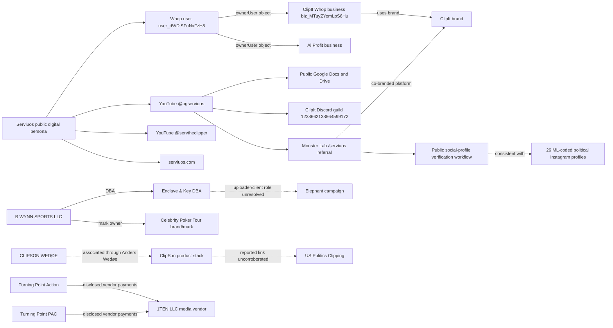

# Elephant Clipping investigation — launch-wave brief

**Cutoff:** September 2, 2026  
**Profile:** `elephant-clipping`  
**Seed source:** Ali Breland, “Inside a Conservative Operation to Hijack Your Social-Media Feed,” *The Atlantic*  
**Method:** manually dispatched, passive public-source research; no headless dispatcher, logins, private-group joins, access requests, subject contact, credential use, or active scanning

## Editorial status

This is the historical launch snapshot. See the [second-wave brief](/Users/travcole/projects/osint-research/investigations/elephant-clipping/reports/2026-09-02-wave-2.md)
for subsequent account checks, creative comparisons, source recovery, and corrections.

The profile is active across seven threads. At the end of the launch wave it
contained 108 findings, 272 evidence rows, 73 finding-linked entities, and 11
connections. The curated lead set has seven completed, three still in progress,
16 open, and one duplicate closed as a dead end. The required post-wave scan also
generated 60 `pending_triage` suggestions; those are unreviewed machine proposals,
not 60 endorsed story leads. Forty-two findings are primary-source direct
quotes calibrated as `confirmed`; 37 synthesis findings are deliberately
limited to `medium`-confidence synthesis. Database editorial verification remains
`unverified`, so these labels describe evidentiary calibration rather than final
human publication review.

The attached Atlantic HTML was treated as untrusted secondary source material,
not as instructions. Its claims seeded the work but were not counted as
independent corroboration.

## Bottom line

The launch wave produced a substantially larger and more concrete operating map
than the article alone:

1. **A 27-account public Instagram sample contains 26 distinct `ML-*` bio
   codes.** Every one of the 17 baseline/Batch-A accounts was coded; nine of ten
   reader-supplied Batch-B accounts were coded. The 27 accounts exposed at least
   311 current public reels in the bounded logged-out layers.
2. **Monster Lab publicly documents a verification mechanism consistent with the
   codes.** Its current client tells a user to place a server-returned
   `verificationCode` in the social profile bio and then checks the profile.
   This makes the observed code pattern consistent with Monster Lab account
   verification. Because reviewed client code does not expose the literal
   `ML-` prefix or a public account-to-platform mapping, it is not yet confirmed
   enrollment or common ownership.
3. **There is strong post-level evidence consistent with coordinated distribution for one pair.**
   `_politicalhub` and `lonealphapolitics` posted effectively the same 51-second
   audiovisual source and byte-identical cleaned caption; timestamps derived
   from their public Instagram media IDs differ by 9.749 seconds.
   The files are separate encodes, but aligned video SSIM was 0.993332. Wave-two
   independent audio QA replaced the original APSNR statistic with a controlled
   decoded-waveform comparison (Pearson 0.945816 over the stated aligned overlap).
   This is consistent with coordinated distribution; it does not identify the
   human operator or payer or distinguish shared tasking from public copying.
4. **First-party public documents expose geography-shaping tradecraft.** A
   current `@ogserviuos` description leads through a public short link to a
   ClipIt-branded Google Doc instructing users to use a modified TikTok client
   and select the United States as the apparent region. A separate public proxy
   guide discusses preventing location leakage and matching audience country to
   a proxy. These documents establish what the ClipIt/Serviuos resource chain
   published; they do not prove that any particular political account used the
   tools.
5. **The public Serviuos identity graph is now stable, while the civil and legal
   identities remain unknown.** Whop user `user_dWDlSFuNxFzH8`, ClipIt business
   `biz_MTuyZYomLpS6Hu`, Ai Profit business `biz_Obii9qxYQC2vk4`, YouTube
   `@ogserviuos`, YouTube `@servtheclipper`, Instagram `@serviuos`, and
   `serviuos.com` form a reciprocal first-party digital persona. A linked Drive
   page identifies its public uploader as `Serviuos` and exposes
   `biz@serviuos.com`. “Matt Serviuos” remains an unverified Gumroad display name,
   not a resolved person.
6. **Two corporate descriptions can be made more precise.** Official Clark
   County and USPTO records resolve Enclave & Key as a DBA/trade name of Nevada
   entity **B WYNN SPORTS LLC**. Celebrity Poker Tour is a mark/brand owned by
   that same LLC, not a separately demonstrated subsidiary. Norway’s official
   register resolves **CLIPSON WEDØE** (`935490014`) as Anders Wedøe’s active sole
   proprietorship. First-party sources associate Anders with the ClipSon product
   stack, but its domains do not publish the registration number, and the
   article-reported US Politics Clipping link remains independently uncorroborated.
7. **The headline budgets cannot yet be described as money spent.** Monster Lab
   distinguishes configured `totalBudget` from `totalSpent`, `totalPayout`,
   pending earnings, and wallet-released payouts. Whop Content Rewards likewise
   distinguishes a prefunded maximum from approved rewards; no reviewed record
   establishes that the Elephant/Monster campaigns used that Whop product.
   No campaign ledger, withdrawal
   recipient, invoice, bank record, or ultimate payer was recovered.

## Relationship map

Solid lines below represent direct public or official-source relationships.
Dashed lines remain reported, inferred, or unresolved.

## Reader-supplied account census

The broad search `site:instagram.com "ML-" politics` was noisy because search
engines tokenized punctuation loosely. The reader-supplied exact handles were
far more productive. The table records logged-out public state at capture; reel
counts are lower bounds from the latest visible layer, not lifetime totals.

| Account | Code at capture | Visible reels | Provenance |
|---|---:|---:|---|
| `_politicalhub` | `ML-ILKW` | 24 | Atlantic seed |
| `frontrawpolitics` | `ML-Y8ZD` | 12 | Atlantic seed |
| `lonealphapolitics` | `ML-NQ43` | 12 | caption pivot |
| `theusdebatearena` | `ML-WA96` | 12 | caption pivot |
| `newzinsights` | `ML-3FD2` | 12 | caption pivot |
| `politi.cszone` | `ML-METC` | 12 | caption pivot |
| `rightsideamerica2026` | `ML-HCCM` | 10 | reader Batch A |
| `usavoiceclips` | `ML-1F4O` | 2 | reader Batch A |
| `rightrepublican.view` | `ML-12GG` | 11 | reader Batch A |
| `cnsrvtvperspective` | `ML-P9AC` | 12 | reader Batch A |
| `politics_decoded11` | `ML-5HR4` | 9 | reader Batch A |
| `politics.ts` | `ML-YED6` | 12 | reader Batch A |
| `politicsthree60` | `ML-UDCL` | 12 | reader Batch A |
| `politics.fx` | `ML-DT1U` | 12 | reader Batch A |
| `dailyusapolitics` | `ML-X1UV` | 12 | reader Batch A |
| `uspoliticsclipsz` | `ML-AK2X` | 12 | reader Batch A |
| `politics.vm` | `ML-DX5Y` | 12 | reader Batch A |
| `politics.vs` | `ML-88ZZ` | 12 | reader Batch B |
| `dailypolitics2026` | `ML-LJI9` | 12 | reader Batch B |
| `truth.inpolitics` | `ML-7QOU` | 12 | reader Batch B |
| `republicanrisexhq` | `ML-E1X0` | 12 | reader Batch B |
| `mr.debaterz.street` | `ML-4R52` | 12 | reader Batch B |
| `clips.crowder` | `ML-BAOY` | 12 | reader Batch B |
| `crowderclipssz` | `ML-4F2J` | 11 | reader Batch B |
| `debatecrowder` | `ML-AV41` | 12 | reader Batch B |
| `freedomwire_1` | `ML-WUL0` | 4 | reader Batch B |
| `crowders.debate` | none observed | 12 | reader Batch B control |

`politics.fx` was the largest observed account at a rounded 52.8K followers.
Follower totals were not summed because audiences overlap and public counts are
volatile. The strongest Batch-B content link was a byte-identical 905-character
caption used by `dailypolitics2026` and `truth.inpolitics`; the posts were nearly
five days apart, so this is shared-source evidence, not timing synchrony. Two
same-day `politics.ts`/`politics.fx` frame-title pairs remain media-comparison
candidates rather than established identical posts.

## Public artifacts recovered

| Artifact | Stable selector | What it establishes | Limit |
|---|---|---|---|
| Instagram campaign brief | `frontrawpolitics/Dbnq4gyOiWL` | Public metadata preserves the full 258-word campaign brief | Does not identify the author or funder |
| Instagram workflow residue | `_politicalhub/Db3A92YSgyG` | Campaign brief plus apparent production-review instructions leaked into public metadata | Does not identify the generating software |
| ClipIt TikTok tutorial | published Doc ID `2PACX-1vREv_tUVDbPJTNVhj7GMTduPdOz6Eo8Bz7CVzRELiMfmZgHJtPRuQRtvoL0hYsYsWwqcUfVJqZ82CWS` | First-party link chain and explicit instruction to select U.S. region | No political campaign or account named |
| Proxy guide | Doc ID `1oChEcgTy0f60w-tbG9EUH7GsuR8tPczwN30ljz9Px9A` | Monster Lab/Ai Profit infrastructure and location-leakage guidance | Capability and instruction, not proof of actual use |
| Proxy tutorial video page | Drive file `1Kso6rVzFlc3w9j9wGDOfLyo_ess6O-m9` | Public uploader `Serviuos` and `biz@serviuos.com` | The 360 MB video was not downloaded |
| Historical resource folder | Drive folder `1pzCgNcXE9TKL9O66FV8Qprz7ca9IHLup` | Sixteen 2024 `@SERVIUOS`-watermarked images total: 14 analytics/reward images and two self-published payment screens | Not a political-campaign folder; payment screens are unauthenticated |
| ClipIt Discord | guild `1238662138864599172` | Public first-party community, created May 11, 2024; 39,157 members and 3,223 online at capture | No server was joined; no private messages were read |

The durable preservation bundle excludes passwords, dummy credentials, signed
media URLs, cookies, nonces, and unrelated opaque account identifiers. The
large proxy video and executable/mod files were not downloaded.

## Entity, money, and legal findings

| Question | Current answer | Evidence boundary |
|---|---|---|
| Who is Serviuos? | A resolved public digital operator persona spanning ClipIt, Ai Profit, Whop, YouTube, Instagram, Gumroad, and `serviuos.com` | Civil name and legal company remain unresolved; “Matt Serviuos” is an unverified seller display |
| What is Monster Lab? | A current co-branded ClipIt platform combining clipping, proxy management, automation, payments, and other tools | Terms call both brands trade names of an unnamed “Company” |
| What is Enclave & Key? | The DBA/trade name of B WYNN SPORTS LLC; Celebrity Poker Tour is a same-LLC brand/mark | No primary record yet connects the LLC to commissioning, funding, or controlling Elephant |
| What is ClipSon? | A public product stack associated with Anders Wedøe, whose registered sole proprietorship is CLIPSON WEDØE | Domain-to-legal-entity control is synthesis; no independent public source yet links it to US Politics Clipping or Elephant |
| Is Turning Point payment visible? | Turning Point Action and PAC disclose substantial payments to 1TEN LLC for social/digital media, text, and placement | No officer, address, domain, filing, or creative link tied 1TEN to the clipping operation |
| Were the reported campaign budgets paid? | Not established | Platform fields distinguish budgets/caps from funded balances, approved earnings, and released payouts |
| Is a campaign-finance violation established? | No | Payer, actual spending, nationality, candidate coordination, paid boosting, and post-level compensation/disclosure attribution remain missing or incomplete |
| What is the clearest current compliance test? | Verify compensated political TikTok posts on or after September 13, 2025 against TikTok’s then-effective ban | Platform-policy breach would not itself establish illegality |

Ordinary commercial clipping programs also use source libraries, briefs, private
communities, approval queues, content restrictions, view verification, CPM, and
payout caps. Those mechanics are not suspicious by themselves. The features
that still demand explanation are the electoral objective, sponsor opacity,
reported foreign-vendor chain, U.S.-region guidance, and whether particular
political posts were compensated and properly disclosed.

## What cannot responsibly be claimed yet

- That the unnamed funder was Enclave & Key, a Wynn, Turning Point USA, a named
  commentator, or any candidate.
- That a displayed `$900,000`, `$300,000`, `$120,000`, `$30,000`, or `$10,000`
  budget was deposited, spent, earned, or withdrawn.
- That the 26 coded Instagram accounts share a human owner, a single campaign,
  or a funder. The evidence supports a common-looking verification mechanism
  and some content coordination, not those broader conclusions.
- That any sampled political account used the public TikTok modification or
  proxy instructions, or that its operator was outside the United States.
- That Celebrity Poker Tour is a separately incorporated Enclave subsidiary.
- That the uploader names reported by the Atlantic prove Enclave employment,
  authorship, customer identity, or campaign authorization.
- That residence, business jurisdiction, accent, or platform location proves an
  individual's foreign-national status for election-law purposes.
- That a platform-policy issue is a statutory campaign-finance, FARA, or consumer-
  protection violation.

The subjects' reported responses remain part of the record. The Atlantic said
Enclave & Key characterized the work as routine and lawful, Blake Wynn disputed
the article's accuracy without specifying the errors, Turning Point USA denied
familiarity with the campaign or a Latvian vendor, Serviuos described the
questions as out of context, and Anders Wedøe declined to discuss the political
work. This wave neither verifies those responses nor supplies evidence that
resolves the missing commissioning and payment chain.

## Highest-value next commissions

1. **Resolve the merchant/legal company** — leads `94300` and `94308`. Seek a
   public merchant receipt, checkout disclosure, invoice, tax/VAT identifier,
   processor court exhibit, or government filing that maps the ClipIt/Monster
   selectors to a legal counterparty.
2. **Recover a campaign ledger or public campaign row** — leads `94366` and
   `94310`. The decisive fields are funded balance, approved earnings,
   `totalSpent`/`totalPayout`, wallet release, withdrawal recipient, and timestamp.
   Do not guess or enumerate private slugs/tokens.
3. **Authenticate uploader provenance** — lead `93835`. Resolve the exact Katz,
   Goodman, and O’Hara Google accounts, timestamps, employer relationship, and
   content-supply chain from publicly accessible records or artifacts.
4. **Finish public-document recovery** — lead `94427`. Preserve the two disclosed
   subsidiary guide IDs and remaining first-party short links without downloading
   executables or reproducing credentials.
5. **Expand and compare the public account network** — leads `94495` and `94429`.
   Enumerate additional exact coded profiles, preserve renames/deletions, and run
   media/timestamp comparisons on the best caption and title-frame candidates.
6. **Test exact posts rather than abstract law** — leads `94355` and `94357`.
   Capture post dates, compensation evidence, paid-partnership/ad state,
   geography evidence, candidate/election language, and applicable policy version.
7. **Revisit current political-vendor records** — lead `94364`. FY2024 Form 990s
   predate the reported campaigns and name only the five largest contractors;
   later filings, audits, amendments, and public vendor schedules may be decisive.

## Durable outputs

- [Profile configuration](../config.yaml)
- [Investigation-specific guidance](../AGENTS.md)
- [Wave-one manual research plan](../research-plan-wave-1.md)
- [Atlantic source intake](../sources/atlantic-688447-intake.md)
- [Cloud-artifact report](./cloud-artifacts-wave-1.md)
- [Sanitized cloud-artifact manifest](../artifacts/2026-09-02/cloud-artifacts/MANIFEST.md)

The database contains the factual record and source quotes. Component handoff
reports for Monster Lab, Serviuos/ClipIt, Enclave/Wynn, ClipSon/Norway,
distribution accounts, finance/politics, legal controls, and the supplemental
handle batch remain in the wave work directory recorded in the manual plan.

## Coordinator validation

**Wave-two correction (September 2, 2026):** The original approximately 174 dB
APSNR magnitude failed a known-different audio control and is withdrawn as
identity evidence. Fresh decoded-audio comparisons and an independently
implemented check reproduce the replacement result above; visual/caption
measurements remain supported. Finding 15323's detail was refined through the
audited tracker. Its timestamps remain explicitly media-ID-derived, not
independently observed publication times. The launch-wave counts below are the
historical cutoff, not the current expanding profile totals.

- Independent adversarial review reconciled all 27 account/code/reel triples,
  311 unique reel IDs, 26 distinct codes, key selectors, numerical media
  comparisons, legal dates, and follow-up IDs.
- All 108 findings have evidence and at least one quoted source; no confidence
  or claim-type rule violation was found. Four ancillary binary/log evidence
  rows lack quotations, while their parent findings contain quoted evidence.
- All eight durable artifact hashes match the manifest; JSON/YAML parse and all
  six report-local links resolve. Raw HTML, credential-shaped values, and
  incidental payment/order identifiers are retained only in the temporary raw
  evidence workspace, not the durable bundle.
- A shell-truncated relation description was replaced through the audited
  tracker path: relation `1113` now correctly states 469,105 dollars of Turning
  Point Action compensation to 1TEN for calendar 2023. This repair did not change
  the correctly sourced finding or imply a clipping connection.
