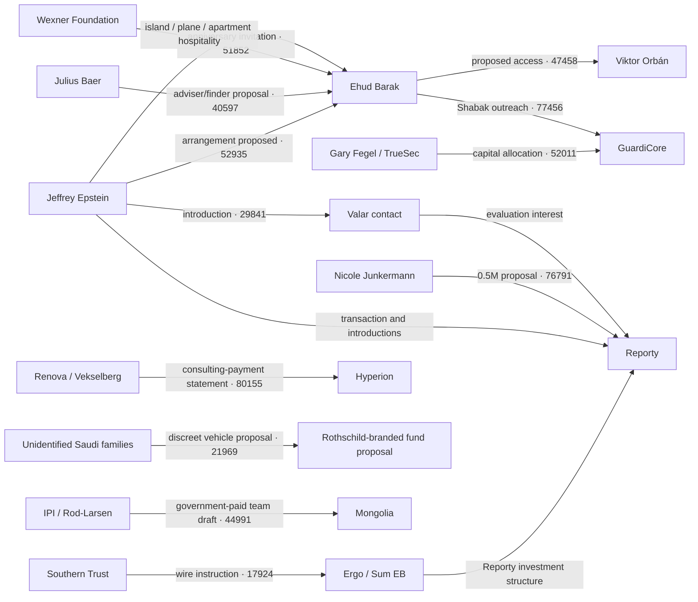

# Ehud Barak email corpus: exhaustive offline review

**Review date:** 2026-08-25  
**Corpus:** `datasets/barak_emails.db`  
**Evidence status:** hacked/Cyberwar-category material; lead generation only

## Evidentiary warning

This corpus was published from a hacked source and may be incomplete, altered, or implanted. Nothing in this report is confirmed by the leak alone. “Fact” below means only that the cited corpus message contains the quoted text; it does not authenticate the message or establish that the underlying event occurred. Every inference is labeled and requires corroboration against independent primary records.

The review was offline and text-only. No URL appearing in a message was opened or fetched. No attachment was opened, extracted, rendered, executed, or inspected. Attachment filenames, hashes, and types were used only as catalog metadata. Incidental personal, passport, account, and telephone identifiers were minimized.

## Method and coverage

Layer A followed the folder/offset plan required for this corpus because normalized dates are unavailable for most HTML records. Every returned preview was triaged; full bodies were read selectively only after triage. Duplicate representations and cross-folder copies were collapsed on sender, subject, and date, preferring HTML or EML over metadata previews.

| Shard | Assignment | Rows triaged | Errors |
|---|---|---:|---:|
| S01 | Gmail Inbox offset 0 | 5,000 | 0 |
| S02 | Gmail Inbox offset 5,000 | 5,000 | 0 |
| S03 | Gmail Inbox offset 10,000 | 5,000 | 0 |
| S04 | Gmail Inbox offset 15,000 | 5,000 | 0 |
| S05 | Gmail Inbox offset 20,000 | 5,000 | 0 |
| S06 | Gmail Inbox offset 25,000 | 2,488 | 0 |
| S07 | Gmail Sent offset 0 | 5,000 | 0 |
| S08 | Gmail Sent offset 5,000 | 5,000 | 0 |
| S09 | Gmail Sent offset 10,000 | 386 | 0 |
| S10 | Hyperion Inbox/Sent plus Gmail Inbox!1/Inbox!2 | 4,599 | 0 |
| S11 | Nine large Gmail folders plus 16 small nested/system folders | 4,602 | 0 |
| S12 | Nine Gmail folders plus Hyperion Inbox!3/system folders | 4,586 | 0 |
| S13 | Nine 502-row folders plus small Gmail/Hyperion folders | 4,582 | 0 |
| S14 | Nine 501-row folders plus Sent!5/Sent!6 and small folders | 4,592 | 0 |
| S15 | Nine 500/501-row folders plus Sent!20 and Hyperion Inbox!2 | 4,615 | 0 |
| S16 | Gmail Inbox!21/24/28/32/36/37/38/39/40/42 | 5,000 | 0 |
| S17 | Gmail Inbox!43/44/45/48/7/8/9 and Sent!10/11/12 | 5,000 | 0 |
| S18 | Remaining Sent/Archive/VV-AZ-JB folders and Hyperion Inbox!1 | 4,771 | 0 |
| **Total** | **All 108 folders, both mailboxes** | **80,221** | **0** |

There were no failed systematic shards, offset gaps, query errors, or unread returned previews. The deduplication step removed representation copies and repeated quoted threads from the findings count; it did not remove unique messages from coverage.

Layer B separately searched the requested names and themes, then de-duplicated its hits against Layer A and the existing Epstein investigation. Its exact query accounting appears below.

### Layer B thematic coverage

The five thematic sweeps ran 77 requested searches. They returned 21,456 rows; every returned preview was triaged, no query reached its limit, and no command errored. Counts are not additive across sweeps because names and themes overlap heavily.

| Sweep | Focus | Queries | Raw rows | Unique message IDs | Canonical groups | Errors/truncation |
|---|---|---:|---:|---:|---:|---:|
| T01 | Epstein, Wexner, Gates, social, women/recruitment | 16 | 5,236 | 3,139 | 2,529 | 0 |
| T02 | Thiel, Junkermann, Reporty, cyber/intelligence, passports/visas | 17 | 6,121 | 5,000 | 3,971 | 0 |
| T03 | Gulf, Asia, SoftBank, and money terms | 15 | 5,033 | 4,276 | 2,654 | 0 |
| T04 | Russia and European elite networks | 13 | 747 | 579 | 579, then manual thread deduplication | 0 |
| T05 | Israeli politics, legal counsel, litigation, and PR | 16 | 4,319 | 3,869 | 3,218 | 0 |
| **Total** | **Requested Layer B scope** | **77** | **21,456** | **Not additive** | **Not additive** | **0** |

Important bounded negative results are part of the review. Exact searches returned no hits for `Bannon`, `Carbyne`, `Carbyne911`, `Masa Son`, `Arif Naqvi`, `OneWeb`, `Wyler`, `Rybolovlev`, `Dmitry Rybolovlev`, `Reid Weingarten`, `Kathy Ruemmler`, `Ruemmler`, or `Brad Karp`. `Abraaj` produced one newsletter hit; MBS-related hits were public/news material rather than direct correspondence; Deripaska appeared chiefly in public material and one tentative SPIEF event listing. Passport and visa hits resolved to routine travel administration, news, or payment-card uses. The women/recruitment/massage sweeps found no direct evidence of Epstein recruiting young women, scheduling a massage through Barak, or misconduct involving the reviewed admissions or internship messages. These are search-string-bounded observations, not proof that no record exists under an alias, in unindexed text, or in excluded attachment content.

## Executive synthesis

**Inference, not confirmation:** the strongest recurring pattern is a post-office business system in which Barak’s political and security relationships, Hyperion/Ergo corporate vehicles, cyber investments, and Epstein’s financing or introductions repeatedly overlap. The corpus alone cannot establish that a proposed arrangement closed, that an asserted payment settled, or that any conduct was lawful or unlawful.

### 1. The Epstein–Barak relationship appears financial and operational, not merely social

- **BARAK:52935** — source_path `ehbarak1@gmail.com/Inbox!41/1 (489).html`. Quote: “continue our present arrangement as agreed untl march, for the total of 5. After, it should be reduced to 2 million per year”. **Fact:** Epstein described an existing arrangement, an ambiguous “total of 5,” a later annual figure, and profit participation. **Inference:** currency, payer, services, acceptance, and payment are not identified. Tracker: lead **88189**, finding **14894**.
- **BARAK:45815** — source_path `ehbarak1@gmail.com/Inbox!40/1 (494).html`. Quote: “after this quarter which will conclude our first agreement. I suggest we change the arrangement to a retainer with a percentage of profits.” **Fact:** Epstein referred to a first agreement and proposed new economics. **Inference:** its relationship to BARAK:52935 requires contracts and bank records. Tracker: finding **14894**.
- **BARAK:57779** — source_path `ehbarak1@gmail.com/Inbox!24/1 (282).html`. Quote: “My accountant in IL will look tomorrow into the idea of our Joint NewCo.” **Fact:** Barak described joint-entity planning after a USVI weekend. **Inference:** no formation or ownership is established. Tracker: lead **88410**, finding **14925**.
- **BARAK:56971** — source_path `ehbarak1@gmail.com/Inbox!24/1 (229).html`. Quote: “our partnership as a US LLC.” **Fact:** the phrase appears during the Reporty decision period. **Inference:** the entity, members, capitalization, and tax purpose remain unresolved. Tracker: finding **14925**.

### 2. Reporty financing is the clearest multi-message transaction chain

- **BARAK:17924** — source_path `ehbarak1@gmail.com/Inbox!20/1 (303).html`. Quote: “I sent wire instructions to the bank this morning to fund the first $1,000,000 under the SPA.” **Fact:** forwarded Indyke text identifies Southern Trust as sender and Ergo as recipient. **Inference:** settlement and beneficial purpose need bank and ledger evidence.
- **BARAK:17139** — source_path `ehbarak1@gmail.com/Inbox!20/1 (485).html`. Quote: “Only upon conversion of the loan (hopefully it will be a good investment), the name of the "investor" shall be public and known.” **Fact:** counsel proposed delayed investor disclosure in a convertible-loan structure. **Inference:** adoption, identity, and legal purpose are unproved.
- **BARAK:37157** — source_path `ehbarak1@gmail.com/Inbox!3/1 (291).html`. Quote: “מימוש כל כתבי האופציה ובלא להתחשב בדילול כתוצאה מהשקעה אחרת יביא לאחזקה של מעל ל-50% בחברה.” **Fact:** counsel wrote that exercising all warrants would produce more than 50% ownership before other dilution. **Inference:** the final cap table is unknown.
- **BARAK:50514** — source_path `ehbarak1@gmail.com/Inbox!22/1 (283).html`. Quote: “Pl find attached the signed TS.” **Fact:** Barak circulated a message so describing the term sheet to Epstein, Nicole Junkermann, and Darren Indyke. **Inference:** the attachment was not opened and definitive closing is not established.
- **BARAK:65229** — source_path `ehbarak1@gmail.com/Inbox!1/1 (53).html`. Quote: “generating: Info, indoor maps, people patterns and the most important money.” **Fact:** a Reporty investor pitch described government-facing data collection and monetization. **Inference:** implementation, contracts, data practices, and revenue require company and procurement records.

These messages are consolidated in existing Reporty lead **1127** and findings **14857**, **14859**, **14868**, **14870**, **14872**, **14876**, **14886**, **14906**, and **14907**, rather than being re-derived as duplicate findings.

Some underlying shard reports use “Reporty/Carbyne” shorthand. This report treats Reporty as the period-specific entity named in the emails; any historical Reporty-to-Carbyne corporate linkage must be established from independent registry and company records.

### 3. The cyber-investment network joined ownership, government access, and offensive-surveillance proposals

- **BARAK:75002** — source_path `ehbarak1@gmail.com/Sent!15/1 (48).html`. Quote: “I said it's a package deal (chairmanship, shares, NSO consultancy and at least half of the USD 3m investment).” **Fact:** the Kaymera thread combines role, equity, NSO consulting, and investment terms. **Inference:** no closing or role is established.
- **BARAK:40438** — source_path `ehbarak1@gmail.com/Sent!18/1 (37).html`. Quote: “גודל העסקאות כ 10-15 מליון דולר.” **Fact:** a forwarded 2013 NSO/Pegasus pitch states approximate USD10–15 million deal sizes and describes government surveillance. **Inference:** technical claims, customers, sales, and Barak’s participation are unverified.
- **BARAK:62236** — source_path `ehbarak1@gmail.com/Inbox!37/1 (94).html`. Quote: “an Advanced Cyber Lab who's main purpose could be create Proof of Concepts that we can try selling using Ehud's connections.” **Fact:** the proposal covers offensive-cyber prototypes and Barak’s connections. **Inference:** formation, products, customers, or sales are not shown.
- **BARAK:77456** — source_path `ehbarak1@gmail.com/Sent!12/1 (339).html`. Quote: “I've sent to the head of Shabak the 1p and one page of my advice. They will contact you for sure.” **Fact:** Barak claimed he sent GuardiCore material to the Shin Bet head. **Inference:** receipt, review, procurement, or deployment needs agency records.
- **BARAK:63552** — source_path `ehbarak1@gmail.com/Inbox!30/1 (365).html`. Quote: “have them redo and take out pay pal name, just put in ‘relevant US companies’”. **Fact:** Epstein instructed removal of PayPal’s name from material after Barak requested an introduction. **Inference:** motive, transmission, and any PayPal relationship are unresolved.
- **BARAK:15313** — source_path `ehbarak1@gmail.com/Inbox!18/1 (255).html`. Quote: “CNTP’s investment committee formally approved the $10 million investment.” **Fact:** Yaron Eitan made that statement about Fifth Dimension. **Inference:** closing, funder, terms, and Barak’s package need primary corporate records.

The principal tracker cluster is lead **88009**, with findings **14860**, **14862**, **14874**, **14875**, **14887**, **14893**, **14909**, **14910**, **14919**, **14928**, **14929**, **14931**, **14934**, and **14939**.

### 4. Paid advisory and corporate flows are unusually specific

- **BARAK:80155** — source_path `ehbarak1@gmail.com/[Gmail]/VV,AZ,JB/1 (147).html`. Quote: “The payment was executed. Below, you can find the interbank SWIFT information re our contract.” **Fact:** the body carries a USD1 million field and identifies Renova/Hyperion consulting context. **Inference:** the SWIFT text and settlement need bank authentication.
- **BARAK:53759** — source_path `ehbarak1@gmail.com/Inbox!46/1 (379).html`. Quote: “I'm ready to close on CHF600k (+expenses) and start working next week.” **Fact:** Barak proposed a TrueSec-routed Julius Baer engagement at that price. **Inference:** execution and payment require the contract and bank records.
- **BARAK:80111** — source_path `ehbarak1@gmail.com/[Gmail]/VV,AZ,JB/1 (141).html`. Quote: “Let's do it. We virtually shake-hands. We will sit down in 1 year from now and review.” **Fact:** Boris Collardi replied with assent. **Inference:** an enforceable agreement or payment is not proved by this exchange alone.
- **BARAK:72244** — source_path `ehbarak1@gmail.com/Inbox!38/1 (328).html`. Quote: “three payments to you in 2013, in the amounts of $30,000, $37,500, and $7,500, totaling $75,000”. **Fact:** Ergo itemized compensation and separately referenced profit share. **Inference:** receipt and contractual treatment require ledgers and bank records.
- **BARAK:42139** — source_path `ehbarak1@gmail.com/Inbox!32/1 (288).html`. Quote: “PointState Capital, who have asked that my firm pay you for research consulting services provided to them.” **Fact:** a third party described paying Barak for PointState research consulting. **Inference:** amount, work product, use, and settlement are unknown.

These messages refine broad paid-advisory lead **88007** and findings **14864**, **14866**, **14869**, **14882**, **14900**, **14901**, **14911**, **14912**, **14915**, **14916**, **14917**, **14932**, and **14933**.

### 5. Government and intelligence access repeatedly appears beside private work

- **BARAK:53065** — source_path `ehbarak1@gmail.com/Inbox!46/1 (485).html`. Quote: “Putin asked that i meet him in st petersburg the same time as his economic conference”. **Fact:** Epstein made this claim to Barak. **Inference:** Putin’s request is unverified. It refines existing Epstein–Putin/Jagland finding **200**.
- **BARAK:53247** — source_path `ehbarak1@gmail.com/Inbox!46/1 (498).html`. Quote: “jagland asked that I make myself availble to meet with him sometine in june, to explain how russia can structure deals”. **Fact:** Epstein made this claim. **Inference:** Jagland’s request and any meeting require calendars and official records.
- **BARAK:35649** — source_path `ehbarak1@gmail.com/Sent!16/1 (493).html`. Quote: “I would like to meet with President Putin for 30-40min at an early opportunity.” **Fact:** Barak asked Yuri Ushakov for access. **Inference:** no response or meeting is shown. Tracker: lead **88362**, finding **14923**.
- **BARAK:72960** — source_path `ehbarak1@gmail.com/Inbox!31/1 (212).html`. Quote: “I can even leave you one on one for some time during the meeting.” **Fact:** Barak offered to broker private Viktor Vekselberg–Viktor Orbán time around a business agenda. **Inference:** occurrence and outcome are unproved. Tracker: lead **88108**, finding **14879**.
- **BARAK:75204** — source_path `ehbarak1@gmail.com/Sent!15/1 (440).html`. Quote: “sources in Nigeria DO NOT know the purpose of the questions and/or identity of end user( namely myself).” **Fact:** Barak requested source concealment for proposed presidential dossiers. **Inference:** client, use, sources, and legality are unresolved. Tracker: finding **14867**.
- **BARAK:69868** — source_path `ehbarak1@gmail.com/Sent!14/1 (291).html`. Quote: “KKR is a client, and we believe there are many new opportunities for Ergo to support Gen. Petraeus and his institute.” **Fact:** Ergo proposed using Barak’s Petraeus relationship for business development. **Inference:** no engagement is established. Tracker: finding **14942**.

### 6. Travel and hospitality evidence is more concrete than generic scheduling

- **BARAK:64623** — source_path `ehbarak1@gmail.com/Inbox!39/1 (383).html`. Quote: “I'm still trying to arrange that the security guys will NOT come with us to the island.” **Fact:** Barak described trying to exclude security from the trip. **Inference:** reason and final arrangement are unknown.
- **BARAK:50113** — source_path `ehbarak1@gmail.com/Inbox!22/1 (253).html`. Quote: “He joined me to LSJ on the second day.” **Fact:** a later St. Thomas exchange says a guard joined at “LSJ.” **Inference:** “LSJ” likely means Little Saint James; the sequence suggests, but does not prove, the earlier exclusion attempt failed.
- **BARAK:58992** — source_path `ehbarak1@gmail.com/Inbox!12/1 (230).html`. Quote: “We are in the apartment. So cute. And your team prepared it with so much attention to details.” **Fact:** Barak thanked Epstein for apartment hospitality. **Inference:** location, ownership, value, and duration require records.

Tracker: lead **88141**, findings **14884**, **14914**, **14926**, and **14941**. No sexual conduct is inferred from these travel messages.

### 7. Discrete high-risk document and legal leads

- **BARAK:72797** — source_path `ehbarak1@gmail.com/Inbox!38/1 (489).html`. Quote: “the north koreans have approached some people. As an american I cannot do biz there.” **Fact:** Epstein relayed a North Korea infrastructure-for-mining approach. **Inference:** actors, project, sanctions analysis, and follow-up are unknown. Tracker: lead **88412**, finding **14927**.
- **BARAK:73849** — source_path `ehbarak1@gmail.com/Inbox!36/1 (309).html`. Quote: “Ehud asked me to send it to you, following the signing of the NDA.” **Fact:** the subject labeled material “DHSG classified information” and the body described an NDA-gated transfer to Andrew Intrater. **Inference:** actual classification, authority, and contents are unverified; the attachment was not opened. Tracker: lead **88414**, finding **14928**.
- **BARAK:74994** — source_path `ehbarak1@gmail.com/Sent!15/1 (273).html`. Quote: “אורי אנא התקשר אליו. הוא הרמטכ״ל ועדכן אותו במשלוח.” **Fact:** the thread says an IWI handgun was being sent to Mongolia and identifies a chief-of-staff contact. **Inference:** export license, recipient, delivery, and compliance need official records. Tracker: lead **88496**, finding **14943**.
- **BARAK:69524** — source_path `ehbarak1@gmail.com/Sent!13/1 (430).html`. Quote: “Pl send the invoice for the 2 pistols to: Hyperion Ltd.” **Fact:** Barak directed the invoice to Hyperion. **Inference:** purchaser, users, licensing, purpose, and accounting are unstated. Tracker: lead **88155**, finding **14892**.

## Thematic deltas after cross-profile de-duplication

Most Layer B hits sharpened evidence already represented by Epstein-profile leads, so they were added as evidence rather than re-created. The durable additions below are the thematic material that changed the synthesis.

### T01 — Epstein, social access, and recruitment terms

- **BARAK:51641** — source_path `ehbarak1@gmail.com/Sent!7/1 (285).html`. Quote: “Thx again for the wonderful weekend in the USVI. Your island was the pinnacle of it.” **Fact:** Barak wrote this first-person thank-you to Epstein. **Inference:** the exact island, dates, attendees, and events require travel and security records. This and the plane/apartment messages produced finding **14946** under existing travel lead **88141**.
- **BARAK:51852** — source_path `ehbarak1@gmail.com/Sent!7/1 (207).html`. Quote: “I'll be honored and proud to attend.” **Fact:** Barak accepted a Wexner Foundation 30th-anniversary invitation; later messages addressed security. **Inference:** attendance needs event records, and no Epstein nexus follows from these messages alone. Tracker: existing lead **2849**, finding **14947**.
- **BARAK:24727** — source_path `ehbarak1@gmail.com/Inbox/1 (407).html`. Quote: “A recent visitor tells me Epstein has a houseful of young women in his East 71st Street mansion.” **Fact:** Epstein forwarded a reporter's allegation that Dershowitz had forwarded to him. **Inference:** it is nested hearsay, does not establish age or truth, and does not implicate Barak. It was retained in this report as a cautionary lead, not promoted as a durable finding.

### T02 — Reporty, cyber, intelligence, and travel documents

- **BARAK:36104** — source_path `ehbarak1@gmail.com/Sent/1 (303).eml`. Quote: “we would need a legal (side) letter confirming the ultimate controlling/owner person of the BVI entity of your client.” **Fact:** a lawyer requested beneficial-owner confirmation in the Reporty investment thread. **Inference:** the owner, final vehicle, and purpose are unknown. Tracker: existing Reporty lead **1127**, finding **14945**; the same full EML also strengthens finding **14886**.
- **BARAK:52011** — source_path `ehbarak1@gmail.com/Inbox!41/1 (334).html`. Quote: “For Truesec Investments I will wire the USD 435k to Guardicore on monday or tuesday directly from my account.” **Fact:** Fegel stated this intended transfer and the thread separately allocated USD50,000 to Barak. **Inference:** settlement and booking require bank and cap-table records. This strengthened existing finding **14875** rather than creating a duplicate.
- Exact `Carbyne`/`Carbyne911` searches returned zero; `Reporty` returned 1,989 rows and is the period-relevant name in this corpus. The Reporty-to-Carbyne historical linkage still requires independent corporate records.

### T03 — Gulf, Asia, and capital flows

- **BARAK:21969** — source_path `ehbarak1@gmail.com/Inbox!11/1 (474).html`. Quote: “So that the identity of the fund investors may be kept discreet, we need to found the fund in Europe”. **Fact:** the proposal described discretion for Saudi-family investors in a Rothschild-branded Israeli life-sciences vehicle. **Inference:** formation, approval, investors, funding, and lawful purpose remain unverified. This strengthens critical lead **88191** and finding **14896**.
- **BARAK:33895** — source_path `ehbarak1@gmail.com/Inbox!34/1 (145).html`. Quote: “Our analysts have begun to research these ideas and determine how we can craft them into a trade.” **Fact:** the preceding sentence labeled one idea Barak's “Saudi currency idea.” **Inference:** no trade, profit, privileged source, or misconduct is established. Tracker: finding **14948** under advisory lead **88007**.
- **BARAK:78154** — source_path `ehbarak1@gmail.com/Inbox!7/1 (480).html`. Quote: “You are expected by the Chinese to give your name and reputation to our activities by carrying the title of Chairman”. **Fact:** a proposed Shanghai Alliance Investment arrangement sought Barak's name, chairmanship, and China exclusivity. **Inference:** acceptance, compensation, or performance is unknown. Together with Temasek introductions, this produced finding **14949**.
- **BARAK:3823** — source_path `ehud.barak@hyperion-eb.com/Inbox!1/1 (22).html`. Quote: “Investment - $1m (at least a portion personally) in current convertible loan round -Compensation – options to purchase 2.0%-2.5%”. **Fact:** the Cortica proposal paired a strategic role with investment and options. **Inference:** acceptance, funding, services, and issuance require company records. Tracker: lead **88524**, finding **14950**.

### T04 — Russia and European elite networks

- **BARAK:63391** — source_path `ehbarak1@gmail.com/Inbox!30/1 (466).html`. Quote: “we’ve tripled the remuneration, signed the contract and paid the advance payment.” **Fact:** this relayed statement appears in the Hungary/Kazakhstan-claim chain. **Inference:** payee, amount, services, and relationship to government access are unstated; no improper payment is inferred. Together with the proposed Hungary/Renova claim structure, it produced finding **14951** under lead **88108**.
- **BARAK:54089** — source_path `ehbarak1@gmail.com/Inbox!48/1 (68).html`. Quote: “Andy Intrater is the CEO of Columbus Nova, a family office investing in North America on behalf of Viktor Vekselberg”. **Fact:** Yaron Eitan made the introduction and proposed collaboration. **Inference:** ownership, mandate, meeting attendance, and any engagement require independent records. Tracker: finding **14952**.
- **BARAK:46224** — source_path `ehbarak1@gmail.com/Inbox!14/1 (135).html`. Quote: “Thx for setting the whole thing together.” **Fact:** Barak thanked Epstein in the SPIEF chain after reporting Russian official and financial contacts. **Inference:** the exact meetings Epstein arranged are unspecified. This augments existing finding **266**; it is duplicate leak provenance, not independent corroboration.
- **BARAK:66669** — source_path `ehbarak1@gmail.com/Sent Messages/1 (45).html`. Quote: “I've mentioned my interest in joining the list of invitees to the next year Bilderberg event”. **Fact:** Barak asked Kissinger for help and an assistant said the request was passed along. **Inference:** Kissinger action, selection, or attendance is not shown. Tracker: finding **14953**.
- **BARAK:13543** — source_path `ehbarak1@gmail.com/Inbox!44/1 (15).html`. Quote: “Can you ask Ehud whether he knows/thinks of this Israeli guy living in London.” **Fact:** Epstein forwarded the request attributed to Mandelson. **Inference:** the nested attribution and any hiring outcome are unverified. Tracker: finding **14954**. No Rybolovlev hits and no private Deripaska correspondence were found.

### T05 — Israeli politics, legal counsel, litigation, and PR

- **BARAK:40597** — source_path `ehbarak1@gmail.com/Sent!18/1 (142).html`. Quote: “retainer of usd200' p.a”. **Fact:** a forwarded Julius Baer proposal describes a retainer and asset-introduction compensation; adjacent messages provide performance terms, finder documents, claimed signing, and a request for discretion. **Inference:** the notation appears to mean USD200,000 annually, but the executed economics and payments require the original agreements and bank records. Tracker: existing lead **88007**, finding **14955**.
- **BARAK:67720** — source_path `ehbarak1@gmail.com/Inbox!52/1 (106).html`. Quote: “the vote will only be delayed if u convince bibi.” **Fact:** a sender asked Barak to persuade Netanyahu in a thread concerning a judicial-appointment bill. **Inference:** the bill, any contact, action, influence, or vote change are unproved. Tracker: lead **88544**, finding **14956**.
- **BARAK:23322** — source_path `ehbarak1@gmail.com/Inbox!42/1 (217).html`. Quote: “STS thinks that the only promising way to proceed at the present stage would be to subtly work in "society" circles in Rome”. **Fact:** a memorandum proposed this around an Italian Cassazione ruling. **Inference:** STS, the docket, client, mandate, contacts, and action are unresolved; no improper influence is established. Tracker: lead **88546**, finding **14957**.
- **BARAK:72540** — source_path `ehbarak1@gmail.com/Inbox!38/1 (343).html`. Quote: “additional material that can support a claim to retreive Salem's funds both in Julius Baer and in the Bank of China”. **Fact:** the email refers to a proposed funds-recovery claim. **Inference:** ownership, restraints, legal theory, Barak's role, fees, and disposition need court, bank, and engagement records. Tracker: lead **88548**, finding **14958**.
- **BARAK:51033** — source_path `ehbarak1@gmail.com/Sent!7/1 (150).html`. Quote: “send even this preliminary response to his editor/publisher or the DM board as well,in order to make sure that deterrence is working.” **Fact:** Barak proposed escalation in the Epstein-related press-response chain. **Inference:** transmission, effect, and the truth or falsity of the reporter's allegations remain unknown. This strengthened existing finding **14914**.
- **BARAK:40734** — source_path `ehbarak1@gmail.com/Sent!18/0000041942-Fwd_ Netanyahu apologizes for leaving Ehud Barak off all Obama guest lists - National Israel News _ Haaretz D.eml.meta`. Quote: “Try if u can make sure that Muli does not give a radio or tv piece to follow on this Verter piece.” **Fact:** Barak requested containment of follow-on coverage. **Inference:** recipient, action, rationale, and effect are unknown. Tracker: lead **88550**, finding **14959**.
- **BARAK:48601** — source_path `ehbarak1@gmail.com/Inbox!13/1 (455).html`. Quote: “We can press on the decision-makers to be that the ElsMed is the right partner”. **Fact:** a correspondent proposed this for a Kazakhstan hospital-equipment opportunity. **Inference:** no pressure, selection, award, or Barak action is established. Tracker: finding **14960**.
- **BARAK:22477** — source_path `ehbarak1@gmail.com/Inbox!45/1 (389).html`. Quote: “We have secured an honorarium of $75,000,plus $10,000 for airfare and home ground transportation expenses.” **Fact:** an invitation offered those terms and proposed Nigerian presidential access. **Inference:** payment, appearance, and meeting require primary records. Tracker: finding **14961**.
- **BARAK:9336** — source_path `ehbarak1@gmail.com/Inbox!26/1 (209).html`. Quote: “It basically put into legal language our understanding re my compensation in case a deal is struck.” **Fact:** Barak sought a finder agreement before introducing a Chinese consortium. **Inference:** signing, transaction, and payment are unknown. Tracker: finding **14962**.
- **BARAK:23853** — source_path `ehbarak1@gmail.com/Inbox!42/1 (44).html`. Quote: “he will setup our 2 Delaware LLC's and coordinates with Shmulik until everything is setup.” **Fact:** Fegel described a proposed legal/tax structuring process. **Inference:** entity identity, ownership, purpose, formation, and transactions require registry records. Tracker: finding **14963**.
- Exact searches found no Reid Weingarten, Kathy Ruemmler, Ruemmler, or Brad Karp records; unqualified `Weingarten` produced three low-signal hits.

## Strongest single messages

This ranking weighs specificity, transaction detail, sensitivity, and the usefulness of an external corroboration path. Rank is an investigative judgment, not a claim that the underlying event occurred.

| Rank | Message and exact source_path | Verbatim quote | Why it ranks / evidentiary boundary |
|---:|---|---|---|
| 1 | **BARAK:52935** — `ehbarak1@gmail.com/Inbox!41/1 (489).html` | “continue our present arrangement as agreed untl march, for the total of 5. After, it should be reduced to 2 million per year” | **Fact:** Epstein described an existing arrangement and future economics. **Inference:** currency, services, acceptance, and payment are unknown. |
| 2 | **BARAK:17924** — `ehbarak1@gmail.com/Inbox!20/1 (303).html` | “I sent wire instructions to the bank this morning to fund the first $1,000,000 under the SPA.” | **Fact:** the forwarded Indyke text names a wire instruction. **Inference:** settlement and beneficial purpose need bank records. |
| 3 | **BARAK:36104** — `ehbarak1@gmail.com/Sent/1 (303).eml` | “we would need a legal (side) letter confirming the ultimate controlling/owner person of the BVI entity of your client.” | **Fact:** counsel requested ultimate-owner confirmation. **Inference:** owner and final structure remain unknown. |
| 4 | **BARAK:75002** — `ehbarak1@gmail.com/Sent!15/1 (48).html` | “I said it's a package deal (chairmanship, shares, NSO consultancy and at least half of the USD 3m investment).” | **Fact:** Barak described bundled role, equity, consultancy, and investment terms. **Inference:** no closing or role is established. |
| 5 | **BARAK:80155** — `ehbarak1@gmail.com/[Gmail]/VV,AZ,JB/1 (147).html` | “The payment was executed. Below, you can find the interbank SWIFT information re our contract.” | **Fact:** the message says a Renova/Hyperion payment executed. **Inference:** SWIFT authenticity, settlement, services, and accounting need primary records. |
| 6 | **BARAK:63391** — `ehbarak1@gmail.com/Inbox!30/1 (466).html` | “we’ve tripled the remuneration, signed the contract and paid the advance payment.” | **Fact:** a relayed statement says this in the Hungary/Kazakhstan chain. **Inference:** payee, amount, services, and any link to state access are unknown. |
| 7 | **BARAK:64623** — `ehbarak1@gmail.com/Inbox!39/1 (383).html` | “I'm still trying to arrange that the security guys will NOT come with us to the island.” | **Fact:** Barak described trying to exclude security. **Inference:** reason, final arrangement, and events are unknown. |
| 8 | **BARAK:51641** — `ehbarak1@gmail.com/Sent!7/1 (285).html` | “Thx again for the wonderful weekend in the USVI. Your island was the pinnacle of it.” | **Fact:** Barak wrote a first-person thank-you. **Inference:** island, dates, attendees, and activity require independent travel records. |
| 9 | **BARAK:63552** — `ehbarak1@gmail.com/Inbox!30/1 (365).html` | “have them redo and take out pay pal name, just put in ‘relevant US companies’” | **Fact:** Epstein directed removal of PayPal's name from material. **Inference:** motive, transmission, and any PayPal relationship are unresolved. |
| 10 | **BARAK:73849** — `ehbarak1@gmail.com/Inbox!36/1 (309).html` | “Ehud asked me to send it to you, following the signing of the NDA.” | **Fact:** an NDA-gated handoff appears under a subject labeling material “DHSG classified information.” **Inference:** actual classification, authority, and contents are unverified. |
| 11 | **BARAK:21969** — `ehbarak1@gmail.com/Inbox!11/1 (474).html` | “So that the identity of the fund investors may be kept discreet, we need to found the fund in Europe” | **Fact:** the proposal describes discretion for Saudi-family investors. **Inference:** identities, formation, funding, purpose, and approval require primary records. |
| 12 | **BARAK:72797** — `ehbarak1@gmail.com/Inbox!38/1 (489).html` | “the north koreans have approached some people. As an american I cannot do biz there.” | **Fact:** Epstein relayed this assertion. **Inference:** actors, official status, project, and follow-up are unknown. |
| 13 | **BARAK:75204** — `ehbarak1@gmail.com/Sent!15/1 (440).html` | “sources in Nigeria DO NOT know the purpose of the questions and/or identity of end user( namely myself).” | **Fact:** Barak requested source and end-user concealment for proposed dossiers. **Inference:** client, collection, use, and legality remain unresolved. |
| 14 | **BARAK:77456** — `ehbarak1@gmail.com/Sent!12/1 (339).html` | “I've sent to the head of Shabak the 1p and one page of my advice.” | **Fact:** Barak claimed he sent GuardiCore material. **Inference:** receipt, evaluation, procurement, and deployment need agency records. |
| 15 | **BARAK:53759** — `ehbarak1@gmail.com/Inbox!46/1 (379).html` | “I'm ready to close on CHF600k (+expenses) and start working next week.” | **Fact:** Barak proposed these Julius Baer engagement terms. **Inference:** execution, services, and payment require the contract and bank records. |

## Entity and relationship map

The diagram maps only relationships proposed, asserted, or described inside the leak. It is not an independently verified social graph.

Representative edge evidence:

| Leak-indicated edge | Message and exact source_path | Verbatim quote | Status |
|---|---|---|---|
| Epstein → Barak arrangement | **BARAK:52935** — `ehbarak1@gmail.com/Inbox!41/1 (489).html` | “After, it should be reduced to 2 million per year plus either a fixed per cent of profits or a sliding scale” | **Fact:** proposal text. **Inference:** contract and payment unverified. |
| Southern Trust → Ergo → Reporty | **BARAK:17924** — `ehbarak1@gmail.com/Inbox!20/1 (303).html` | “I sent wire instructions to the bank this morning to fund the first $1,000,000 under the SPA.” | **Fact:** forwarded instruction. **Inference:** settlement and use unverified. |
| Junkermann / Epstein → Reporty proposal | **BARAK:76791** — `ehbarak1@gmail.com/Inbox!9/1 (218).html` | “Entering (in coordination with JE) with .5M into our investment in Reporty.” | **Fact:** Barak's proposal. **Inference:** closing and beneficial ownership unverified. |
| Epstein → Valar contact | **BARAK:29841** — `ehbarak1@gmail.com/Inbox!2/1 (496).html` | “ehud barak former defense minister of israel has an interesting project called Reporty” | **Fact:** direct introduction. **Inference:** investment outcome unknown. |
| Fegel/TrueSec → GuardiCore | **BARAK:52011** — `ehbarak1@gmail.com/Inbox!41/1 (334).html` | “For Truesec Investments I will wire the USD 435k to Guardicore on monday or tuesday directly from my account.” | **Fact:** stated intent. **Inference:** settlement and ownership unverified. |
| Barak → Shabak for GuardiCore | **BARAK:77456** — `ehbarak1@gmail.com/Sent!12/1 (339).html` | “They will contact you for sure.” | **Fact:** Barak predicted contact after saying he sent material. **Inference:** agency action unverified. |
| Julius Baer → Barak adviser proposal | **BARAK:40597** — `ehbarak1@gmail.com/Sent!18/1 (142).html` | “retainer of usd200' p.a” | **Fact:** proposed term. **Inference:** notation, execution, and payment unverified. |
| Renova → Hyperion | **BARAK:80155** — `ehbarak1@gmail.com/[Gmail]/VV,AZ,JB/1 (147).html` | “The payment was executed.” | **Fact:** message assertion. **Inference:** bank authentication and services needed. |
| Barak → Orbán access for Vekselberg | **BARAK:47458** — `ehbarak1@gmail.com/Sent!9/1 (464).html` | “I can even leave you one on one for some time during the meeting.” | **Fact:** Barak's proposal. **Inference:** meeting and outcome unverified. |
| Saudi investors → Rothschild-branded proposal | **BARAK:21969** — `ehbarak1@gmail.com/Inbox!11/1 (474).html` | “So that the identity of the fund investors may be kept discreet” | **Fact:** proposal language. **Inference:** identities, formation, and funding unverified. |
| IPI/Mongolia advisory path | **BARAK:44991** — `ehbarak1@gmail.com/Inbox!47/1 (244).html` | “Members of the Team will be remunerated by the Government of Mongolia.” | **Fact:** draft language. **Inference:** adoption, membership, and payment require records. |
| Wexner Foundation → Barak | **BARAK:51852** — `ehbarak1@gmail.com/Sent!7/1 (207).html` | “I'll be honored and proud to attend.” | **Fact:** acceptance text. **Inference:** attendance and any Epstein connection are not established. |
| Epstein → Barak hospitality | **BARAK:51641** — `ehbarak1@gmail.com/Sent!7/1 (285).html` | “Your island was the pinnacle of it.” | **Fact:** first-person thank-you. **Inference:** island, attendees, and activity require independent evidence. |

## Open questions and primary-source corroboration matrix

| Cluster | Primary records needed | Central unresolved question |
|---|---|---|
| Epstein–Barak quantified arrangement | Executed contracts, invoices, bank statements, tax returns, corporate formations, calendars | What were the services, currency, counterparties, duration, profit definition, and actual payments behind **BARAK:52935** and **BARAK:45815**? |
| Reporty financing and ownership | Southern Trust/Ergo bank records, SPA and note, BVI side letter, LLP documents, cap tables, board minutes, registry extracts, KYC files | Who supplied the money, who controlled the investment vehicles, what did Barak contribute, and what economics actually closed? |
| Cyber and surveillance ventures | Cap tables, shareholder registers, board minutes, patents, export-control files, lawful-use policies, contracts, government procurement and pilot records | Did the Kaymera/NSO, GuardiCore, QuaDream, DHSG, Intelligo, or “advanced cyber lab” proposals form, sell, or deploy as described? |
| Advisory and corporate payments | Original Renova, Julius Baer, Ergo, PointState, Cortica, and finder agreements; invoices; authenticated SWIFTs; bank ledgers; conflict and regulatory disclosures | Which proposals were executed, what services were delivered, and what payments or equity were actually received? |
| Vekselberg/Hungary/Kazakhstan claim | Claim instrument, contract, advance-payment record, Renova files, Hungarian visitor logs and cabinet calendars, working-group papers | Who was paid for what, did Orbán-level access occur, and was the state-title/collection structure adopted? |
| Saudi/Rothschild fund | Letters of intent, Luxembourg/European fund registrations, LP/KYC registers, Rothschild approvals, subscription and bank records | Were the Saudi investors and fund real, and how were identity, branding, control, and allocations structured? |
| Russian access / SPIEF | Forum accreditation, official calendars, government visitor records, meeting notes, travel manifests, independent correspondence | Which meetings occurred, what did Epstein arrange, and did any investment-advice or commercial mandate follow? |
| Travel and hospitality | Flight manifests, immigration and customs records, hotel/apartment leases and invoices, security logs, calendars, passenger and guest records | When and where did island, plane, apartment, and USVI hospitality occur, who attended, and who paid? No sexual conduct is inferred from the leak messages. |
| Legal and PR response | Authenticated sent mail, publisher and reporter records, public court dockets, permissible non-privileged engagement and billing records | Which drafts were transmitted, what was published or litigated, and what response actions occurred? Underlying media allegations remain allegations. |
| High-risk documents, arms, and sanctions | Classification authority and handling logs, NDA, export licenses, end-user certificate, customs/shipping records, sanctions/legal reviews | What was actually transmitted or shipped, under what authority, to whom, and with what compliance review? Attachments were not inspected. |
| Netanyahu judicial-bill request and political PR | Knesset bill and vote history, PMO/Barak calendars and correspondence, broadcaster/editor records | Did Barak act on the request in **BARAK:67720**, or on the publication-containment requests, and did anything change? |
| Italian appeal, Salem funds, ElsMed, and Nigeria | Court dockets, restraint orders, procurement files, mandates, contracts, invoices, government calendars, bank records | Identify the clients and matters, then separate proposals from actions, awards, influence, compensation, and legal dispositions. |

## Tracker disposition and quality audit

- **53 new Barak-corpus leads** were created under the explicit `epstein` profile: 5 critical, 44 high, and 4 medium; all remain open. Existing profile leads were reused where they already covered Reporty, Russia/SPIEF, Mongolia, Wexner, cyber, travel, and advisory clusters.
- **108 findings** were created as IDs **14856–14963**, with **297 evidence rows**. Every finding is profile `epstein`, verification status `unverified`, and none is `confirmed`. All inference/synthesis findings are `medium` or lower; every evidence quote is nonempty and at most 25 words; every finding detail contains `source_path`.
- Evidence from the Barak corpus was also added to existing findings, including **77** (Mongolia), **200** (Jagland/Putin), **266** (SPIEF), **274** (Belyakov), and the pre-existing Reporty and travel clusters. Repeated copies inside leaked corpora are internal consistency, not independent corroboration.
- The post-wave generator scanned **1,568** Epstein-profile cross-reference items and created **0** extra leads.
- The active investigation remained `mark-walter`; it was never changed. Every lead/finding creation used an explicit `--profile epstein` flag.
- Independent report-level QA checked S01–S18 and T01–T04: 694/694 notable items had an ID, exact corpus path, quote of at most 25 words, and fact/inference label; 220/220 ranked message IDs resolved to cited items; safety and coverage checks passed. T05 separately has 52/52 items with all four required fields and reconciles to 4,319/4,319 raw hits. QA's two editorial cautions were adopted here: the Reporty-to-Carbyne linkage is qualified, and same-leak repetitions are not called independent corroboration.

## Coverage gaps and limitations

- **No systematic coverage gap:** all 80,221 database rows across both mailboxes and all 108 folders were triaged; no shard errored, so no re-dispatch was necessary.
- **No thematic execution gap:** all 21,456 returned rows across 77 requested queries were triaged; no query hit its limit or errored.
- **Search-string limitation:** thematic absence results do not cover aliases, misspellings beyond the assigned variants, text absent from the index, or attachment-only content.
- **Attachment limitation by design:** 21,202 attachment records were available only as catalog metadata. No attachment payload was opened, extracted, rendered, or executed.
- **URL limitation by design:** no message URL was opened or fetched, so linked articles and cloud documents were not used.
- **Date limitation:** normalized dates are absent for most HTML records; complete coverage therefore used folder/offset shards. Dates quoted from individual HTML messages remain raw header strings.
- **Representation limitation:** the same message can appear in HTML, EML, metadata, Inbox, Sent, or forwarded-thread copies. De-duplication preferred full EML/HTML and treated repeats as redundancy, never corroboration.
- **Source limitation:** the corpus is hacked and potentially altered or implanted. This review generated leads and internal consistency observations only; it performed no independent authentication or primary-source corroboration.

## Bottom line

The exhaustive review materially strengthens a picture of overlapping financial arrangements, technology investments, private advisory work, elite access, and Epstein-facilitated introductions around Barak. The most actionable clusters are the quantified Epstein–Barak arrangement, Reporty financing and beneficial ownership, Renova/Julius Baer/Ergo payment trails, cyber-company ownership and state access, and the Vekselberg/Hungary/Kazakhstan claim. The travel, legal-response, Saudi-fund, and sensitive-document threads are important but especially vulnerable to overinterpretation. None should be published as fact without the primary records identified above.
