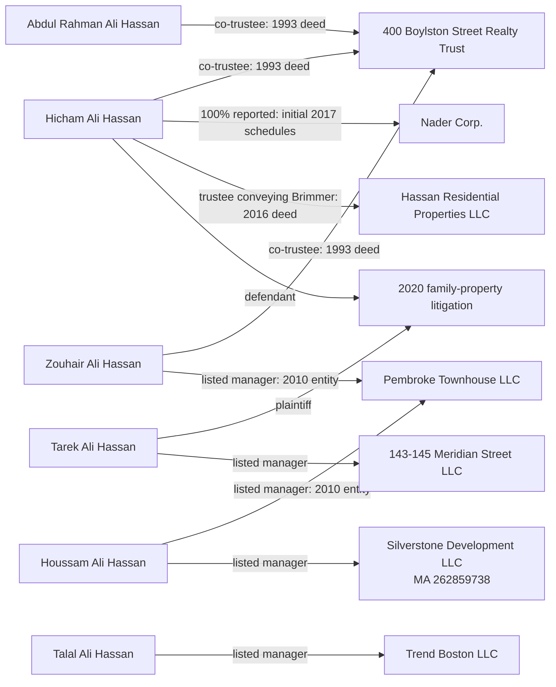

# Documented business links — September 4, 2026

Edges state the capacity and source date. Trustee/manager roles are not beneficial ownership. Family kinship is not inferred from these links.

Source anchors: Suffolk deed 17988/312 (three trustees); Massachusetts corporate records 001037265,262859738,001446912,001297451; Suffolk deed56617/279; Nader bankruptcy17-12398 document9; Suffolk Superior2020CV0531-BLS2. See the [initial report](/Users/travcole/projects/osint-research/investigations/hassan-boston/reports/initial-investigation-2026-09-04.md) and its linked primary records for qualifications and subsequent proceedings.
